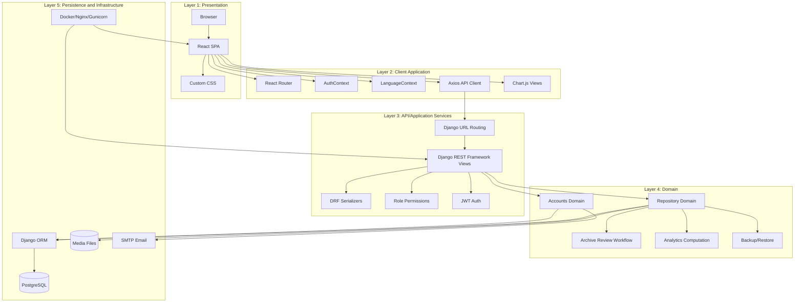
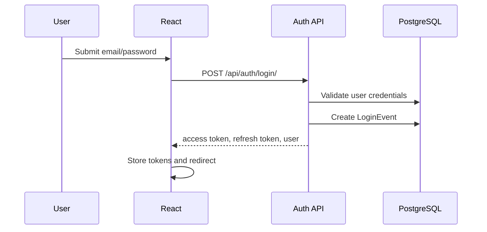
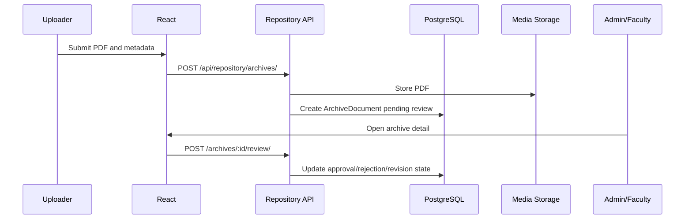
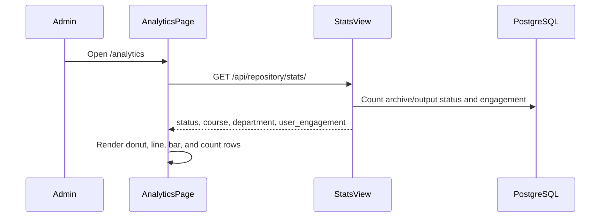

# SaliksikLab Multi-Layer Architecture

## Purpose

This document describes the current layered architecture of SaliksikLab after removal of collaboration, tunneling, and AI translation/model-cache features.

## Layer Overview



## Layer 1: Presentation

The presentation layer is the browser-rendered React application.

| File/Area | Responsibility |
| --- | --- |
| `frontend/src/main.jsx` | React entrypoint |
| `frontend/src/App.jsx` | App routes and auth/admin route guards |
| `frontend/src/index.css` | Main design system and responsive layout |
| `frontend/src/App.css` | Legacy/global app styles |
| `frontend/public/logo.png` | Product logo |
| `frontend/nginx.conf` | Static frontend serving and API/media proxy in container |

## Layer 2: Client Application

This layer manages browser state, navigation, and API communication.

| Module | Responsibility |
| --- | --- |
| `AuthContext.jsx` | Authenticated user, login, register, logout, refresh current user |
| `LanguageContext.jsx` | Static UI text switching |
| `axios.js` | JWT headers, refresh-token retry, auth redirect |
| `Sidebar.jsx` | Navigation and role-aware admin links |
| `LanguageSwitcher.jsx` | Locale toggle |

### Current Pages

| Page | Route | Notes |
| --- | --- | --- |
| `LoginPage` | `/login` | Authenticates and redirects by role |
| `RegisterPage` | `/register` | Creates account |
| `ForgotPasswordPage` | `/forgot-password` | Sends reset email/token |
| `ResetPasswordPage` | `/reset-password` | Applies reset token |
| `DashboardPage` | `/dashboard` | Summary cards, archive activity, recent submissions |
| `RepositoryPage` | `/repository` | Browse/search archive repository |
| `ArchiveDetailPage` | `/archives/:id` | Detail, metadata, review, revisions |
| `ArchivePdfViewerPage` | `/archives/:id/view` | PDF reading view |
| `UploadPage` | `/upload` | Upload archive PDF |
| `AdminPage` | `/admin` | User/account/admin management |
| `AnalyticsPage` | `/analytics` | Charts and repository/user engagement analytics |
| `ReportGenerationPage` | `/reports` | Admin-only route, hidden from sidebar |
| `ProfilePage` | `/profile` | Profile and avatar editing |

## Layer 3: API/Application Services

The backend exposes DRF views through two active API namespaces.

```text
/api/auth/          backend/accounts/urls.py
/api/repository/    backend/repository/urls.py
```

### Auth Services

| Endpoint | Responsibility |
| --- | --- |
| `/api/auth/login/` | JWT login and `LoginEvent` creation |
| `/api/auth/register/` | Account creation |
| `/api/auth/refresh/` | Token refresh |
| `/api/auth/me/` | Current user retrieve/update |
| `/api/auth/admin/users/` | Admin user management |
| `/api/auth/password-reset/` | Reset request |
| `/api/auth/password-reset/confirm/` | Reset confirmation |

### Repository Services

| Endpoint Group | Responsibility |
| --- | --- |
| `/api/repository/archives/` | Archive document CRUD |
| `/api/repository/archives/<id>/review/` | Approve, reject, request revision |
| `/api/repository/archives/<id>/revise/` | Upload a revised archive file |
| `/api/repository/archives/<id>/versions/` | Archive version history |
| `/api/repository/archives/<id>/preview/` | Preview archive file |
| `/api/repository/archives/<id>/download/` | Download archive file |
| `/api/repository/stats/` | Dashboard and analytics data |
| `/api/repository/departments/` | Department management |
| `/api/repository/courses/` | Course management |
| `/api/repository/export/csv/` | CSV export |
| `/api/repository/backup/` and `/restore/` | JSON backup and restore |

## Layer 4: Domain Logic

### Accounts Domain

Core entities:

- `User`
- `PasswordResetToken`
- `LoginEvent`

Rules:

- Email is the username field.
- Users have one of four roles: admin, faculty, student, researcher.
- Admins can approve accounts and change user status/roles.
- Successful logins create `LoginEvent` records for engagement analytics.

### Repository Domain

Core entities:

- `ArchiveDocument`
- `ArchiveDocumentVersion`
- `Department`
- `Course`
- `ResearchOutput`
- `OutputFile`
- `DownloadLog`
- `Repository`
- `RepositoryFile`

Rules:

- Archive uploads are PDF-focused.
- Archive documents start as pending review.
- Review can approve, reject, or request revision.
- Revision uploads create a version record and reset review state.
- Private archives are limited by uploader/faculty/admin visibility rules.
- Stats are role-aware.

### Analytics Domain

Analytics are computed in `StatsView` and rendered in `AnalyticsPage`.

Current analytics include:

- Approval breakdown.
- Student daily active users.
- Student logins per day.
- Output counts by course.
- Department and course output-count summaries.

## Layer 5: Persistence And Infrastructure

| Component | Responsibility |
| --- | --- |
| PostgreSQL | Main relational database |
| Django ORM | Model persistence and query construction |
| Django media root | Uploaded PDFs, revisions, avatars |
| SMTP backend | Password reset and account approval email |
| Docker Compose | Local/container orchestration |
| Gunicorn | Backend WSGI server in container |
| Nginx | Frontend static server |

## Data Flow Examples

### Login



### Archive Upload And Review



### Analytics



## Removed Layers And Integrations

The following are intentionally no longer part of the architecture:

- Collaboration app and `/api/collab/` routes.
- Collaboration React page.
- ngrok and SSH reverse tunnel scripts/docs/config.
- Hugging Face model cache, translation settings, and AI translation docs.
