# Multi-Layered System Architecture

## SaliksikLab - Research Repository Management Platform

---

## Table of Contents

1. [Architecture Overview](#architecture-overview)
2. [Layer 1: Presentation Layer](#layer-1-presentation-layer)
3. [Layer 2: Application Service Layer](#layer-2-application-service-layer)
4. [Layer 3: Domain Logic Layer](#layer-3-domain-logic-layer)
5. [Layer 4: Data Access Layer](#layer-4-data-access-layer)
6. [Layer 5: Infrastructure Layer](#layer-5-infrastructure-layer)
7. [Cross-Cutting Concerns](#cross-cutting-concerns)
8. [Data Flow Diagrams](#data-flow-diagrams)
9. [Integration Patterns](#integration-patterns)

---

## Architecture Overview

This document describes a **five-layer architecture** for the SaliksikLab platform, separating concerns into distinct layers that promote maintainability, testability, and scalability.

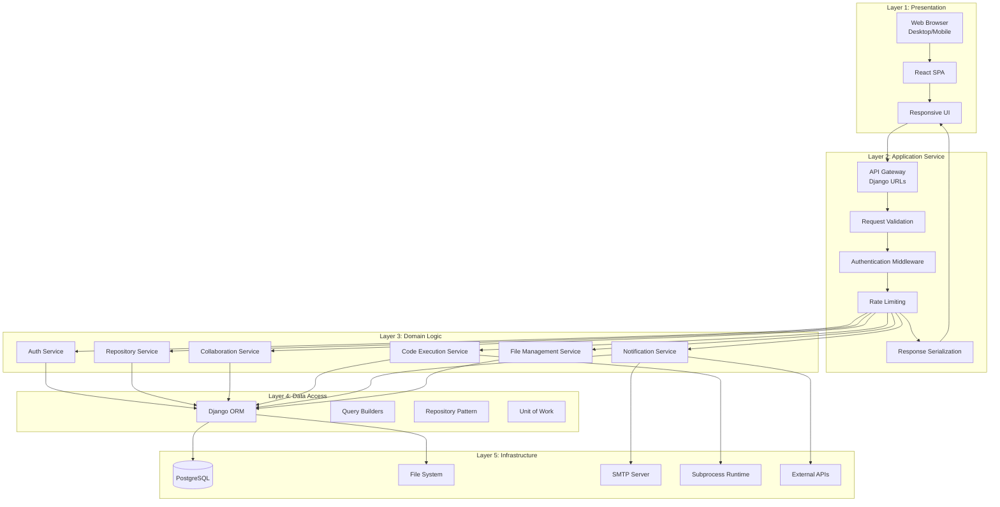

### Layer Responsibilities

| Layer | Primary Responsibility | Technologies |
|-------|----------------------|--------------|
| **Layer 1: Presentation** | User interface, input validation, state management | React, CSS, JavaScript |
| **Layer 2: Application Service** | Request routing, authentication, rate limiting | Django REST Framework, JWT |
| **Layer 3: Domain Logic** | Business rules, workflow orchestration | Python, Django Views/Services |
| **Layer 4: Data Access** | Data persistence, query optimization | Django ORM, PostgreSQL |
| **Layer 5: Infrastructure** | External services, file storage, email | PostgreSQL, SMTP, OS |

---

## Layer 1: Presentation Layer

### Purpose
The Presentation Layer handles all user interactions, displaying data and capturing user input. It is responsible for the visual representation and client-side logic.

### Components

```mermaid
graph TD
    A[Presentation Layer] --> B[Page Components]
    A --> C[Shared Components]
    A --> D[Context Providers]
    A --> E[API Client]
    
    B --> B1[LoginPage]
    B --> B2[DashboardPage]
    B --> B3[RepositoryPage]
    B --> B4[DetailPage]
    B --> B5[UploadPage]
    B --> B6[AdminPage]
    B --> B7[ProfilePage]
    B --> B8[CodePlaygroundPage]
    B --> B9[CollaborationPage]
    
    C --> C1[Sidebar]
    C --> C2[SearchBar]
    C --> C3[FilterPanel]
    C --> C4[RepositoryCard]
    C --> C5[VersionHistoryPanel]
    C --> C6[FilePreviewer]
    C --> C7[CodeEditor]
    C --> C8[NotificationPanel]
    C --> C9[ToastContainer]
    
    D --> D1[AuthContext]
    D --> D2[LanguageContext]
    
    E --> E1[Axios Instance]
    E --> E2[Request Interceptors]
    E --> E3[Response Interceptors]
    E --> E4[Error Handling]
```

### Component Responsibilities

#### Page Components

| Component | Route | Responsibilities |
|-----------|-------|------------------|
| LoginPage | `/login` | User credential input, form validation |
| RegisterPage | `/register` | New user registration, field validation |
| DashboardPage | `/dashboard` | Display analytics, recent submissions |
| RepositoryPage | `/repository` | Browse, search, filter research outputs |
| DetailPage | `/repository/:id` | View output details, version history, file preview |
| UploadPage | `/upload` | File upload, metadata entry, form submission |
| AdminPage | `/admin` | User management, approvals, data export |
| ProfilePage | `/profile` | View/edit user profile, change password |
| CodePlaygroundPage | `/code-lab` | In-browser code editor, execution, output display |
| CollaborationPage | `/collaborate` | Project management, issues, merge requests |

#### Shared Components

| Component | Purpose | Props/State |
|-----------|---------|-------------|
| Sidebar | Navigation menu, user info | Current route, user role |
| SearchBar | Text search input | Search query, debounced update |
| FilterPanel | Filter controls | Type, year, department, course |
| RepositoryCard | Output preview card | Output data, click handler |
| VersionHistoryPanel | Version list with actions | Versions array, rollback handler |
| FilePreviewer | Inline file viewing | File URL, MIME type |
| CodeEditor | Monaco/textarea editor | Code, language, onChange |
| NotificationPanel | Notification list | Notifications, mark read handler |

### State Management Architecture

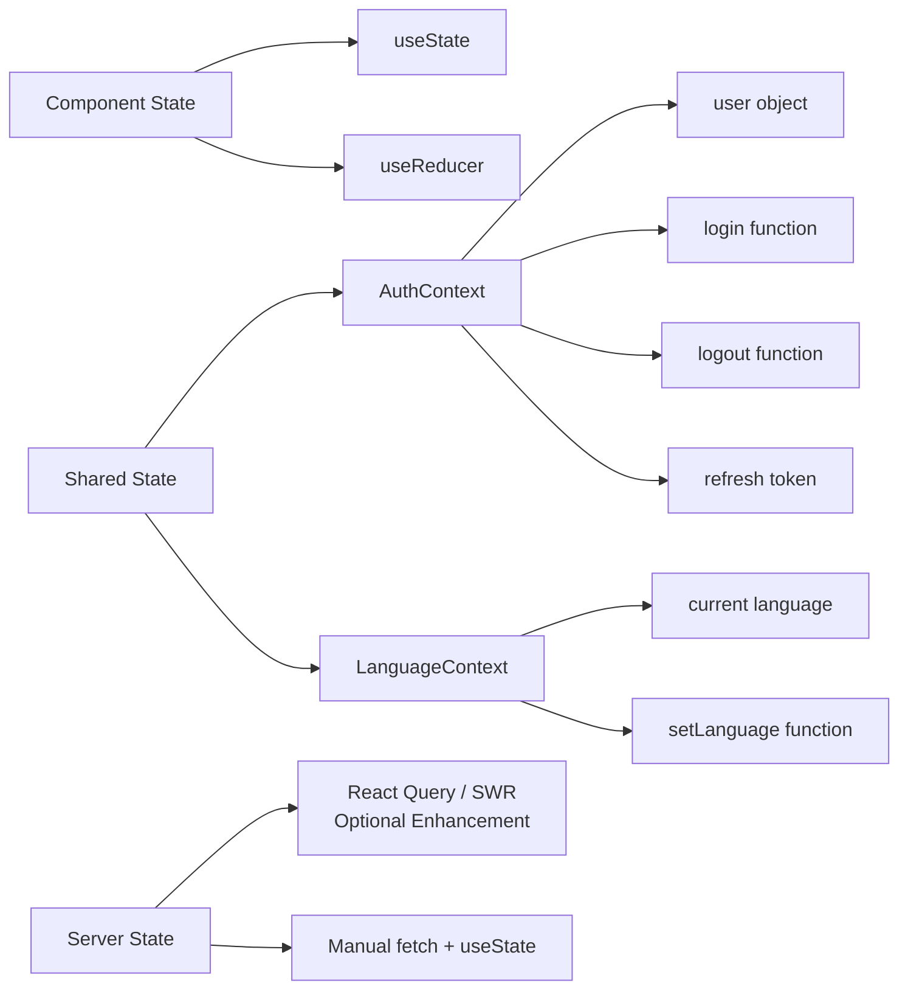

### Client-Side Data Flow

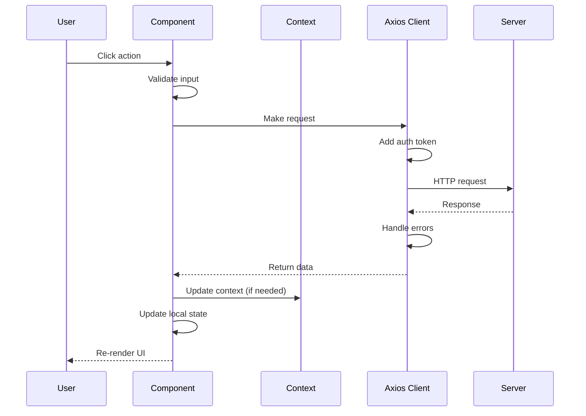

### Responsive Design Strategy

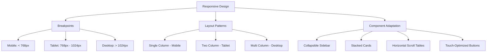

### CSS Design System

```css
/* Custom Properties (CSS Variables) */
:root {
    /* Colors */
    --bg: #ffffff;
    --bg2: #f8f9fa;
    --bg3: #e9ecef;
    --text: #212529;
    --text2: #6c757d;
    --border: #dee2e6;
    --accent: #4361ee;
    --accent2: #3a0ca3;
    --success: #2ec4b6;
    --warning: #ff9f1c;
    --danger: #f85149;
    
    /* Spacing */
    --space-xs: 4px;
    --space-sm: 8px;
    --space-md: 16px;
    --space-lg: 24px;
    --space-xl: 32px;
    
    /* Typography */
    --font-sans: -apple-system, BlinkMacSystemFont, 'Segoe UI', Roboto, sans-serif;
    --font-mono: 'Fira Code', 'Cascadia Code', monospace;
    
    /* Shadows */
    --shadow-sm: 0 1px 2px rgba(0,0,0,0.05);
    --shadow-md: 0 4px 6px rgba(0,0,0,0.1);
    --shadow-lg: 0 10px 15px rgba(0,0,0,0.1);
    
    /* Border Radius */
    --radius-sm: 4px;
    --radius: 8px;
    --radius-lg: 12px;
}
```

---

## Layer 2: Application Service Layer

### Purpose
The Application Service Layer acts as the entry point for all client requests. It handles cross-cutting concerns like authentication, validation, rate limiting, and response formatting before delegating to domain services.

### Components

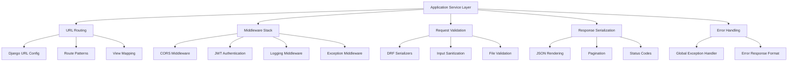

### URL Routing Structure

```python
# config/urls.py

from django.urls import path, include

urlpatterns = [
    # Authentication endpoints
    path('api/auth/', include('accounts.urls')),
    
    # Repository endpoints
    path('api/repository/', include('repository.urls')),
    
    # Collaboration endpoints
    path('api/collab/', include('collaboration.urls')),
    
    # Code execution endpoints
    path('api/code/', include('code_execution.urls')),
]
```

### Middleware Stack

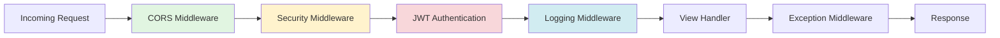

| Middleware | Purpose | Configuration |
|------------|---------|---------------|
| CORS | Cross-origin requests | `CORS_ALLOWED_ORIGINS` |
| Security | HTTPS, XSS protection | `SECURE_*` settings |
| JWT Authentication | Token validation | `SIMPLE_JWT` config |
| Logging | Request/response logging | Custom middleware |
| Exception | Global error handling | DRF `EXCEPTION_HANDLER` |

### Authentication Flow

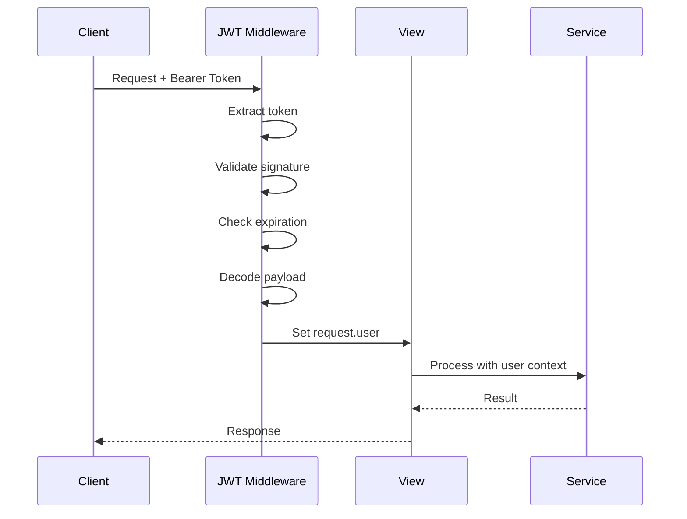

### JWT Token Structure

```json
{
  "token_type": "access",
  "exp": 1712345678,
  "iat": 1712345378,
  "jti": "uuid-here",
  "user_id": "uuid-here",
  "email": "user@example.com",
  "role": "student",
  "first_name": "John",
  "last_name": "Doe"
}
```

### Request Validation Pipeline

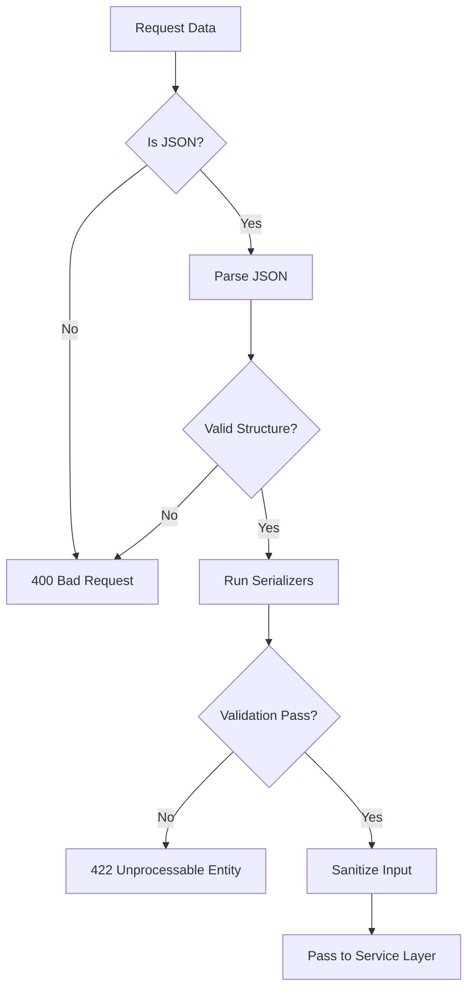

### DRF Serializer Example

```python
# repository/serializers.py

from rest_framework import serializers
from .models import ResearchOutput, OutputFile

class ResearchOutputSerializer(serializers.ModelSerializer):
    """Serializer for research output with validation."""
    
    file_count = serializers.IntegerField(read_only=True)
    current_version = serializers.IntegerField(read_only=True)
    
    class Meta:
        model = ResearchOutput
        fields = [
            'id', 'title', 'abstract', 'output_type',
            'department', 'year', 'keywords', 'author',
            'adviser', 'course', 'co_authors',
            'is_approved', 'is_rejected',
            'file_count', 'current_version',
            'created_at', 'updated_at'
        ]
        read_only_fields = ['id', 'uploaded_by', 'is_approved', 'is_rejected']
    
    def validate_title(self, value):
        if len(value) < 3:
            raise serializers.ValidationError("Title must be at least 3 characters.")
        return value.strip()
    
    def validate_year(self, value):
        current_year = datetime.now().year
        if value < 1900 or value > current_year + 1:
            raise serializers.ValidationError(f"Year must be between 1900 and {current_year + 1}")
        return value
    
    def validate_keywords(self, value):
        if not isinstance(value, list):
            raise serializers.ValidationError("Keywords must be a list.")
        if len(value) > 20:
            raise serializers.ValidationError("Maximum 20 keywords allowed.")
        return [k.strip().lower() for k in value if k.strip()]
```

### Response Serialization

```python
# Standard response format
{
    "success": true,
    "data": { ... },
    "message": "Operation successful",
    "timestamp": "2026-04-05T12:00:00Z"
}

# Paginated response
{
    "count": 100,
    "next": "/api/repository/?page=2",
    "previous": null,
    "results": [ ... ]
}

# Error response
{
    "success": false,
    "error": {
        "code": "validation_error",
        "message": "Invalid input",
        "details": {
            "title": ["This field is required."]
        }
    }
}
```

### Rate Limiting Configuration

```python
# config/settings.py

REST_FRAMEWORK = {
    'DEFAULT_THROTTLE_CLASSES': [
        'rest_framework.throttling.AnonRateThrottle',
        'rest_framework.throttling.UserRateThrottle',
    ],
    'DEFAULT_THROTTLE_RATES': {
        'anon': '100/hour',
        'user': '1000/hour',
        'login': '10/minute',
        'upload': '20/hour',
        'code_execute': '30/hour',
    }
}
```

---

## Layer 3: Domain Logic Layer

### Purpose
The Domain Logic Layer contains the core business logic of the application. It implements the rules, workflows, and orchestration that define how the system behaves.

### Service Architecture

```mermaid
graph TD
    A[Domain Logic Layer] --> B[AuthService]
    A --> C[RepositoryService]
    A --> D[CollaborationService]
    A --> E[CodeExecutionService]
    A --> F[NotificationService]
    A --> G[FileManagementService]
    
    B --> B1[Register User]
    B --> B2[Authenticate]
    B --> B3[Refresh Token]
    B --> B4[Reset Password]
    B --> B5[Update Profile]
    
    C --> C1[Create Output]
    C --> C2[Update Output]
    C --> C3[Delete Output]
    C --> C4[Submit Revision]
    C --> C5[Approve/Reject]
    C --> C6[Rollback Version]
    C --> C7[Search & Filter]
    C --> C8[Export Data]
    
    D --> D1[Create Project]
    D --> D2[Manage Members]
    D --> D3[Create Issue]
    D --> D4[Manage MR]
    D --> D5[Push Commit]
    D --> D6[Send Notifications]
    
    E --> E1[Execute Code]
    E --> E2[Get History]
    E --> E3[Manage Sandbox]
    
    F --> F1[Send Email]
    F --> F2[Create Notification]
    F --> F3[Mark Read]
    
    G --> G1[Upload File]
    G --> G2[Download File]
    G --> G3[Preview File]
    G --> G4[Delete File]
```

### Service Implementation Pattern

```python
# repository/services.py

from django.db import transaction
from django.core.mail import send_mail
from django.conf import settings
from .models import ResearchOutput, OutputFile, DownloadLog
from .serializers import ResearchOutputSerializer


class RepositoryService:
    """Business logic for repository operations."""
    
    @staticmethod
    @transaction.atomic
    def create_output(user, validated_data, uploaded_file):
        """Create a new research output with initial file."""
        # Create the research output record
        output = ResearchOutput.objects.create(
            uploaded_by=user,
            **validated_data
        )
        
        # Create the first version file
        OutputFile.objects.create(
            research_output=output,
            file=uploaded_file,
            original_filename=uploaded_file.name,
            version=1,
            uploaded_by=user
        )
        
        # Send notification to admins
        NotificationService.notify_admins_new_submission(output)
        
        return output
    
    @staticmethod
    @transaction.atomic
    def submit_revision(output, user, new_file, change_notes, metadata_updates=None):
        """Submit a new revision of an existing output."""
        # Get current version
        current_version = output.files.order_by('-version').first()
        new_version_number = current_version.version + 1
        
        # Create new file version
        new_file_record = OutputFile.objects.create(
            research_output=output,
            file=new_file,
            original_filename=new_file.name,
            version=new_version_number,
            change_notes=change_notes,
            uploaded_by=user
        )
        
        # Update metadata if provided
        if metadata_updates:
            for field, value in metadata_updates.items():
                setattr(output, field, value)
            output.save(update_fields=metadata_updates.keys())
        
        # Reset approval status
        output.is_approved = False
        output.is_rejected = False
        output.save(update_fields=['is_approved', 'is_rejected'])
        
        # Notify admins
        NotificationService.notify_admins_revision(output, new_version_number)
        
        return new_file_record
    
    @staticmethod
    @transaction.atomic
    def approve_output(output, admin_user, is_approved, reason=None):
        """Approve or reject a research output."""
        output.is_approved = is_approved
        output.is_rejected = not is_approved
        if reason:
            output.rejection_reason = reason
        output.save(update_fields=['is_approved', 'is_rejected', 'rejection_reason'])
        
        # Notify the uploader
        NotificationService.notify_approval_result(output, is_approved, reason)
        
        return output
    
    @staticmethod
    def search_outputs(query_params, user=None):
        """Search and filter research outputs."""
        queryset = ResearchOutput.objects.filter(is_deleted=False)
        
        # Only show approved outputs for non-admin/non-owner
        if not user or not user.is_staff:
            queryset = queryset.filter(is_approved=True)
        
        # Apply filters
        if query_params.get('search'):
            search_term = query_params['search']
            queryset = queryset.filter(
                models.Q(title__icontains=search_term) |
                models.Q(author__icontains=search_term) |
                models.Q(abstract__icontains=search_term) |
                models.Q(keywords__contains=[search_term])
            )
        
        if query_params.get('type'):
            queryset = queryset.filter(output_type=query_params['type'])
        
        if query_params.get('year'):
            queryset = queryset.filter(year=query_params['year'])
        
        if query_params.get('department'):
            queryset = queryset.filter(
                department__icontains=query_params['department']
            )
        
        if query_params.get('mine') and user:
            queryset = queryset.filter(uploaded_by=user)
        
        return queryset.order_by('-created_at')
    
    @staticmethod
    def get_analytics():
        """Get dashboard analytics."""
        total = ResearchOutput.objects.filter(is_deleted=False).count()
        approved = ResearchOutput.objects.filter(is_approved=True, is_deleted=False).count()
        pending = ResearchOutput.objects.filter(
            is_approved=False, is_rejected=False, is_deleted=False
        ).count()
        rejected = ResearchOutput.objects.filter(is_rejected=True, is_deleted=False).count()
        
        by_type = ResearchOutput.objects.filter(is_deleted=False).values(
            'output_type'
        ).annotate(count=models.Count('id')).order_by('-count')
        
        by_dept = ResearchOutput.objects.filter(is_deleted=False).values(
            'department'
        ).annotate(count=models.Count('id')).order_by('-count')[:8]
        
        return {
            'total': total,
            'approved': approved,
            'pending': pending,
            'rejected': rejected,
            'by_type': list(by_type),
            'by_dept': list(by_dept),
        }
```

### Domain Events

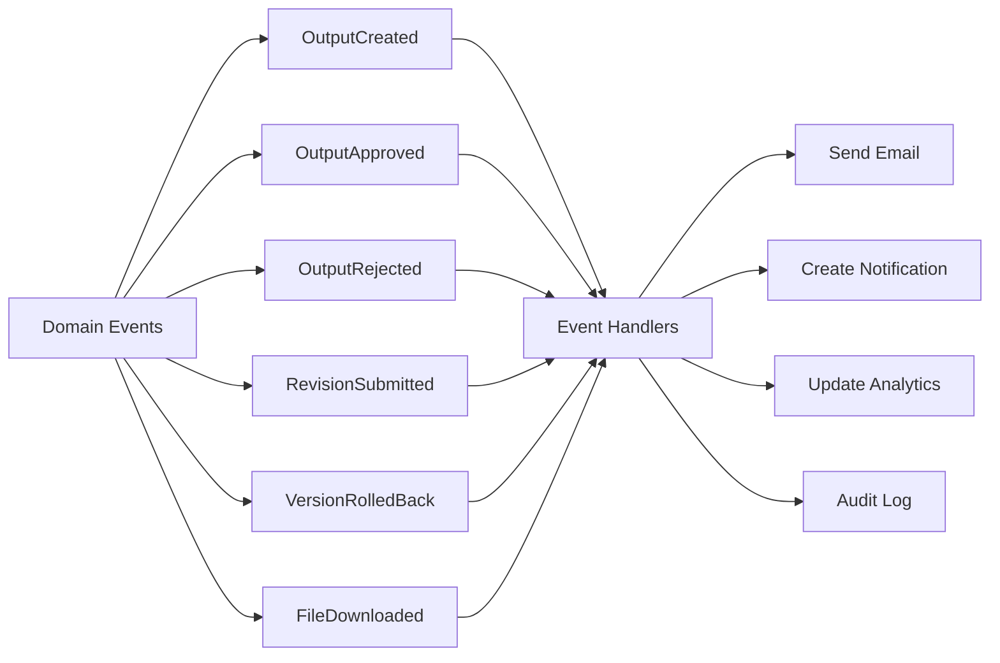

### Business Rules

| Rule | Description | Enforcement |
|------|-------------|-------------|
| File Size Limit | Maximum 100 MB per file | Validator in serializer |
| File Type Whitelist | Only allowed extensions | Validator in serializer |
| Version Increment | Each revision increments version | Service layer logic |
| Approval Reset | Revision resets approval status | Service layer logic |
| Owner/Admin Only | Only owner or admin can revise | Permission check in view |
| Soft Delete | Outputs are marked deleted, not removed | `is_deleted` flag |
| Download Tracking | All downloads are logged | DownloadLog creation |
| Admin Approval Required | New submissions need approval | Default `is_approved=False` |

### Workflow: Research Output Lifecycle

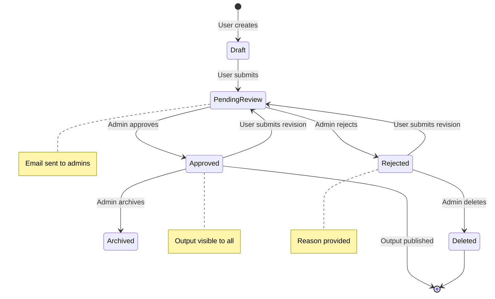

---

## Layer 4: Data Access Layer

### Purpose
The Data Access Layer abstracts database operations, providing a clean interface for persisting and retrieving data. It handles query optimization, transactions, and data mapping.

### Repository Pattern

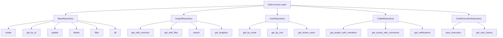

### Django ORM Query Examples

```python
# repository/repositories.py

from django.db import models
from django.db.models import Q, Count, Prefetch
from .models import ResearchOutput, OutputFile, DownloadLog


class OutputRepository:
    """Data access operations for ResearchOutput."""
    
    @staticmethod
    def get_with_versions(output_id):
        """Get output with all version files prefetched."""
        return ResearchOutput.objects.prefetch_related(
            Prefetch(
                'files',
                queryset=OutputFile.objects.select_related('uploaded_by').order_by('-version'),
                to_attr='all_versions'
            )
        ).select_related('uploaded_by').get(id=output_id)
    
    @staticmethod
    def search_advanced(search_term=None, output_type=None, year=None, 
                        department=None, course=None, user=None, mine_only=False):
        """Advanced search with multiple filters."""
        queryset = ResearchOutput.objects.filter(is_deleted=False)
        
        if search_term:
            queryset = queryset.filter(
                Q(title__icontains=search_term) |
                Q(author__icontains=search_term) |
                Q(abstract__icontains=search_term) |
                Q(keywords__contains=[search_term.lower()])
            )
        
        if output_type:
            queryset = queryset.filter(output_type=output_type)
        
        if year:
            queryset = queryset.filter(year=year)
        
        if department:
            queryset = queryset.filter(department__icontains=department)
        
        if course:
            queryset = queryset.filter(course__icontains=course)
        
        if mine_only and user:
            queryset = queryset.filter(uploaded_by=user)
        
        return queryset.select_related('uploaded_by').order_by('-created_at')
    
    @staticmethod
    def get_analytics():
        """Get comprehensive analytics."""
        base_qs = ResearchOutput.objects.filter(is_deleted=False)
        
        total = base_qs.count()
        approved = base_qs.filter(is_approved=True).count()
        pending = base_qs.filter(is_approved=False, is_rejected=False).count()
        rejected = base_qs.filter(is_rejected=True).count()
        
        by_type = base_qs.values('output_type').annotate(
            count=Count('id')
        ).order_by('-count')
        
        by_dept = base_qs.values('department').annotate(
            count=Count('id')
        ).order_by('-count')[:8]
        
        by_year = base_qs.values('year').annotate(
            count=Count('id')
        ).order_by('-year')[:5]
        
        # Download statistics
        download_stats = DownloadLog.objects.values(
            'research_output__title'
        ).annotate(
            download_count=Count('id')
        ).order_by('-download_count')[:10]
        
        return {
            'total': total,
            'approved': approved,
            'pending': pending,
            'rejected': rejected,
            'by_type': list(by_type),
            'by_dept': list(by_dept),
            'by_year': list(by_year),
            'top_downloaded': list(download_stats),
        }
    
    @staticmethod
    def get_user_uploads(user, include_deleted=False):
        """Get all uploads by a specific user."""
        qs = ResearchOutput.objects.filter(uploaded_by=user)
        if not include_deleted:
            qs = qs.filter(is_deleted=False)
        return qs.prefetch_related('files').order_by('-created_at')
    
    @staticmethod
    def get_pending_approvals():
        """Get outputs awaiting admin approval."""
        return ResearchOutput.objects.filter(
            is_approved=False,
            is_rejected=False,
            is_deleted=False
        ).select_related('uploaded_by').order_by('-created_at')
```

### Transaction Management

```python
from django.db import transaction


class TransactionalService:
    """Services with transaction boundaries."""
    
    @transaction.atomic
    def create_output_with_files(user, output_data, files):
        """Create output with multiple files atomically."""
        # All operations succeed or all fail
        output = ResearchOutput.objects.create(
            uploaded_by=user,
            **output_data
        )
        
        for idx, file_data in enumerate(files, start=1):
            OutputFile.objects.create(
                research_output=output,
                file=file_data['file'],
                original_filename=file_data['name'],
                version=idx,
                uploaded_by=user
            )
        
        # Transaction commits here if no exception
        return output
    
    @transaction.atomic
    def rollback_version(output, target_version):
        """Rollback to a specific version, deleting newer versions."""
        # Get versions to delete
        versions_to_delete = output.files.filter(version__gt=target_version)
        
        # Delete file records (and files on disk via signal)
        for version in versions_to_delete:
            version.file.delete(save=False)  # Delete from filesystem
            version.delete()
        
        return output
```

### Database Query Optimization

```python
# N+1 Query Prevention

# BAD: N+1 queries
outputs = ResearchOutput.objects.all()
for output in outputs:
    print(output.uploaded_by.email)  # Query per iteration

# GOOD: select_related for ForeignKey
outputs = ResearchOutput.objects.select_related('uploaded_by').all()
for output in outputs:
    print(output.uploaded_by.email)  # No additional queries

# GOOD: prefetch_related for ManyToMany/Reverse ForeignKey
outputs = ResearchOutput.objects.prefetch_related('files').all()
for output in outputs:
    for file in output.files.all():  # Single prefetch query
        print(file.version)

# COMPLEX: Combined optimization
outputs = ResearchOutput.objects\
    .select_related('uploaded_by')\
    .prefetch_related(
        Prefetch('files', queryset=OutputFile.objects.order_by('-version'))
    )\
    .filter(is_approved=True)\
    .annotate(file_count=Count('files'))\
    .all()
```

### Index Strategy Implementation

```python
# repository/models.py

class ResearchOutput(models.Model):
    # ... fields ...
    
    class Meta:
        ordering = ['-created_at']
        indexes = [
            models.Index(fields=['output_type'], name='idx_output_type'),
            models.Index(fields=['department'], name='idx_output_dept'),
            models.Index(fields=['year'], name='idx_output_year'),
            models.Index(fields=['is_approved'], name='idx_output_approved'),
            models.Index(fields=['is_deleted'], name='idx_output_deleted'),
            models.Index(fields=['-created_at'], name='idx_output_created'),
            models.Index(fields=['title'], name='idx_output_title'),
        ]


class OutputFile(models.Model):
    # ... fields ...
    
    class Meta:
        ordering = ['-version']
        indexes = [
            models.Index(fields=['research_output'], name='idx_file_output'),
            models.Index(fields=['-version'], name='idx_file_version'),
        ]


class DownloadLog(models.Model):
    # ... fields ...
    
    class Meta:
        ordering = ['-downloaded_at']
        indexes = [
            models.Index(fields=['user'], name='idx_download_user'),
            models.Index(fields=['research_output'], name='idx_download_output'),
            models.Index(fields=['-downloaded_at'], name='idx_download_date'),
        ]
```

### Database Connection Pooling

```python
# config/settings.py

DATABASES = {
    'default': {
        'ENGINE': 'django.db.backends.postgresql',
        'NAME': os.getenv('DB_NAME'),
        'USER': os.getenv('DB_USER'),
        'PASSWORD': os.getenv('DB_PASSWORD'),
        'HOST': os.getenv('DB_HOST'),
        'PORT': os.getenv('DB_PORT'),
        'CONN_MAX_AGE': 600,  # Persistent connections (10 min)
        'CONN_HEALTH_CHECKS': True,  # Check connection before use
        'OPTIONS': {
            'connect_timeout': 10,
        },
    }
}
```

---

## Layer 5: Infrastructure Layer

### Purpose
The Infrastructure Layer provides technical capabilities that support the upper layers, including database management, file storage, email delivery, and external service integration.

### Components

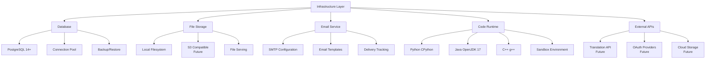

### Database Infrastructure

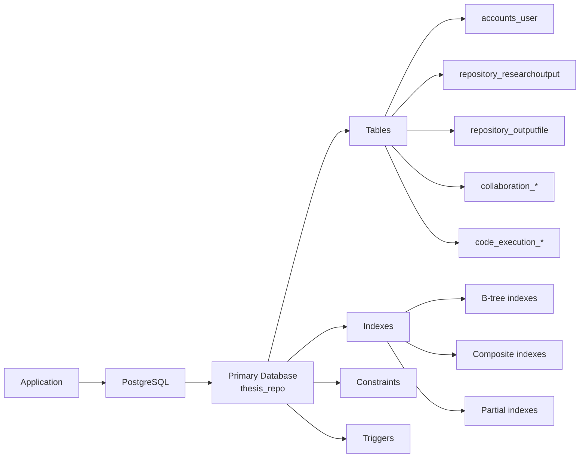

### PostgreSQL Configuration

```postgresql
# postgresql.conf (production recommendations)

# Memory
shared_buffers = 2GB                    # 25% of RAM
effective_cache_size = 6GB              # 75% of RAM
work_mem = 16MB                         # Per-operation memory
maintenance_work_mem = 512MB            # For VACUUM, CREATE INDEX

# Connections
max_connections = 200
superuser_reserved_connections = 3

# WAL & Checkpoints
wal_level = replica
max_wal_senders = 3
checkpoint_completion_target = 0.9

# Query Planning
random_page_cost = 1.1                  # SSD storage
effective_io_concurrency = 200          # SSD parallelism

# Logging
log_min_duration_statement = 1000       # Log slow queries (1s+)
log_checkpoints = on
log_connections = on
log_disconnections = on
```

### File Storage Architecture

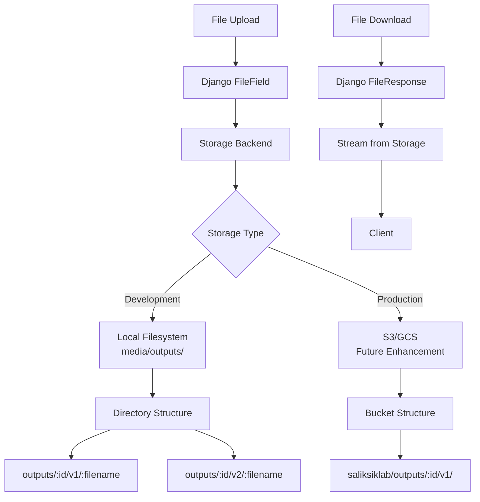

### Storage Path Convention

```
media/
└── outputs/
    ├── {output_uuid}/
    │   ├── v1/
    │   │   └── {original_filename}
    │   ├── v2/
    │   │   └── {original_filename}
    │   └── v3/
    │       └── {original_filename}
    └── ...
```

### Email Infrastructure

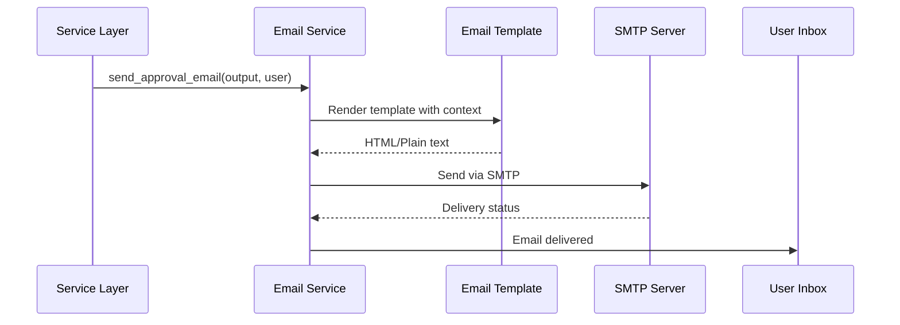

### Email Configuration

```python
# config/settings.py

# Development - Console backend
EMAIL_BACKEND = 'django.core.mail.backends.console.EmailBackend'

# Production - SMTP backend
# EMAIL_BACKEND = 'django.core.mail.backends.smtp.EmailBackend'
EMAIL_HOST = os.getenv('EMAIL_HOST', 'smtp.gmail.com')
EMAIL_PORT = int(os.getenv('EMAIL_PORT', 587))
EMAIL_USE_TLS = os.getenv('EMAIL_USE_TLS', 'True') == 'True'
EMAIL_HOST_USER = os.getenv('EMAIL_HOST_USER')
EMAIL_HOST_PASSWORD = os.getenv('EMAIL_HOST_PASSWORD')
DEFAULT_FROM_EMAIL = os.getenv('DEFAULT_FROM_EMAIL', 'noreply@saliksiklab.edu')
```

### Email Templates

```python
# repository/emails.py

from django.core.mail import send_mail
from django.template.loader import render_to_string
from django.conf import settings


class EmailService:
    """Email notification service."""
    
    @staticmethod
    def send_approval_notification(output, is_approved, reason=None):
        """Send approval/rejection email to uploader."""
        recipient = output.uploaded_by.email
        subject = f"Submission {'Approved' if is_approved else 'Rejected'}: {output.title}"
        
        context = {
            'output': output,
            'is_approved': is_approved,
            'reason': reason,
            'frontend_url': settings.FRONTEND_URL,
        }
        
        html_message = render_to_string('emails/approval.html', context)
        plain_message = render_to_string('emails/approval.txt', context)
        
        send_mail(
            subject=subject,
            message=plain_message,
            from_email=settings.DEFAULT_FROM_EMAIL,
            recipient_list=[recipient],
            html_message=html_message,
            fail_silently=False,
        )
    
    @staticmethod
    def notify_admins_revision(output, version_number):
        """Notify all admins about a new revision."""
        from accounts.models import User
        
        admins = User.objects.filter(role='admin', is_active=True)
        recipient_list = [admin.email for admin in admins]
        
        subject = f"New Revision v{version_number}: {output.title}"
        context = {
            'output': output,
            'version': version_number,
            'frontend_url': settings.FRONTEND_URL,
        }
        
        html_message = render_to_string('emails/revision.html', context)
        plain_message = render_to_string('emails/revision.txt', context)
        
        send_mail(
            subject=subject,
            message=plain_message,
            from_email=settings.DEFAULT_FROM_EMAIL,
            recipient_list=recipient_list,
            html_message=html_message,
            fail_silently=False,
        )
```

### Code Execution Sandbox

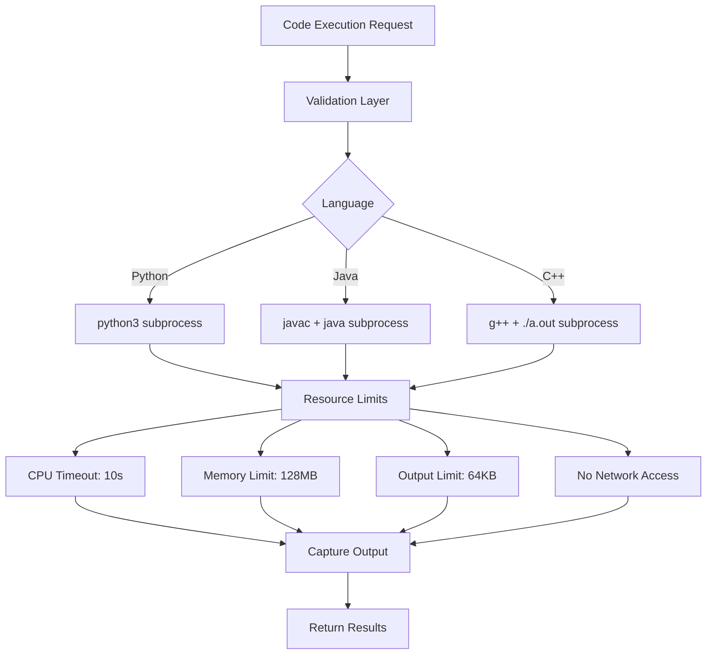

### Sandbox Implementation

```python
# code_execution/executor.py

import subprocess
import os
import tempfile
import resource


class CodeExecutor:
    """Sandboxed code execution engine."""
    
    TIMEOUT = 10  # seconds
    MAX_OUTPUT = 64 * 1024  # 64 KB
    MAX_MEMORY = 128 * 1024 * 1024  # 128 MB
    
    LANGUAGE_CONFIG = {
        'python': {
            'compile': None,
            'run': ['python3', '-u'],
            'extension': '.py',
        },
        'java': {
            'compile': ['javac'],
            'run': ['java', '-cp', '.'],
            'extension': '.java',
        },
        'cpp': {
            'compile': ['g++', '-std=c++17', '-o', 'a.out'],
            'run': ['./a.out'],
            'extension': '.cpp',
        },
    }
    
    @classmethod
    def execute(cls, language, source_code, stdin_input=''):
        """Execute code in a sandboxed environment."""
        config = cls.LANGUAGE_CONFIG.get(language)
        if not config:
            return {'error': f'Unsupported language: {language}'}
        
        with tempfile.TemporaryDirectory() as temp_dir:
            try:
                # Write source code to temp file
                source_file = os.path.join(temp_dir, f'main{config["extension"]}')
                with open(source_file, 'w') as f:
                    f.write(source_code)
                
                # Compile if needed
                if config['compile']:
                    compile_cmd = config['compile'] + [source_file]
                    compile_result = subprocess.run(
                        compile_cmd,
                        cwd=temp_dir,
                        capture_output=True,
                        timeout=cls.TIMEOUT,
                    )
                    if compile_result.returncode != 0:
                        return {
                            'status': 'error',
                            'stderr': compile_result.stderr.decode('utf-8', errors='replace'),
                            'exit_code': compile_result.returncode,
                        }
                
                # Execute
                run_cmd = config['run']
                if language == 'java':
                    run_cmd = config['run'] + [temp_dir]
                
                process = subprocess.Popen(
                    run_cmd,
                    cwd=temp_dir if language != 'java' else None,
                    stdin=subprocess.PIPE,
                    stdout=subprocess.PIPE,
                    stderr=subprocess.PIPE,
                )
                
                # Set resource limits
                try:
                    resource.setrlimit(resource.RLIMIT_AS, (cls.MAX_MEMORY, cls.MAX_MEMORY))
                except (ValueError, OSError):
                    pass  # May not work on all systems
                
                stdout, stderr = process.communicate(
                    input=stdin_input.encode() if stdin_input else None,
                    timeout=cls.TIMEOUT,
                )
                
                return {
                    'status': 'success' if process.returncode == 0 else 'error',
                    'stdout': stdout.decode('utf-8', errors='replace')[:cls.MAX_OUTPUT],
                    'stderr': stderr.decode('utf-8', errors='replace')[:cls.MAX_OUTPUT],
                    'exit_code': process.returncode,
                }
                
            except subprocess.TimeoutExpired:
                process.kill()
                return {
                    'status': 'timeout',
                    'stderr': f'Execution exceeded {cls.TIMEOUT} second timeout',
                }
            except Exception as e:
                return {
                    'status': 'error',
                    'stderr': f'Execution error: {str(e)}',
                }
```

---

## Cross-Cutting Concerns

### Logging

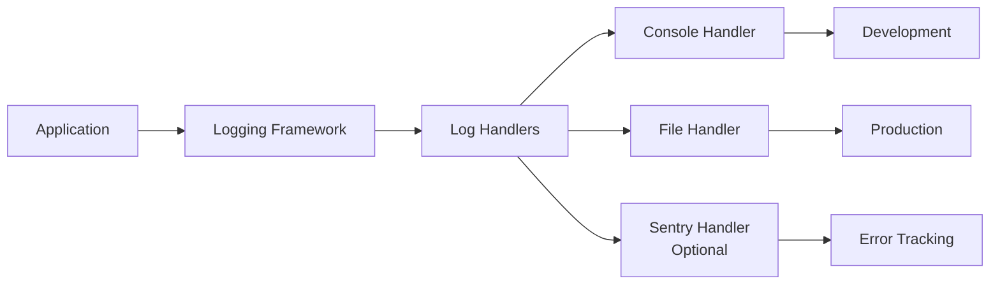

```python
# config/settings.py

LOGGING = {
    'version': 1,
    'disable_existing_loggers': False,
    'formatters': {
        'verbose': {
            'format': '{levelname} {asctime} {module} {process:d} {thread:d} {message}',
            'style': '{',
        },
        'simple': {
            'format': '{levelname} {message}',
            'style': '{',
        },
    },
    'handlers': {
        'console': {
            'class': 'logging.StreamHandler',
            'formatter': 'simple',
            'level': 'DEBUG',
        },
        'file': {
            'class': 'logging.FileHandler',
            'filename': 'logs/django.log',
            'formatter': 'verbose',
            'level': 'INFO',
        },
    },
    'loggers': {
        'django': {
            'handlers': ['console', 'file'],
            'level': 'INFO',
            'propagate': True,
        },
        'repository': {
            'handlers': ['console', 'file'],
            'level': 'DEBUG',
            'propagate': False,
        },
    },
}
```

### Error Handling

```python
# config/exceptions.py

from rest_framework.views import exception_handler
from rest_framework.response import Response
from rest_framework import status
import logging

logger = logging.getLogger(__name__)


def custom_exception_handler(exc, context):
    """Custom exception handler for consistent error responses."""
    # Call DRF's default exception handler first
    response = exception_handler(exc, context)
    
    if response is not None:
        # Add error code and timestamp
        response.data = {
            'success': False,
            'error': {
                'code': response.data.get('detail', 'unknown_error'),
                'message': str(response.data.get('detail', exc)),
                'status_code': response.status_code,
            }
        }
        return response
    
    # Handle unhandled exceptions
    logger.exception(f'Unhandled exception: {exc}', exc_info=True)
    
    return Response({
        'success': False,
        'error': {
            'code': 'internal_error',
            'message': 'An unexpected error occurred. Please try again later.',
        }
    }, status=status.HTTP_500_INTERNAL_SERVER_ERROR)
```

### Caching Strategy

```python
# config/settings.py

CACHES = {
    'default': {
        'BACKEND': 'django.core.cache.backends.locmem.LocMemCache',
        'LOCATION': 'saliksiklab-cache',
    }
}

# Cache analytics for 5 minutes
from django.core.cache import cache

def get_cached_analytics():
    cache_key = 'dashboard_analytics'
    analytics = cache.get(cache_key)
    
    if analytics is None:
        analytics = RepositoryService.get_analytics()
        cache.set(cache_key, analytics, timeout=300)  # 5 minutes
    
    return analytics
```

### Audit Logging

```python
# repository/signals.py

from django.db.models.signals import post_save, post_delete
from django.dispatch import receiver
from .models import ResearchOutput, OutputFile
import logging

audit_logger = logging.getLogger('audit')


@receiver(post_save, sender=ResearchOutput)
def log_output_change(sender, instance, created, **kwargs):
    """Log research output changes for audit trail."""
    if created:
        audit_logger.info(f'OUTPUT_CREATED: id={instance.id}, title={instance.title}, user={instance.uploaded_by}')
    else:
        audit_logger.info(f'OUTPUT_UPDATED: id={instance.id}, approved={instance.is_approved}')


@receiver(post_delete, sender=ResearchOutput)
def log_output_deletion(sender, instance, **kwargs):
    """Log research output deletion."""
    audit_logger.info(f'OUTPUT_DELETED: id={instance.id}, title={instance.title}')
```

---

## Data Flow Diagrams

### Complete Request Flow

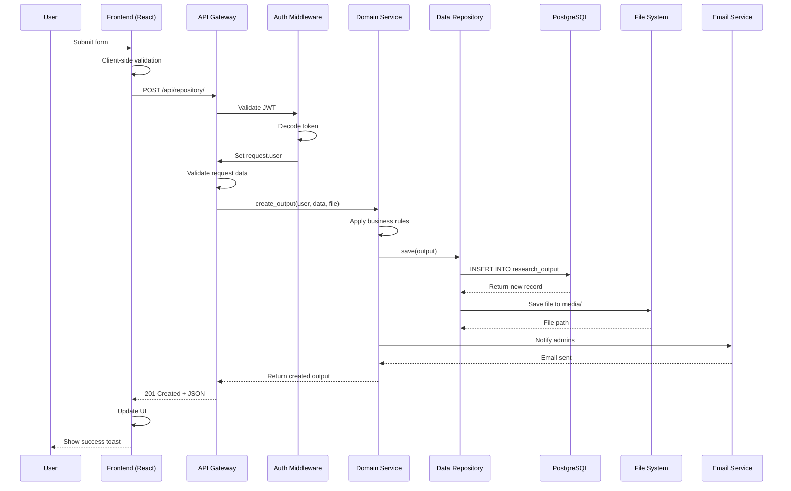

### File Download Flow

```mermaid
sequenceDiagram
    participant U as User
    participant FE as Frontend
    participant API as API Gateway
    participant AUTH as Auth Middleware
    participant SVC as File Service
    participant DB as Database
    participant FS as File System
    
    U->>FE: Click download
    FE->>API: GET /api/repository/:id/download/
    API->>AUTH: Validate JWT
    AUTH-->>API: User authenticated
    API->>SVC: get_latest_file(output_id)
    SVC->>DB: SELECT file FROM outputfile
    DB-->>SVC: File record
    SVC->>DB: INSERT INTO downloadlog
    SVC->>FS: Open file
    FS-->>SVC: File stream
    SVC-->>API: FileResponse
    API-->>FE: Stream file
    FE->>FE: Trigger download
    FE-->>U: File downloaded
```

---

## Integration Patterns

### Synchronous Integration

```mermaid
graph LR
    A[Service A] -->|HTTP Request| B[Service B]
    B -->|Process| B
    B -->|HTTP Response| A
    
    style A fill:#e1f5e1
    style B fill:#fff3cd
```

**Use Cases:**
- API calls between frontend and backend
- Real-time validation
- Authentication verification

### Asynchronous Integration

```mermaid
graph LR
    A[Service] -->|Publish Event| B[Message Queue]
    B -->|Consume| C[Email Service]
    B -->|Consume| D[Notification Service]
    B -->|Consume| E[Analytics Service]
    
    style A fill:#e1f5e1
    style B fill:#d1ecf1
    style C fill:#fff3cd
    style D fill:#fff3cd
    style E fill:#fff3cd
```

**Use Cases:**
- Email notifications (future Celery implementation)
- Analytics processing
- Background file processing

### Database Integration

```mermaid
graph TD
    A[Application] --> B[Django ORM]
    B --> C[Connection Pool]
    C --> D[PostgreSQL]
    
    D --> E[Primary Tables]
    D --> F[Index Tables]
    D --> G[Materialized Views<br/>Future]
    
    style A fill:#e1f5e1
    style B fill:#d1ecf1
    style C fill:#fff3cd
    style D fill:#f8d7da
```

---

## Summary

This multi-layered architecture provides:

1. **Separation of Concerns**: Each layer has distinct responsibilities
2. **Testability**: Services can be unit tested independently
3. **Maintainability**: Changes in one layer don't affect others
4. **Scalability**: Layers can be scaled independently
5. **Flexibility**: Easy to swap implementations (e.g., S3 for local storage)

| Layer | Key Technologies | Primary Files |
|-------|-----------------|---------------|
| Presentation | React, CSS | `frontend/src/pages/*`, `frontend/src/components/*` |
| Application Service | Django REST Framework | `backend/*/urls.py`, `backend/*/serializers.py` |
| Domain Logic | Python, Django Views | `backend/*/views.py`, `backend/*/services.py` |
| Data Access | Django ORM | `backend/*/models.py`, `backend/*/repositories.py` |
| Infrastructure | PostgreSQL, SMTP, OS | Database, File System, Email Server |

---

*This architecture document provides a comprehensive view of how all layers interact to create a robust, maintainable research repository management system.*
