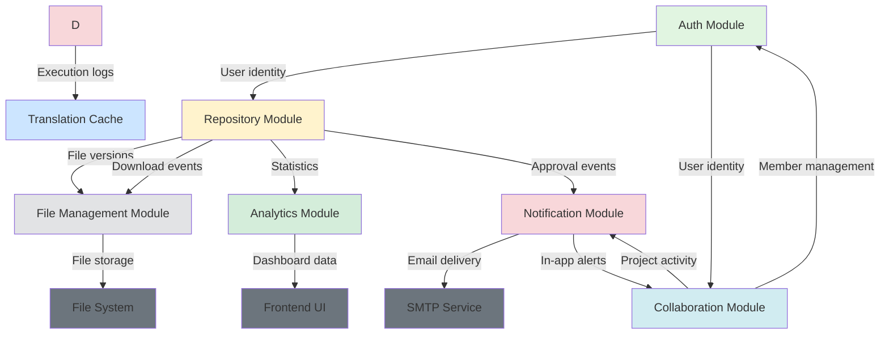

# SaliksikLab — Research Repository System

A web-based platform for managing, submitting, and reviewing academic research outputs. Built with **Django REST Framework** (backend) and **React + Vite** (frontend), using **PostgreSQL** as the database.

---

## Table of Contents

- [Features](#features)
- [Tech Stack](#tech-stack)
- [Project Structure](#project-structure)
- [Prerequisites](#prerequisites)
- [Installation & Setup](#installation--setup)
  - [Docker Setup](#docker-setup)
  - [1. Clone the Repository](#1-clone-the-repository)
  - [2. Backend Setup (Django)](#2-backend-setup-django)
  - [3. Frontend Setup (React)](#3-frontend-setup-react)
  - [4. Environment Variables](#4-environment-variables)
  - [5. Running the App](#5-running-the-app)
- [User Roles](#user-roles)
- [Version Control System](#version-control-system)
  - [How It Works](#how-it-works)
  - [User Flow](#user-flow)
  - [Version History Panel](#version-history-panel)
  - [Submitting a Revision](#submitting-a-revision)
  - [Admin Rollback](#admin-rollback)
- [Collaboration Hub](#collaboration-hub)
  - [Key Concepts](#key-concepts)
  - [Roles & Permissions](#roles--permissions)
  - [Collaboration Flow](#collaboration-flow)
  - [Projects](#projects)
  - [Issues](#issues)
  - [Merge Requests](#merge-requests)
  - [Commits](#commits)
  - [Notifications](#notifications)
- [API Overview](#api-overview)
- [File Upload Limits](#file-upload-limits)
- [Email Notifications](#email-notifications)

---

## Features

- 🔐 JWT-based authentication (login, register, password reset)
- 👤 Role-based access: **Admin**, **Faculty**, **Student**, **Researcher**
- 📂 Upload research outputs (thesis, source code, documentation, etc.)
- 🔍 Search and filter the repository by title, author, department, year, type
- ✅ Admin approval / rejection workflow with feedback
- 📜 **Version control** — submit revisions with change notes, full history preserved
- ⬇️ File download tracking with download counts
- 👁️ Inline file previewer (PDF, images, text/code files)
- 📊 Dashboard with analytics (by type, department, year)
- 📧 Email notifications for approvals, rejections, and revisions
- 🗂️ CSV export and JSON backup (admin only)
- 🤝 **Collaboration Hub** — Git/GitHub-style project spaces with Issues, Merge Requests, Commits, and in-app Notifications

---

## Tech Stack

| Layer     | Technology                                      |
|-----------|-------------------------------------------------|
| Backend   | Python 3, Django 4+, Django REST Framework      |
| Auth      | Simple JWT (`djangorestframework-simplejwt`)    |
| Frontend  | React 18, Vite 5, React Router 7                |
| Styling   | Vanilla CSS (custom design system)              |
| Database  | PostgreSQL                                      |
| File I/O  | Django `FileField`, served via `FileResponse`   |
| Icons     | Lucide React                                    |
| Toasts    | react-hot-toast                                 |

---

## Project Structure

```
SaliksikLab/
├── backend/                  # Django project
│   ├── accounts/             # User model, auth views, serializers
│   ├── config/               # Django settings, URL config
│   │   ├── settings.py
│   │   └── urls.py
│   ├── repository/           # Core app: outputs, versions, files
│   │   ├── models.py         # ResearchOutput, OutputFile, DownloadLog
│   │   ├── serializers.py    # DRF serializers
│   │   ├── views.py          # All API views
│   │   └── urls.py           # Repository endpoint routes
│   │   ├── models.py         # ExecutionLog (run history)
│   │   ├── views.py          # /execute/, /history/ endpoints
│   │   └── urls.py
│   ├── collaboration/        # Git-style collaboration engine
│   │   ├── models.py         # CollabProject, ProjectMember, Issue,
│   │   │                     # IssueComment, MergeRequest, MRComment,
│   │   │                     # Commit, Notification
│   │   ├── serializers.py
│   │   ├── views.py          # All collaboration API views
│   │   └── urls.py           # /api/collab/ routes
│   ├── media/                # Uploaded files (auto-created)
│   │   └── outputs/<id>/v<N>/<filename>
│   ├── manage.py
│   ├── requirements.txt
│   └── .env                  # Environment variables (not committed)
│
└── frontend/                 # React + Vite project
    ├── src/
    │   ├── api/              # Axios instance (axios.js)
    │   ├── components/       # Sidebar, shared UI
    │   ├── contexts/         # AuthContext, LanguageContext
    │   └── pages/            # All page components
    │       ├── LoginPage.jsx
    │       ├── RegisterPage.jsx
    │       ├── DashboardPage.jsx
    │       ├── RepositoryPage.jsx
    │       ├── DetailPage.jsx          ← version control UI
    │       ├── UploadPage.jsx
    │       ├── AdminPage.jsx
    │       ├── ProfilePage.jsx
    │       └── CollaborationPage.jsx   ← Collaboration Hub
    ├── package.json
    └── vite.config.js
```

---

## Prerequisites

Make sure the following are installed on youar machine:

- **Python** 3.10+
- **Node.js** 18+ and **npm**
- **PostgreSQL** 14+
- **Git**

---

## Installation & Setup

### Docker Setup

You can run the frontend, backend, and PostgreSQL together with Docker Compose:

```bash
docker compose up --build
```

Services:

| Service  | URL / Port                 |
|----------|----------------------------|
| Frontend | `http://localhost:3000`    |
| Backend  | `http://localhost:8080`    |
| Database | `localhost:5432`           |

The backend container automatically waits for PostgreSQL, applies migrations, and collects static files before starting Gunicorn. Uploaded media files, collected static files, PostgreSQL data, and Hugging Face model cache data are stored in Docker volumes.

To create an admin user inside the backend container:

```bash
docker compose exec backend python manage.py createsuperuser
```

To stop the containers:

```bash
docker compose down
```

To stop the containers and remove Docker volumes:

```bash
docker compose down -v
```

### 1. Clone the Repository

```bash
git clone <your-repo-url>
cd SaliksikLab
```

---

### 2. Backend Setup (Django)

```bash
# Navigate to backend
cd backend

# Create and activate a virtual environment
python3 -m venv venv
source venv/bin/activate        # On Windows: venv\Scripts\activate

# Install Python dependencies
pip install -r requirements.txt
```

#### Create the PostgreSQL Database

```sql
-- In your PostgreSQL shell (psql):
CREATE DATABASE thesis_repo;
CREATE USER postgres WITH PASSWORD 'postgres';
GRANT ALL PRIVILEGES ON DATABASE thesis_repo TO postgres;
```

#### Configure environment variables (see [Environment Variables](#4-environment-variables))

```bash
# Copy example env
cp .env.example .env
# Then edit .env with your actual DB credentials and secret key
```

#### Apply Migrations & Create Superuser

```bash
python3 manage.py migrate
python3 manage.py createsuperuser
```

When creating the superuser, you will be prompted for email, full name, and password. After creation, log into the Django admin at `http://localhost:8080/admin/` and set the user's **role** to `admin`.

---

### 3. Frontend Setup (React)

```bash
# Navigate to frontend (from project root)
cd frontend

# Install dependencies
npm install
```

---

### 4. Environment Variables

Create a `.env` file inside the `backend/` folder with the following:

```env
# Django
SECRET_KEY=your-secret-key-here
DEBUG=True
ALLOWED_HOSTS=localhost,127.0.0.1,.ngrok-free.dev,.trycloudflare.com

# CORS (must match frontend URL)
CORS_ALLOWED_ORIGINS=http://localhost:5173,http://127.0.0.1:5173
CORS_ALLOWED_ORIGIN_REGEXES=^https://.*\.ngrok-free\.dev$,^https://.*\.trycloudflare\.com$
CSRF_TRUSTED_ORIGINS=https://*.ngrok-free.dev,https://*.trycloudflare.com

# PostgreSQL
DB_NAME=thesis_repo
DB_USER=postgres
DB_PASSWORD=postgres
DB_HOST=localhost
DB_PORT=5432

# Email (optional — defaults to console output in development)
EMAIL_BACKEND=django.core.mail.backends.console.EmailBackend
EMAIL_HOST=smtp.gmail.com
EMAIL_PORT=587
EMAIL_USE_TLS=True
EMAIL_HOST_USER=your-email@gmail.com
EMAIL_HOST_PASSWORD=your-app-password
DEFAULT_FROM_EMAIL=Research Repository <noreply@repository.local>

# Frontend URL (used in password reset links)
FRONTEND_URL=http://localhost:5173
```

> **Note:** For Gmail, generate an [App Password](https://support.google.com/accounts/answer/185833) if 2FA is enabled.

---

### 5. Running the App

Open **two terminals** simultaneously:

**Terminal 1 — Django Backend:**
```bash
cd backend
source venv/bin/activate
python3 manage.py runserver 8080
```
Backend runs at: `http://localhost:8080`

**Terminal 2 — React Frontend:**
```bash
cd frontend
npm run dev
```
Frontend runs at: `http://localhost:5173`

Open your browser and go to **http://localhost:5173**.

---

## User Roles

| Role         | Permissions                                                                              |
|--------------|------------------------------------------------------------------------------------------|
| `student`    | Upload outputs, revise own submissions, browse approved outputs, collaborate |
| `researcher` | Same as student — intended for active research staff                                     |
| `faculty`    | Same as student — can act as advisers on submissions                                     |
| `admin`      | All of the above + approve/reject, rollback versions, export data, manage all users      |

> New registrations default to `student`. Admins must manually promote users via the Admin Panel.

---

## Version Control System

SaliksikLab includes a built-in version control system for research submissions. Every file upload is versioned, and users can submit revisions while admins maintain full history with rollback capability.

---

### How It Works

Every research output has a **parent record** (`ResearchOutput`) that holds metadata, and one or more **versioned file records** (`OutputFile`) attached to it:

```
ResearchOutput (id=5, title="My Thesis")
  └── OutputFile  version=1  [thesis_draft.pdf]      ← initial upload
  └── OutputFile  version=2  [thesis_revised.pdf]    ← after revision
  └── OutputFile  version=3  [thesis_final.pdf]      ← after another revision
```

Files are stored on disk at:
```
media/outputs/<output_id>/v<version_number>/<filename>
```

---

### User Flow

```
┌──────────────────────────────────────────────────────────────┐
│   User uploads → v1 created → Status: Pending Review        │
│         ↓                                                    │
│   Admin reviews → Approve ✅  or  Reject ❌                  │
│         ↓                                                    │
│   User revises → v2 created → Status resets: Pending Review │
│         ↓         (email sent to all admins)                 │
│   Admin re-reviews → Approve ✅  or  Reject ❌               │
└──────────────────────────────────────────────────────────────┘
```

Key behaviors:
- **Submitting a revision always resets the approval status to Pending Review**, regardless of whether it was previously approved or rejected.
- **All previous versions are preserved** and remain downloadable/viewable.
- **Admin email notifications** are sent whenever a revision is submitted.
- **Metadata can be updated** during revision (title, abstract, author, keywords, etc.).

---

### Version History Panel

On a submission's detail page, the right sidebar shows the full version history:

```
🔄 Version History              [3 versions]

┌─────────────────────────────────────────────┐
│ v3  [Current]                               │
│ thesis_final.pdf                            │
│ 1.4 MB · Mar 2, 2026 · Juan dela Cruz      │
│ ┊ Revised conclusion and references         │
│                               [👁️]  [⬇️]   │
└─────────────────────────────────────────────┘
  v2
  thesis_revised.pdf
  1.2 MB · Feb 28, 2026 · Juan dela Cruz
  ┊ Fixed methodology section
                         [👁️]  [⬇️]  [↩ Rollback]

  v1
  thesis_draft.pdf
  0.9 MB · Feb 26, 2026
                         [👁️]  [⬇️]  [↩ Rollback]
```

- The **latest version** is always shown first with a green **[Current]** badge.
- Each version shows its filename, file size, upload date, uploader name, and change notes.
- **👁️ View** — opens the file inline (PDF viewer, image viewer, or text viewer).
- **⬇️ Download** — downloads that specific version's file.
- **↩ Rollback** — visible to admins only on older versions (see below).

---

### Submitting a Revision

Only the **submission owner** or an **admin** can submit a revision. From the detail page:

1. Click the **🔄 Revise** button in the page header.
2. An inline form expands below the metadata card:

```
┌─── Submit Revision ────────────────────────────────────────┐
│                                                            │
│  ⚠ Submitting a revision will reset the approval          │
│    status to Pending Review.                               │
│                                                            │
│  New File *         [Choose File...]                       │
│                                                            │
│  Change Notes                                              │
│  ┌──────────────────────────────────────────────────────┐ │
│  │ Describe what changed in this revision…              │ │
│  └──────────────────────────────────────────────────────┘ │
│                                                            │
│  ▶ Update Metadata (optional)                              │
│    ├─ Title                                                │
│    ├─ Author(s) / Adviser                                  │
│    ├─ Department / Course                                  │
│    ├─ Abstract                                             │
│    ├─ Co-Authors                                           │
│    └─ Keywords                                             │
│                                                            │
│  [Submit Revision]    [Cancel]                             │
└────────────────────────────────────────────────────────────┘
```

3. After submission:
   - The version number increments (e.g., v2 → v3).
   - The status badge on the detail page changes to **🕐 Pending Review**.
   - A success toast appears: *"Revision v3 uploaded! Status reset to Pending Review."*
   - All admin users receive an email notification.

---

### Admin Rollback

Admins can revert a submission to any earlier version:

1. Navigate to the submission's detail page.
2. In the **Version History** panel, click **↩ Rollback** on an older version.
3. A confirmation dialog appears:
   > *"Rollback to version 1? All newer versions will be permanently deleted."*
4. If confirmed:
   - All `OutputFile` records with a version number **greater than** the target are deleted.
   - The corresponding files on disk are also permanently removed.
   - The version history refreshes to show the rolled-back state.

> ⚠️ **Rollback is irreversible.** Deleted versions and their files cannot be recovered.

---

## API Overview

All endpoints are prefixed with `/api/`.

### Auth (`/api/auth/`)

| Method | Endpoint              | Description                   |
|--------|-----------------------|-------------------------------|
| POST   | `/auth/register/`     | Register a new user           |
| POST   | `/auth/login/`        | Login, returns JWT tokens     |
| POST   | `/auth/refresh/`      | Refresh access token          |
| GET    | `/auth/me/`           | Get current user profile      |
| PATCH  | `/auth/me/`           | Update profile / password     |
| POST   | `/auth/forgot-password/`  | Send password reset email |
| POST   | `/auth/reset-password/`   | Complete password reset   |

### Repository (`/api/repository/`)

| Method | Endpoint                            | Description                              |
|--------|-------------------------------------|------------------------------------------|
| GET    | `/repository/`                      | List research outputs                    |
| POST   | `/repository/`                      | Upload a new output                      |
| GET    | `/repository/<id>/`                 | Get full details of an output            |
| PATCH  | `/repository/<id>/`                 | Update output metadata                   |
| DELETE | `/repository/<id>/`                 | Soft-delete an output                    |
| POST   | `/repository/<id>/approve/`         | Approve or reject (admin only)           |
| GET    | `/repository/<id>/download/`        | Download latest version                  |
| GET    | `/repository/<id>/download/<fid>/`  | Download a specific version              |
| GET    | `/repository/<id>/preview/`         | Preview latest version inline            |
| GET    | `/repository/<id>/preview/<fid>/`   | Preview a specific version inline        |
| POST   | `/repository/<id>/revise/`          | Submit a new revision                    |
| GET    | `/repository/<id>/versions/`        | List all versions                        |
| POST   | `/repository/<id>/rollback/`        | Rollback to a version (admin only)       |
| GET    | `/repository/stats/`                | Dashboard analytics                      |
| GET    | `/repository/export/csv/`           | CSV export (admin only)                  |
| GET    | `/repository/backup/`               | JSON export (admin only)                 |

---

## File Upload Limits

| Setting                  | Value   |
|--------------------------|---------|
| Maximum file size        | 100 MB  |
| Allowed extensions       | `.pdf`, `.doc`, `.docx`, `.txt`, `.zip`, `.tar`, `.gz`, `.rar`, `.py`, `.js`, `.ts`, `.java`, `.c`, `.cpp`, `.h`, `.cs`, `.php`, `.rb`, `.html`, `.css`, `.json`, `.xml`, `.yaml`, `.yml`, `.md`, `.png`, `.jpg`, `.jpeg`, `.gif`, `.svg` |

---

## Email Notifications

The system sends email notifications for the following events:

| Event                   | Recipient        |
|-------------------------|------------------|
| Submission approved     | Submission owner |
| Submission rejected     | Submission owner |
| Revision submitted      | All admin users  |
| Password reset request  | Requesting user  |

In **development**, emails are printed to the Django console by default (`EMAIL_BACKEND=django.core.mail.backends.console.EmailBackend`). To send real emails, configure SMTP settings in your `.env` file.

---

## Collaboration Hub

The Collaboration Hub provides a **Git / GitHub-style research project workspace** for students, researchers, and faculty. It is accessible at `/collaborate` in the sidebar.

Every user can create and participate in multiple Collaboration Projects — shared spaces where teams manage tasks, propose changes, track file contributions, and communicate, all within SaliksikLab.

---

### Key Concepts

| Concept           | Description                                                                          | GitHub Equivalent   |
|-------------------|--------------------------------------------------------------------------------------|---------------------|
| **Project**       | A shared research workspace owned by one user                                        | Repository          |
| **Member**        | A user invited to a project with a specific role                                     | Collaborator        |
| **Issue**         | A task, bug report, or discussion thread tied to a project                           | GitHub Issue        |
| **Merge Request** | A proposal to incorporate a change or file revision into the project                 | Pull Request        |
| **Commit**        | A version snapshot or contribution pushed to a project (with a simulated SHA)        | Git Commit          |
| **Notification**  | An in-app alert triggered by team activity (new issue, MR opened, merge, etc.)       | GitHub Notification |

---

### Roles & Permissions

| Role            | Create Issues | Create MRs | Push Commits | Merge/Close MRs | Invite Members | Archive Project |
|-----------------|:---:|:---:|:---:|:---:|:---:|:---:|
| **Owner**       | ✅  | ✅  | ✅  | ✅  | ✅  | ✅  |
| **Contributor** | ✅  | ✅  | ✅  | ✅  | ❌  | ❌  |
| **Viewer**      | ❌  | ❌  | ❌  | ❌  | ❌  | ❌  |

---

### Collaboration Flow

```
┌───────────────────────────────────────────────────────────────────┐
│  OWNER creates a Project                                           │
│    └─ Auto-added as first member with role: owner                  │
│         ↓                                                          │
│  OWNER invites team members by email                               │
│    └─ Assigns role: contributor or viewer                          │
│    └─ Invitee receives in-app notification: "You were added to X" │
│         ↓                                                          │
│  Team works collaboratively:                                       │
│                                                                    │
│   📋 Issues                                                        │
│    └─ Any contributor opens an Issue (title, description, label)   │
│    └─ Status cycles: Open → In Progress → Closed                   │
│    └─ Teammates comment in a threaded discussion                   │
│    └─ All members notified on open / close / comment               │
│                                                                    │
│   🔀 Merge Requests                                                │
│    └─ Contributor opens an MR proposing a change or revision       │
│    └─ Reviewers leave comments on the MR thread                    │
│    └─ Owner or contributor clicks Merge →                          │
│         • MR status → "merged"                                     │
│         • A Commit record is auto-created with a simulated SHA     │
│         • All members notified: "🎉 MR #N merged"                  │
│    └─ Alternatively, MR can be Closed without merging              │
│                                                                    │
│   📦 Commits                                                       │
│    └─ Contributors push commits manually (message + description)   │
│    └─ Each commit gets a SHA-1 hash (simulated, unique)            │
│    └─ Commit log displayed in chronological timeline               │
│    └─ All members notified on each push                            │
│                                                                    │
│   🔔 Notifications                                                 │
│    └─ Bell icon in top-right shows unread count badge              │
│    └─ Slide-out panel lists all recent activity                    │
│    └─ "Mark all read" clears the badge                             │
└───────────────────────────────────────────────────────────────────┘
```

---

### Projects

From the Collaboration Hub home screen:

1. Click **New Project** to create a workspace.
2. Give it a **name** and optional **description**.
3. The project card displays live stats:
   - 👥 Member count
   - 🔴 Open issues
   - 🔀 Open merge requests
   - 📦 Total commits
4. Click a project card to enter the project's detail view with four inner tabs: **Issues**, **Merge Requests**, **Commits**, **Members**.

---

### Issues

Issues are the primary way to track tasks, bugs, and discussions within a project.

**Opening an issue:**
1. Select the **Issues** tab inside a project.
2. Use the status filter bar to switch between **Open**, **In Progress**, and **Closed**.
3. Click **New Issue** and fill in:
   - **Title** (required)
   - **Description** (optional, supports free text)
   - **Label**: `bug` · `feature` · `discussion` · `question` · `documentation`
4. Submit — the issue number increments automatically (e.g., `#1`, `#2`, …).
5. Click an issue row to open the detail view with full description and comment thread.

**Managing an issue:**
- Click **Mark In Progress** to move it to `in_progress`.
- Click **Close Issue** to mark it `closed` (sets `closed_at` timestamp).
- Click **Reopen** to move a closed issue back to `open`.
- Any member can post comments; all members are notified.

---

### Merge Requests

Merge Requests (MRs) represent proposed changes — a revised chapter, updated source code, or any contribution that needs team review before acceptance.

**Opening an MR:**
1. Select the **Merge Requests** tab.
2. Filter by **Open**, **Merged**, or **Closed**.
3. Click **New MR** and fill in:
   - **Title** (required)
   - **Description** (what changes does this include?)
4. Submit — MR number increments automatically (e.g., `!1`, `!2`, …).

**Review & merge:**
1. Click an MR row to view its detail.
2. Reviewers post comments in the review thread.
3. Click **Merge** to merge the MR:
   - MR status → `merged`
   - `merged_at` timestamp is recorded
   - A **Commit** is auto-created in the commit log (message: `Merge MR #N: <title>`)
   - All members receive a 🎉 notification
4. Click **Close MR** to reject without merging — status → `closed`.

---

### Commits

Commits represent versioned contributions pushed to the project. Each commit has:
- A **unique SHA-1 hash** (7-character short form displayed in the UI)
- A **commit message** (required)
- An optional **description**
- The **author** (the user who pushed it)
- A **timestamp**

Commits are displayed in a **vertical timeline** (most recent first). Commits generated automatically by merge operations are labelled `Merge MR #N: <title>`.

**Manual commit:**
1. Select the **Commits** tab.
2. Click **New Commit**.
3. Enter a message and optional description.
4. Submit — a SHA is auto-generated and saved; all members are notified.

---

### Notifications

The bell icon (🔔) in the Collaboration Hub header shows an **unread count badge**.

| Event             | Notification Message                                      |
|-------------------|-----------------------------------------------------------|
| Member added      | `<Actor> added you to "<Project>"`                        |
| Issue opened      | `<Actor> opened issue #N: <title>`                        |
| Issue closed      | `<Actor> closed issue #N: <title>`                        |
| Issue comment     | `<Actor> commented on issue #N`                           |
| MR opened         | `<Actor> opened MR #N: <title>`                           |
| MR merged         | `<Actor> merged MR #N: <title>`                           |
| MR closed         | `<Actor> closed MR #N: <title>`                           |
| MR comment        | `<Actor> reviewed MR #N`                                  |
| Commit pushed     | `<Actor> pushed commit: <message>`                        |

Notifications are **not** sent to the actor who triggered the event. Click **Mark all read** to clear the badge.

### Collaboration API

All endpoints are under `/api/collab/` and require JWT authentication.

| Method | Endpoint                                              | Description                              |
|--------|-------------------------------------------------------|------------------------------------------|
| GET    | `/collab/projects/`                                   | List projects the user is a member of    |
| POST   | `/collab/projects/`                                   | Create a new project                     |
| GET    | `/collab/projects/<id>/`                              | Project details                          |
| PATCH  | `/collab/projects/<id>/`                              | Update project (owner only)              |
| DELETE | `/collab/projects/<id>/`                              | Delete project (owner only)              |
| GET    | `/collab/projects/<id>/members/`                      | List members                             |
| POST   | `/collab/projects/<id>/members/`                      | Invite member by email                   |
| DELETE | `/collab/projects/<id>/members/<mid>/`                | Remove a member                          |
| GET    | `/collab/projects/<id>/issues/`                       | List issues (filterable by status)       |
| POST   | `/collab/projects/<id>/issues/`                       | Open a new issue                         |
| GET    | `/collab/projects/<id>/issues/<number>/`              | Issue detail + comments                  |
| PATCH  | `/collab/projects/<id>/issues/<number>/`              | Update issue status / fields             |
| POST   | `/collab/projects/<id>/issues/<number>/comments/`     | Post a comment on an issue               |
| GET    | `/collab/projects/<id>/mrs/`                          | List merge requests                      |
| POST   | `/collab/projects/<id>/mrs/`                          | Open a new MR                            |
| GET    | `/collab/projects/<id>/mrs/<number>/`                 | MR detail + comments                     |
| PATCH  | `/collab/projects/<id>/mrs/<number>/`                 | Merge or close an MR                     |
| POST   | `/collab/projects/<id>/mrs/<number>/comments/`        | Post a review comment on an MR           |
| GET    | `/collab/projects/<id>/commits/`                      | List commits (newest first)              |
| POST   | `/collab/projects/<id>/commits/`                      | Push a new commit                        |
| GET    | `/collab/notifications/`                              | Get current user's notifications         |
| POST   | `/collab/notifications/read/`                         | Mark notifications as read               |
| GET    | `/collab/users/search/?q=<email>`                     | Search users by email (for inviting)     |

---

## License

This project is for academic use. All research outputs uploaded to this system remain the intellectual property of their respective authors.

---

## Security & Data Privacy

SaliksikLab employs multiple layers of security measures to protect user information, maintain data integrity, and ensure privacy compliance. This section details the security protocols, access control mechanisms, and data protection strategies implemented in the system.

### Security Architecture Overview

```
┌─────────────────────────────────────────────────────────────┐
│                    Security Layers                           │
├─────────────────────────────────────────────────────────────┤
│  Layer 1: Transport Security (HTTPS/SSL)                     │
│  Layer 2: Authentication (JWT Tokens)                        │
│  Layer 3: Authorization (Role-Based Access Control)          │
│  Layer 4: Input Validation & Sanitization                    │
│  Layer 5: Data Encryption & Storage Security                 │
│  Layer 6: Application Security (CORS, CSRF, XSS Protection)  │
└─────────────────────────────────────────────────────────────┘
```

---

### 1. User Authentication

#### JWT-Based Authentication

SaliksikLab uses **JSON Web Tokens (JWT)** for stateless, secure user authentication via the `djangorestframework-simplejwt` package.

**How It Works:**

```
┌──────────────────────────────────────────────────────────────┐
│                    JWT Authentication Flow                    │
├──────────────────────────────────────────────────────────────┤
│                                                               │
│  1. Login Request                                             │
│     POST /api/auth/login/                                     │
│     Body: { "email": "user@example.com", "password": "..." }  │
│                        ↓                                      │
│  2. Server Validation                                         │
│     • Verify credentials against database                     │
│     • Check account status (active, approved)                 │
│     • Generate access token (5 min expiry)                    │
│     • Generate refresh token (7 day expiry)                   │
│                        ↓                                      │
│  3. Response                                                  │
│     {                                                         │
│       "access": "eyJhbGciOiJIUzI1NiIs...",                    │
│       "refresh": "eyJhbGciOiJIUzI1NiIs...",                   │
│       "user": { "id": "...", "email": "...", "role": "..." }  │
│     }                                                         │
│                        ↓                                      │
│  4. Subsequent Requests                                       │
│     Header: Authorization: Bearer <access_token>              │
│                        ↓                                      │
│  5. Token Refresh (when access expires)                       │
│     POST /api/auth/refresh/                                   │
│     Body: { "refresh": "<refresh_token>" }                    │
│                                                               │
└──────────────────────────────────────────────────────────────┘
```

**Token Security Features:**

| Feature | Description |
|---------|-------------|
| **Short-lived access tokens** | 5-minute expiry minimizes exposure window |
| **Separate refresh tokens** | 7-day expiry with secure storage |
| **Token signing** | HMAC-SHA256 algorithm prevents tampering |
| **Unique token IDs (jti)** | Each token has a unique identifier for revocation |
| **Automatic token rotation** | New refresh token issued on each refresh |
| **Blacklist support** | Compromised tokens can be invalidated |

**Password Security:**

- **Hashing**: Passwords are hashed using Django's built-in `PBKDF2` algorithm with SHA256
- **Salt**: Unique salt generated per user
- **Iterations**: 600,000 iterations (Django 4.2 default)
- **No plaintext storage**: Passwords are never stored or logged in plaintext
- **Strength validation**: Minimum 8 characters with complexity requirements

**Password Reset Workflow:**

```
1. User requests reset → POST /api/auth/forgot-password/
2. System generates UUID token → Stores in PasswordResetToken table
3. Email sent with reset link → https://frontend/reset-password/<uuid>/
4. User submits new password → POST /api/auth/reset-password/
5. Token validated and marked as used → One-time use only
6. Password updated → Old sessions invalidated
```

---

### 2. Role-Based Access Control (RBAC)

#### User Roles and Permissions

SaliksikLab implements a **four-tier role-based access control** system to ensure users can only access resources and perform actions appropriate to their role.

| Role | Description | Permissions |
|------|-------------|-------------|
| **Admin** | System administrators | Full access: approve/reject outputs, manage users, export data, rollback versions, manage all projects |
| **Faculty** | Faculty members | Upload, revise own outputs, browse approved outputs, create/join collaboration projects |
| **Researcher** | Research staff | Same as Faculty — intended for non-teaching research personnel |
| **Student** | Students | Upload, revise own outputs, browse approved outputs, create/join collaboration projects |

#### Permission Matrix

```
┌─────────────────────────────────────────────────────────────────────────┐
│                        Permission Matrix                                 │
├──────────────────────────┬─────────┬────────────┬──────────┬────────────┤
│ Action                   │ Student │ Researcher │ Faculty  │ Admin      │
├──────────────────────────┼─────────┼────────────┼──────────┼────────────┤
│ View approved outputs    │    ✅   │     ✅     │    ✅    │     ✅     │
│ Upload new output        │    ✅   │     ✅     │    ✅    │     ✅     │
│ Edit own output metadata │    ✅   │     ✅     │    ✅    │     ✅     │
│ Revise own output        │    ✅   │     ✅     │    ✅    │     ✅     │
│ Delete own output        │    ✅   │     ✅     │    ✅    │     ✅     │
│ Approve/reject outputs   │    ❌   │     ❌     │    ❌    │     ✅     │
│ Rollback versions        │    ❌   │     ❌     │    ❌    │     ✅     │
│ Export data (CSV/JSON)   │    ❌   │     ❌     │    ❌    │     ✅     │
│ Manage users             │    ❌   │     ❌     │    ❌    │     ✅     │
│ Create collaboration     │    ✅   │     ✅     │    ✅    │     ✅     │
│ Manage all projects      │    ❌   │     ❌     │    ❌    │     ✅     │
│ View pending outputs     │    ❌   │     ❌     │    ❌    │     ✅     │
│ Download any output      │    ✅   │     ✅     │    ✅    │     ✅     │
│ Download pending output  │    ❌   │     ❌     │    ❌    │     ✅     │
└──────────────────────────┴─────────┴────────────┴──────────┴────────────┘
```

#### Implementation

**Backend Permission Classes:**

```python
# Custom permission classes in Django REST Framework

from rest_framework.permissions import BasePermission

class IsAdmin(BasePermission):
    """Allow access only to admin users."""
    def has_permission(self, request, view):
        return request.user and request.user.role == 'admin'

class IsOwnerOrAdmin(BasePermission):
    """Allow access only to the owner or admin users."""
    def has_object_permission(self, request, view, obj):
        return obj.uploaded_by == request.user or request.user.role == 'admin'

class IsAuthenticatedOrReadOnly(BasePermission):
    """Allow read access to anyone, write access to authenticated users."""
    def has_permission(self, request, view):
        if request.method in SAFE_METHODS:
            return True
        return request.user and request.user.is_authenticated
```

**Frontend Route Protection:**

```javascript
// Protected route component in React

import { Navigate } from 'react-router-dom'
import { useAuth } from '../contexts/AuthContext'

function AdminRoute({ children }) {
    const { user } = useAuth()
    
    if (!user) {
        return <Navigate to="/login" replace />
    }
    
    if (user.role !== 'admin') {
        return <Navigate to="/dashboard" replace />
    }
    
    return children
}
```

---

### 3. Data Protection & Privacy

#### Data Encryption

| Data Type | Encryption Method | Storage |
|-----------|-------------------|---------|
| Passwords | PBKDF2 with SHA256 (600,000 iterations) | Database (hashed) |
| JWT Tokens | HMAC-SHA256 signing | Client memory (not localStorage) |
| Database at Rest | PostgreSQL encryption (optional) | Disk |
| File Uploads | Filesystem permissions | `media/outputs/` directory |
| Email Transmission | TLS (STARTTLS) | SMTP transport |

#### Personal Data Handling

**Data Collected:**

| Data Type | Purpose | Retention |
|-----------|---------|-----------|
| Email address | Authentication, notifications | Until account deletion |
| Full name | User identification, attribution | Until account deletion |
| Department/Course | Categorization, filtering | Until account deletion |
| Uploaded research outputs | Repository storage | Permanent (academic record) |
| Download logs | Analytics, tracking | 2 years |
| Code execution history | User convenience, debugging | 90 days |
| Collaboration activity | Project management | Permanent (project history) |

**Privacy Measures:**

- **Data minimization**: Only necessary data is collected
- **Purpose limitation**: Data used only for stated purposes
- **User consent**: Registration implies consent to data processing
- **Right to access**: Users can view their own data via profile page
- **Right to deletion**: Account deletion removes personal data (research outputs retained as institutional record)
- **No third-party sharing**: Data not shared with external parties

#### File Upload Security

```
┌──────────────────────────────────────────────────────────────┐
│                    File Upload Validation                     │
├──────────────────────────────────────────────────────────────┤
│                                                               │
│  1. Client-side Validation                                    │
│     • Check file size (< 100 MB)                              │
│     • Check file extension                                    │
│                        ↓                                      │
│  2. Server-side Validation                                    │
│     • Verify MIME type                                        │
│     • Re-check file size                                      │
│     • Validate extension against whitelist                    │
│     • Scan for malicious content (optional ClamAV)            │
│                        ↓                                      │
│  3. File Processing                                           │
│     • Generate unique filename                                │
│     • Store in isolated directory: outputs/<id>/v<N>/         │
│     • Set file permissions: 644 (owner RW, group/other R)     │
│                        ↓                                      │
│  4. Database Record                                           │
│     • Create OutputFile record                                │
│     • Link to ResearchOutput                                  │
│     • Track uploader, timestamp, version                      │
│                                                               │
└──────────────────────────────────────────────────────────────┘
```

**Allowed File Extensions:**

```
Documents: .pdf, .doc, .docx, .txt, .md
Archives:  .zip, .tar, .gz, .rar
Code:      .py, .js, .ts, .java, .c, .cpp, .h, .cs, .php, .rb
Web:       .html, .css, .json, .xml, .yaml, .yml
Images:    .png, .jpg, .jpeg, .gif, .svg
```

**File Size Limits:**

- Maximum upload size: **100 MB** per file
- Configured in Django settings: `DATA_UPLOAD_MAX_MEMORY_SIZE`
- Enforced at both nginx and application level

---

### 4. Application Security

#### CORS (Cross-Origin Resource Sharing)

```python
# config/settings.py

CORS_ALLOWED_ORIGINS = [
    "http://localhost:5173",   # Development frontend
    "https://yourdomain.com",   # Production frontend
]

CORS_ALLOW_CREDENTIALS = True

CORS_ALLOW_HEADERS = [
    'accept',
    'accept-encoding',
    'authorization',
    'content-type',
    'dnt',
    'origin',
    'user-agent',
    'x-csrftoken',
    'x-requested-with',
]
```

#### CSRF Protection

- **JWT in headers**: Tokens sent via `Authorization: Bearer <token>` header (not cookies)
- **CSRF tokens**: Django's built-in CSRF protection enabled for session-based auth
- **SameSite cookies**: If cookies used, `SameSite=Lax` attribute set

#### XSS (Cross-Site Scripting) Prevention

| Measure | Implementation |
|---------|----------------|
| React auto-escaping | All user input rendered as text (not HTML) |
| Content Security Policy | CSP headers restrict script sources |
| Input sanitization | User input sanitized on server side |
| Output encoding | Special characters escaped in responses |
| HTTP-only cookies | Session cookies marked `HttpOnly` |

#### SQL Injection Prevention

- **Django ORM**: All database queries use parameterized queries
- **No raw SQL**: Raw SQL queries avoided; when necessary, use parameterized statements
- **Input validation**: DRF serializers validate and sanitize all input

#### Rate Limiting & Throttling

```python
# config/settings.py

REST_FRAMEWORK = {
    'DEFAULT_THROTTLE_CLASSES': [
        'rest_framework.throttling.AnonRateThrottle',
        'rest_framework.throttling.UserRateThrottle',
    ],
    'DEFAULT_THROTTLE_RATES': {
        'anon': '100/hour',          # Anonymous users
        'user': '1000/hour',         # Authenticated users
        'login': '10/minute',        # Login attempts
        'upload': '20/hour',         # File uploads
        'code_execute': '30/hour',   # Code execution
        'register': '5/hour',        # Registration attempts
    }
}
```

**Rate Limit Response:**

```json
{
    "detail": "Request was throttled. Expected available in 45 seconds."
}
```

#### Security Headers

```python
# config/settings.py

SECURE_BROWSER_XSS_FILTER = True          # X-XSS-Protection header
SECURE_CONTENT_TYPE_NOSNIFF = True        # X-Content-Type-Options header
X_FRAME_OPTIONS = 'DENY'                  # Prevent clickjacking
SECURE_HSTS_SECONDS = 31536000            # HSTS (1 year)
SECURE_HSTS_INCLUDE_SUBDOMAINS = True
SECURE_HSTS_PRELOAD = True
```

---


### 6. Data Integrity

#### Database Constraints

```sql
-- Unique constraints
ALTER TABLE accounts_user ADD CONSTRAINT unique_email UNIQUE (email);
ALTER TABLE collaboration_projectmember ADD CONSTRAINT unique_membership UNIQUE (project_id, user_id);

-- Foreign key constraints (cascade deletes where appropriate)
ALTER TABLE repository_researchoutput 
    ADD CONSTRAINT fk_uploaded_by 
    FOREIGN KEY (uploaded_by_id) REFERENCES accounts_user(id) ON DELETE SET NULL;

-- Check constraints
ALTER TABLE repository_researchoutput 
    ADD CONSTRAINT check_year 
    CHECK (year >= 1900 AND year <= 2030);

-- Not null constraints
ALTER TABLE repository_researchoutput 
    ALTER COLUMN title SET NOT NULL;
```

#### Soft Deletes

Research outputs are **soft-deleted** (marked with `is_deleted=True`) rather than permanently removed:

- Preserves academic record integrity
- Allows admins to restore accidentally deleted items
- Maintains referential integrity with download logs, versions, etc.

#### Audit Trail

| Action | Logged | Details |
|--------|--------|---------|
| User login | ✅ | Timestamp, IP address (future) |
| File upload | ✅ | User, output ID, timestamp, file size |
| File download | ✅ | User, output ID, timestamp, version |
| Approval/rejection | ✅ | Admin, output ID, decision, reason |
| Version rollback | ✅ | Admin, output ID, target version |
| Password change | ✅ | User, timestamp |
| Account creation | ✅ | Email, role, timestamp |

---

### 7. Security Best Practices for Deployment

#### Production Checklist

```
□ Change SECRET_KEY to a unique, random value
□ Set DEBUG = False
□ Configure ALLOWED_HOSTS with production domain
□ Enable HTTPS with valid SSL certificate
□ Configure production database (PostgreSQL)
□ Set up database backups (daily)
□ Configure SMTP for email notifications
□ Set up logging and monitoring (Sentry, LogRocket)
□ Enable rate limiting
□ Configure CORS for production domain only
□ Set up firewall rules (only ports 80, 443, 5432)
□ Use environment variables for all secrets
□ Disable directory listing on web server
□ Set up automated security updates
□ Conduct regular security audits
```

#### Environment Variables (Never Commit to Git)

```bash
# .env file (gitignored)
SECRET_KEY=<generate-with-django-admin-startproject>
DEBUG=False
DB_PASSWORD=<strong-password>
EMAIL_HOST_PASSWORD=<app-password>
JWT_SIGNING_KEY=<optional-custom-key>
```

#### Nginx Security Configuration

```nginx
server {
    listen 443 ssl http2;
    
    # SSL configuration
    ssl_certificate /etc/letsencrypt/live/yourdomain.com/fullchain.pem;
    ssl_certificate_key /etc/letsencrypt/live/yourdomain.com/privkey.pem;
    ssl_protocols TLSv1.2 TLSv1.3;
    ssl_ciphers HIGH:!aNULL:!MD5;
    
    # Security headers
    add_header X-Frame-Options "DENY" always;
    add_header X-Content-Type-Options "nosniff" always;
    add_header X-XSS-Protection "1; mode=block" always;
    add_header Strict-Transport-Security "max-age=31536000" always;
    
    # Limit file upload size
    client_max_body_size 100M;
    
    # Hide nginx version
    server_tokens off;
    
    location / {
        proxy_pass http://127.0.0.1:8080;
        proxy_set_header Host $host;
        proxy_set_header X-Real-IP $remote_addr;
        proxy_set_header X-Forwarded-For $proxy_add_x_forwarded_for;
        proxy_set_header X-Forwarded-Proto $scheme;
    }
}
```

---

### 8. Vulnerability Reporting

If you discover a security vulnerability in SaliksikLab, please report it responsibly:

1. **Do not** create a public GitHub issue
2. Email the maintainers at `[security-email-placeholder]`
3. Provide detailed steps to reproduce the vulnerability
4. Allow time for a fix before public disclosure

---

### 9. Compliance & Standards

SaliksikLab follows industry-standard security practices:

| Standard | Compliance |
|----------|------------|
| **OWASP Top 10** | Protected against common web vulnerabilities |
| **GDPR Principles** | Data minimization, purpose limitation, user rights |
| **NIST Cybersecurity Framework** | Identify, Protect, Detect, Respond, Recover |
| **ACM Code of Ethics** | Protecting user privacy and data integrity |

---

*Security is an ongoing process. Regular updates, security audits, and community feedback help maintain the integrity and safety of the SaliksikLab platform.*

---

## Security & Data Privacy

SaliksikLab employs multiple layers of security measures to protect user information, maintain data integrity, and ensure privacy compliance. This section details the security protocols, access control mechanisms, and data protection strategies implemented in the system.

### Security Architecture Overview

```
┌─────────────────────────────────────────────────────────────┐
│                    Security Layers                           │
├─────────────────────────────────────────────────────────────┤
│  Layer 1: Transport Security (HTTPS/SSL)                     │
│  Layer 2: Authentication (JWT Tokens)                        │
│  Layer 3: Authorization (Role-Based Access Control)          │
│  Layer 4: Input Validation & Sanitization                    │
│  Layer 5: Data Encryption & Storage Security                 │
│  Layer 6: Application Security (CORS, CSRF, XSS Protection)  │
└─────────────────────────────────────────────────────────────┘
```

---

### 1. User Authentication

#### JWT-Based Authentication

SaliksikLab uses **JSON Web Tokens (JWT)** for stateless, secure user authentication via the `djangorestframework-simplejwt` package.

**How It Works:**

```
┌──────────────────────────────────────────────────────────────┐
│                    JWT Authentication Flow                    │
├──────────────────────────────────────────────────────────────┤
│                                                               │
│  1. Login Request                                             │
│     POST /api/auth/login/                                     │
│     Body: { "email": "user@example.com", "password": "..." }  │
│                        ↓                                      │
│  2. Server Validation                                         │
│     • Verify credentials against database                     │
│     • Check account status (active, approved)                 │
│     • Generate access token (5 min expiry)                    │
│     • Generate refresh token (7 day expiry)                   │
│                        ↓                                      │
│  3. Response                                                  │
│     {                                                         │
│       "access": "eyJhbGciOiJIUzI1NiIs...",                    │
│       "refresh": "eyJhbGciOiJIUzI1NiIs...",                   │
│       "user": { "id": "...", "email": "...", "role": "..." }  │
│     }                                                         │
│                        ↓                                      │
│  4. Subsequent Requests                                       │
│     Header: Authorization: Bearer <access_token>              │
│                        ↓                                      │
│  5. Token Refresh (when access expires)                       │
│     POST /api/auth/refresh/                                   │
│     Body: { "refresh": "<refresh_token>" }                    │
│                                                               │
└──────────────────────────────────────────────────────────────┘
```

**Token Security Features:**

| Feature | Description |
|---------|-------------|
| **Short-lived access tokens** | 5-minute expiry minimizes exposure window |
| **Separate refresh tokens** | 7-day expiry with secure storage |
| **Token signing** | HMAC-SHA256 algorithm prevents tampering |
| **Unique token IDs (jti)** | Each token has a unique identifier for revocation |
| **Automatic token rotation** | New refresh token issued on each refresh |
| **Blacklist support** | Compromised tokens can be invalidated |

**Password Security:**

- **Hashing**: Passwords are hashed using Django's built-in `PBKDF2` algorithm with SHA256
- **Salt**: Unique salt generated per user
- **Iterations**: 600,000 iterations (Django 4.2 default)
- **No plaintext storage**: Passwords are never stored or logged in plaintext
- **Strength validation**: Minimum 8 characters with complexity requirements

**Password Reset Workflow:**

```
1. User requests reset → POST /api/auth/forgot-password/
2. System generates UUID token → Stores in PasswordResetToken table
3. Email sent with reset link → https://frontend/reset-password/<uuid>/
4. User submits new password → POST /api/auth/reset-password/
5. Token validated and marked as used → One-time use only
6. Password updated → Old sessions invalidated
```

---

### 2. Role-Based Access Control (RBAC)

#### User Roles and Permissions

SaliksikLab implements a **four-tier role-based access control** system to ensure users can only access resources and perform actions appropriate to their role.

| Role | Description | Permissions |
|------|-------------|-------------|
| **Admin** | System administrators | Full access: approve/reject outputs, manage users, export data, rollback versions, manage all projects |
| **Faculty** | Faculty members | Upload, revise own outputs, browse approved outputs, create/join collaboration projects |
| **Researcher** | Research staff | Same as Faculty — intended for non-teaching research personnel |
| **Student** | Students | Upload, revise own outputs, browse approved outputs, create/join collaboration projects |

#### Permission Matrix

```
┌─────────────────────────────────────────────────────────────────────────┐
│                        Permission Matrix                                 │
├──────────────────────────┬─────────┬────────────┬──────────┬────────────┤
│ Action                   │ Student │ Researcher │ Faculty  │ Admin      │
├──────────────────────────┼─────────┼────────────┼──────────┼────────────┤
│ View approved outputs    │    ✅   │     ✅     │    ✅    │     ✅     │
│ Upload new output        │    ✅   │     ✅     │    ✅    │     ✅     │
│ Edit own output metadata │    ✅   │     ✅     │    ✅    │     ✅     │
│ Revise own output        │    ✅   │     ✅     │    ✅    │     ✅     │
│ Delete own output        │    ✅   │     ✅     │    ✅    │     ✅     │
│ Approve/reject outputs   │    ❌   │     ❌     │    ❌    │     ✅     │
│ Rollback versions        │    ❌   │     ❌     │    ❌    │     ✅     │
│ Export data (CSV/JSON)   │    ❌   │     ❌     │    ❌    │     ✅     │
│ Manage users             │    ❌   │     ❌     │    ❌    │     ✅     │
│ Create collaboration     │    ✅   │     ✅     │    ✅    │     ✅     │
│ Manage all projects      │    ❌   │     ❌     │    ❌    │     ✅     │
│ View pending outputs     │    ❌   │     ❌     │    ❌    │     ✅     │
│ Download any output      │    ✅   │     ✅     │    ✅    │     ✅     │
│ Download pending output  │    ❌   │     ❌     │    ❌    │     ✅     │
└──────────────────────────┴─────────┴────────────┴──────────┴────────────┘
```

#### Implementation

**Backend Permission Classes:**

```python
# Custom permission classes in Django REST Framework

from rest_framework.permissions import BasePermission

class IsAdmin(BasePermission):
    """Allow access only to admin users."""
    def has_permission(self, request, view):
        return request.user and request.user.role == 'admin'

class IsOwnerOrAdmin(BasePermission):
    """Allow access only to the owner or admin users."""
    def has_object_permission(self, request, view, obj):
        return obj.uploaded_by == request.user or request.user.role == 'admin'

class IsAuthenticatedOrReadOnly(BasePermission):
    """Allow read access to anyone, write access to authenticated users."""
    def has_permission(self, request, view):
        if request.method in SAFE_METHODS:
            return True
        return request.user and request.user.is_authenticated
```

**Frontend Route Protection:**

```javascript
// Protected route component in React

import { Navigate } from 'react-router-dom'
import { useAuth } from '../contexts/AuthContext'

function AdminRoute({ children }) {
    const { user } = useAuth()
    
    if (!user) {
        return <Navigate to="/login" replace />
    }
    
    if (user.role !== 'admin') {
        return <Navigate to="/dashboard" replace />
    }
    
    return children
}
```

---

### 3. Data Protection & Privacy

#### Data Encryption

| Data Type | Encryption Method | Storage |
|-----------|-------------------|---------|
| Passwords | PBKDF2 with SHA256 (600,000 iterations) | Database (hashed) |
| JWT Tokens | HMAC-SHA256 signing | Client memory (not localStorage) |
| Database at Rest | PostgreSQL encryption (optional) | Disk |
| File Uploads | Filesystem permissions | `media/outputs/` directory |
| Email Transmission | TLS (STARTTLS) | SMTP transport |

#### Personal Data Handling

**Data Collected:**

| Data Type | Purpose | Retention |
|-----------|---------|-----------|
| Email address | Authentication, notifications | Until account deletion |
| Full name | User identification, attribution | Until account deletion |
| Department/Course | Categorization, filtering | Until account deletion |
| Uploaded research outputs | Repository storage | Permanent (academic record) |
| Download logs | Analytics, tracking | 2 years |
| Code execution history | User convenience, debugging | 90 days |
| Collaboration activity | Project management | Permanent (project history) |

**Privacy Measures:**

- **Data minimization**: Only necessary data is collected
- **Purpose limitation**: Data used only for stated purposes
- **User consent**: Registration implies consent to data processing
- **Right to access**: Users can view their own data via profile page
- **Right to deletion**: Account deletion removes personal data (research outputs retained as institutional record)
- **No third-party sharing**: Data not shared with external parties

#### File Upload Security

```
┌──────────────────────────────────────────────────────────────┐
│                    File Upload Validation                     │
├──────────────────────────────────────────────────────────────┤
│                                                               │
│  1. Client-side Validation                                    │
│     • Check file size (< 100 MB)                              │
│     • Check file extension                                    │
│                        ↓                                      │
│  2. Server-side Validation                                    │
│     • Verify MIME type                                        │
│     • Re-check file size                                      │
│     • Validate extension against whitelist                    │
│     • Scan for malicious content (optional ClamAV)            │
│                        ↓                                      │
│  3. File Processing                                           │
│     • Generate unique filename                                │
│     • Store in isolated directory: outputs/<id>/v<N>/         │
│     • Set file permissions: 644 (owner RW, group/other R)     │
│                        ↓                                      │
│  4. Database Record                                           │
│     • Create OutputFile record                                │
│     • Link to ResearchOutput                                  │
│     • Track uploader, timestamp, version                      │
│                                                               │
└──────────────────────────────────────────────────────────────┘
```

**Allowed File Extensions:**

```
Documents: .pdf, .doc, .docx, .txt, .md
Archives:  .zip, .tar, .gz, .rar
Code:      .py, .js, .ts, .java, .c, .cpp, .h, .cs, .php, .rb
Web:       .html, .css, .json, .xml, .yaml, .yml
Images:    .png, .jpg, .jpeg, .gif, .svg
```

**File Size Limits:**

- Maximum upload size: **100 MB** per file
- Configured in Django settings: `DATA_UPLOAD_MAX_MEMORY_SIZE`
- Enforced at both nginx and application level

---

### 4. Application Security

#### CORS (Cross-Origin Resource Sharing)

```python
# config/settings.py

CORS_ALLOWED_ORIGINS = [
    "http://localhost:5173",   # Development frontend
    "https://yourdomain.com",   # Production frontend
]

CORS_ALLOW_CREDENTIALS = True

CORS_ALLOW_HEADERS = [
    'accept',
    'accept-encoding',
    'authorization',
    'content-type',
    'dnt',
    'origin',
    'user-agent',
    'x-csrftoken',
    'x-requested-with',
]
```

#### CSRF Protection

- **JWT in headers**: Tokens sent via `Authorization: Bearer <token>` header (not cookies)
- **CSRF tokens**: Django's built-in CSRF protection enabled for session-based auth
- **SameSite cookies**: If cookies used, `SameSite=Lax` attribute set

#### XSS (Cross-Site Scripting) Prevention

| Measure | Implementation |
|---------|----------------|
| React auto-escaping | All user input rendered as text (not HTML) |
| Content Security Policy | CSP headers restrict script sources |
| Input sanitization | User input sanitized on server side |
| Output encoding | Special characters escaped in responses |
| HTTP-only cookies | Session cookies marked `HttpOnly` |

#### SQL Injection Prevention

- **Django ORM**: All database queries use parameterized queries
- **No raw SQL**: Raw SQL queries avoided; when necessary, use parameterized statements
- **Input validation**: DRF serializers validate and sanitize all input

#### Rate Limiting & Throttling

```python
# config/settings.py

REST_FRAMEWORK = {
    'DEFAULT_THROTTLE_CLASSES': [
        'rest_framework.throttling.AnonRateThrottle',
        'rest_framework.throttling.UserRateThrottle',
    ],
    'DEFAULT_THROTTLE_RATES': {
        'anon': '100/hour',          # Anonymous users
        'user': '1000/hour',         # Authenticated users
        'login': '10/minute',        # Login attempts
        'upload': '20/hour',         # File uploads
        'code_execute': '30/hour',   # Code execution
        'register': '5/hour',        # Registration attempts
    }
}
```

**Rate Limit Response:**

```json
{
    "detail": "Request was throttled. Expected available in 45 seconds."
}
```

#### Security Headers

```python
# config/settings.py

SECURE_BROWSER_XSS_FILTER = True          # X-XSS-Protection header
SECURE_CONTENT_TYPE_NOSNIFF = True        # X-Content-Type-Options header
X_FRAME_OPTIONS = 'DENY'                  # Prevent clickjacking
SECURE_HSTS_SECONDS = 31536000            # HSTS (1 year)
SECURE_HSTS_INCLUDE_SUBDOMAINS = True
SECURE_HSTS_PRELOAD = True
```

---


### 6. Data Integrity

#### Database Constraints

```sql
-- Unique constraints
ALTER TABLE accounts_user ADD CONSTRAINT unique_email UNIQUE (email);
ALTER TABLE collaboration_projectmember ADD CONSTRAINT unique_membership UNIQUE (project_id, user_id);

-- Foreign key constraints (cascade deletes where appropriate)
ALTER TABLE repository_researchoutput 
    ADD CONSTRAINT fk_uploaded_by 
    FOREIGN KEY (uploaded_by_id) REFERENCES accounts_user(id) ON DELETE SET NULL;

-- Check constraints
ALTER TABLE repository_researchoutput 
    ADD CONSTRAINT check_year 
    CHECK (year >= 1900 AND year <= 2030);

-- Not null constraints
ALTER TABLE repository_researchoutput 
    ALTER COLUMN title SET NOT NULL;
```

#### Soft Deletes

Research outputs are **soft-deleted** (marked with `is_deleted=True`) rather than permanently removed:

- Preserves academic record integrity
- Allows admins to restore accidentally deleted items
- Maintains referential integrity with download logs, versions, etc.

#### Audit Trail

| Action | Logged | Details |
|--------|--------|---------|
| User login | ✅ | Timestamp, IP address (future) |
| File upload | ✅ | User, output ID, timestamp, file size |
| File download | ✅ | User, output ID, timestamp, version |
| Approval/rejection | ✅ | Admin, output ID, decision, reason |
| Version rollback | ✅ | Admin, output ID, target version |
| Password change | ✅ | User, timestamp |
| Account creation | ✅ | Email, role, timestamp |

---

### 7. Security Best Practices for Deployment

#### Production Checklist

```
□ Change SECRET_KEY to a unique, random value
□ Set DEBUG = False
□ Configure ALLOWED_HOSTS with production domain
□ Enable HTTPS with valid SSL certificate
□ Configure production database (PostgreSQL)
□ Set up database backups (daily)
□ Configure SMTP for email notifications
□ Set up logging and monitoring (Sentry, LogRocket)
□ Enable rate limiting
□ Configure CORS for production domain only
□ Set up firewall rules (only ports 80, 443, 5432)
□ Use environment variables for all secrets
□ Disable directory listing on web server
□ Set up automated security updates
□ Conduct regular security audits
```

#### Environment Variables (Never Commit to Git)

```bash
# .env file (gitignored)
SECRET_KEY=<generate-with-django-admin-startproject>
DEBUG=False
DB_PASSWORD=<strong-password>
EMAIL_HOST_PASSWORD=<app-password>
JWT_SIGNING_KEY=<optional-custom-key>
```

#### Nginx Security Configuration

```nginx
server {
    listen 443 ssl http2;
    
    # SSL configuration
    ssl_certificate /etc/letsencrypt/live/yourdomain.com/fullchain.pem;
    ssl_certificate_key /etc/letsencrypt/live/yourdomain.com/privkey.pem;
    ssl_protocols TLSv1.2 TLSv1.3;
    ssl_ciphers HIGH:!aNULL:!MD5;
    
    # Security headers
    add_header X-Frame-Options "DENY" always;
    add_header X-Content-Type-Options "nosniff" always;
    add_header X-XSS-Protection "1; mode=block" always;
    add_header Strict-Transport-Security "max-age=31536000" always;
    
    # Limit file upload size
    client_max_body_size 100M;
    
    # Hide nginx version
    server_tokens off;
    
    location / {
        proxy_pass http://127.0.0.1:8080;
        proxy_set_header Host $host;
        proxy_set_header X-Real-IP $remote_addr;
        proxy_set_header X-Forwarded-For $proxy_add_x_forwarded_for;
        proxy_set_header X-Forwarded-Proto $scheme;
    }
}
```

---

### 8. Vulnerability Reporting

If you discover a security vulnerability in SaliksikLab, please report it responsibly:

1. **Do not** create a public GitHub issue
2. Email the maintainers at `[security-email-placeholder]`
3. Provide detailed steps to reproduce the vulnerability
4. Allow time for a fix before public disclosure

---

### 9. Compliance & Standards

SaliksikLab follows industry-standard security practices:

| Standard | Compliance |
|----------|------------|
| **OWASP Top 10** | Protected against common web vulnerabilities |
| **GDPR Principles** | Data minimization, purpose limitation, user rights |
| **NIST Cybersecurity Framework** | Identify, Protect, Detect, Respond, Recover |
| **ACM Code of Ethics** | Protecting user privacy and data integrity |

---

*Security is an ongoing process. Regular updates, security audits, and community feedback help maintain the integrity and safety of the SaliksikLab platform.*

---

## Functional Components & System Modules

SaliksikLab is composed of multiple integrated modules that work together to provide a comprehensive research repository management platform. This section provides a detailed breakdown of all functional components and their capabilities.

### System Modules Overview

```
┌─────────────────────────────────────────────────────────────────┐
│                   SaliksikLab System Modules                     │
├─────────────────────────────────────────────────────────────────┤
│                                                                  │
│  ┌──────────────┐  ┌──────────────┐  ┌──────────────────────┐   │
│  │   Module 1   │  │   Module 2   │  │      Module 3        │   │
│  │  User Auth   │  │  Repository  │  │   Version Control    │   │
│  └──────────────┘  └──────────────┘  └──────────────────────┘   │
│                                                                  │
│  ┌──────────────┐  ┌──────────────┐  ┌──────────────────────┐   │
│  │   Module 4   │  │   Module 5   │  │      Module 6        │   │
│  └──────────────┘  └──────────────┘  └──────────────────────┘   │
│                                                                  │
│  ┌──────────────┐  ┌──────────────┐  ┌──────────────────────┐   │
│  │   Module 7   │  │   Module 8   │  │      Module 9        │   │
│  │  Analytics   │  │  Admin Panel │  │   Notifications      │   │
│  └──────────────┘  └──────────────┘  └──────────────────────┘   │
│                                                                  │
└─────────────────────────────────────────────────────────────────┘
```

---

### Module 1: User Authentication & Account Management

**Location:** `backend/accounts/`, `frontend/src/contexts/AuthContext.jsx`

**Purpose:** Manages user registration, login, session management, and account settings.

**Sub-Components:**

| Component | Type | Description |
|-----------|------|-------------|
| **Registration System** | Backend + Frontend | User signup with email verification, role assignment |
| **Login System** | Backend + Frontend | JWT-based authentication with token management |
| **Password Reset** | Backend + Frontend | UUID-based token password recovery via email |
| **Profile Management** | Backend + Frontend | Update personal information, change password |
| **Account Approval** | Backend | Admin approval workflow for new registrations |
| **Token Refresh** | Backend | Automatic access token renewal using refresh tokens |
| **Session Management** | Frontend | AuthContext for global user state |

**Key Features:**
- Email-based authentication
- JWT access tokens (5-minute expiry)
- JWT refresh tokens (7-day expiry)
- Password strength validation
- Account status tracking (active, inactive, approved)
- Remember me functionality

**API Endpoints:**

| Method | Endpoint | Description |
|--------|----------|-------------|
| POST | `/api/auth/register/` | Register new user |
| POST | `/api/auth/login/` | Login and receive tokens |
| POST | `/api/auth/refresh/` | Refresh access token |
| GET | `/api/auth/me/` | Get current user profile |
| PATCH | `/api/auth/me/` | Update profile information |
| POST | `/api/auth/forgot-password/` | Request password reset |
| POST | `/api/auth/reset-password/` | Complete password reset |

---

### Module 2: Research Repository Management

**Location:** `backend/repository/`, `frontend/src/pages/RepositoryPage.jsx`, `frontend/src/pages/DetailPage.jsx`

**Purpose:** Core module for managing research outputs including upload, browsing, search, and metadata management.

**Sub-Components:**

| Component | Type | Description |
|-----------|------|-------------|
| **Upload System** | Backend + Frontend | Multi-file upload with metadata entry |
| **Browse Interface** | Frontend | Paginated grid/list view of research outputs |
| **Search Engine** | Backend + Frontend | Full-text search across title, author, abstract, keywords |
| **Filter System** | Frontend | Filter by type, year, department, course |
| **Detail View** | Frontend | Comprehensive output details with file preview |
| **Metadata Editor** | Frontend | Update output information (title, abstract, authors, etc.) |
| **Soft Delete** | Backend | Mark outputs as deleted without removing data |

**Key Features:**
- Support for multiple file types (PDF, DOC, code, images, archives)
- Rich metadata fields (title, abstract, keywords, co-authors, adviser)
- Department and course categorization
- Approval workflow (pending, approved, rejected)
- Full-text search with fuzzy matching
- Advanced filtering and sorting

**API Endpoints:**

| Method | Endpoint | Description |
|--------|----------|-------------|
| GET | `/api/repository/` | List/search outputs (paginated) |
| POST | `/api/repository/` | Upload new research output |
| GET | `/api/repository/<id>/` | Get output details |
| PATCH | `/api/repository/<id>/` | Update output metadata |
| DELETE | `/api/repository/<id>/` | Soft delete output |
| GET | `/api/repository/stats/` | Get dashboard statistics |

---

### Module 3: Version Control System

**Location:** `backend/repository/models.py` (OutputFile), `frontend/src/pages/DetailPage.jsx`

**Purpose:** Tracks all revisions of research outputs with full history preservation and rollback capability.

**Sub-Components:**

| Component | Type | Description |
|-----------|------|-------------|
| **Revision Submission** | Backend + Frontend | Upload new version with change notes |
| **Version History Panel** | Frontend | Display all versions with metadata |
| **Version Comparison** | Frontend | View differences between versions (future) |
| **Rollback System** | Backend | Admin-only version rollback with cleanup |
| **File Versioning** | Backend | Isolated storage per version |
| **Change Notes** | Backend + Frontend | Describe what changed in each revision |

**Key Features:**
- Automatic version incrementing (v1, v2, v3, ...)
- Change notes for each revision
- Approval status reset on new revision
- Admin rollback to any previous version
- Version-specific file downloads
- Complete audit trail

**API Endpoints:**

| Method | Endpoint | Description |
|--------|----------|-------------|
| POST | `/api/repository/<id>/revise/` | Submit new revision |
| GET | `/api/repository/<id>/versions/` | List all versions |
| POST | `/api/repository/<id>/rollback/` | Rollback to specific version (admin) |
| GET | `/api/repository/<id>/download/<fid>/` | Download specific version |
| GET | `/api/repository/<id>/preview/<fid>/` | Preview specific version |

---

### Module 4: Collaboration Hub

**Location:** `backend/collaboration/`, `frontend/src/pages/CollaborationPage.jsx`

**Purpose:** Git/GitHub-style project collaboration workspace for research teams.

**Sub-Components:**

| Component | Type | Description |
|-----------|------|-------------|
| **Project Management** | Backend + Frontend | Create, manage, and archive collaboration projects |
| **Member Management** | Backend + Frontend | Invite members, assign roles (owner, contributor, viewer) |
| **Issue Tracking** | Backend + Frontend | Create, assign, and track issues with labels and status |
| **Merge Requests** | Backend + Frontend | Propose changes, review, merge or close |
| **Commit History** | Backend + Frontend | Track contributions with simulated SHA hashes |
| **Comment System** | Backend | Threaded comments on issues and merge requests |
| **Notification Center** | Frontend | In-app notifications for team activity |

**Key Features:**
- Multiple projects per user
- Role-based permissions (owner, contributor, viewer)
- Issue lifecycle (open → in progress → closed)
- Merge request workflow (open → review → merge/close)
- Automatic commit creation on merge
- Real-time notification bell with unread count
- Link projects to research outputs

**API Endpoints:**

| Method | Endpoint | Description |
|--------|----------|-------------|
| GET | `/api/collab/projects/` | List user's projects |
| POST | `/api/collab/projects/` | Create new project |
| GET | `/api/collab/projects/<id>/` | Project details |
| POST | `/api/collab/projects/<id>/members/` | Invite member |
| GET | `/api/collab/projects/<id>/issues/` | List issues |
| POST | `/api/collab/projects/<id>/issues/` | Open new issue |
| GET | `/api/collab/projects/<id>/mrs/` | List merge requests |
| POST | `/api/collab/projects/<id>/mrs/` | Open new MR |
| PATCH | `/api/collab/projects/<id>/mrs/<number>/` | Merge or close MR |
| GET | `/api/collab/projects/<id>/commits/` | List commits |
| POST | `/api/collab/projects/<id>/commits/` | Push commit |
| GET | `/api/collab/notifications/` | Get notifications |
| POST | `/api/collab/notifications/read/` | Mark all read |

---


### Module 6: File Management System

**Location:** `backend/repository/models.py` (OutputFile, DownloadLog), `backend/repository/views.py`

**Purpose:** Handles file upload, storage, download, preview, and access tracking.

**Sub-Components:**

| Component | Type | Description |
|-----------|------|-------------|
| **Upload Handler** | Backend | Multi-part file upload with validation |
| **File Storage** | Backend | Organized directory structure by output and version |
| **Download Handler** | Backend | Streamed file download with tracking |
| **File Previewer** | Frontend | Inline preview for PDF, images, text, code |
| **Download Logger** | Backend | Track all downloads with user and timestamp |
| **File Validator** | Backend | Extension whitelist, size limit, MIME type check |
| **Cleanup System** | Backend | Remove files on version rollback or deletion |

**Key Features:**
- Maximum file size: 100 MB
- 30+ supported file extensions
- Organized storage: `media/outputs/<id>/v<version>/<filename>`
- Download count tracking
- Inline file preview (PDF, images, text, code)
- Streaming downloads for large files
- Automatic file cleanup on deletion

**Supported File Types:**

| Category | Extensions |
|----------|------------|
| Documents | `.pdf`, `.doc`, `.docx`, `.txt`, `.md` |
| Archives | `.zip`, `.tar`, `.gz`, `.rar` |
| Source Code | `.py`, `.js`, `.ts`, `.java`, `.c`, `.cpp`, `.h`, `.cs`, `.php`, `.rb` |
| Web Files | `.html`, `.css`, `.json`, `.xml`, `.yaml`, `.yml` |
| Images | `.png`, `.jpg`, `.jpeg`, `.gif`, `.svg` |

**API Endpoints:**

| Method | Endpoint | Description |
|--------|----------|-------------|
| GET | `/api/repository/<id>/download/` | Download latest version |
| GET | `/api/repository/<id>/download/<fid>/` | Download specific version |
| GET | `/api/repository/<id>/preview/` | Preview latest version |
| GET | `/api/repository/<id>/preview/<fid>/` | Preview specific version |

---

### Module 7: Analytics & Dashboard

**Location:** `backend/repository/views.py` (stats endpoint), `frontend/src/pages/DashboardPage.jsx`

**Purpose:** Provides insights and statistics about the research repository.

**Sub-Components:**

| Component | Type | Description |
|-----------|------|-------------|
| **Statistics Cards** | Frontend | Display total, approved, pending, rejected counts |
| **Type Distribution Chart** | Frontend | Bar chart showing outputs by type |
| **Department Distribution** | Frontend | Bar chart showing outputs by department |
| **Year Distribution** | Frontend | Outputs by year (future enhancement) |
| **Recent Submissions** | Frontend | Table of latest uploads |
| **My Uploads Counter** | Frontend | Personal upload statistics |
| **Download Analytics** | Backend | Track popular downloads (future) |

**Key Features:**
- Real-time statistics from database
- Visual charts for data distribution
- Quick access to recent submissions
- Personal upload tracking
- Admin-only analytics (future: user activity, storage usage)

**API Endpoints:**

| Method | Endpoint | Description |
|--------|----------|-------------|
| GET | `/api/repository/stats/` | Get comprehensive statistics |

---

### Module 8: Admin Panel

**Location:** `frontend/src/pages/AdminPage.jsx`, Django Admin (`/admin/`)

**Purpose:** Administrative interface for system management and moderation.

**Sub-Components:**

| Component | Type | Description |
|-----------|------|-------------|
| **Approval Queue** | Frontend | Review and approve/reject pending submissions |
| **User Management** | Django Admin | Manage user accounts, roles, permissions |
| **Data Export** | Backend + Frontend | Export repository data as CSV or JSON |
| **Rejection Feedback** | Frontend | Provide reasons for rejected submissions |
| **System Backup** | Backend | JSON backup of all data (future) |
| **Content Moderation** | Frontend | Flag or remove inappropriate content |

**Key Features:**
- Batch approval/rejection
- Rejection reason input
- CSV export for analysis
- JSON backup for disaster recovery
- User role management
- Activity monitoring

**API Endpoints:**

| Method | Endpoint | Description |
|--------|----------|-------------|
| POST | `/api/repository/<id>/approve/` | Approve or reject output |
| GET | `/api/repository/export/csv/` | Export data as CSV |
| GET | `/api/repository/backup/` | Export full JSON backup |

---

### Module 9: Notification System

**Location:** `backend/collaboration/models.py` (Notification), `backend/repository/emails.py`

**Purpose:** Delivers timely notifications via email and in-app alerts.

**Sub-Components:**

| Component | Type | Description |
|-----------|------|-------------|
| **Email Notifications** | Backend | Send emails for approvals, rejections, revisions |
| **In-App Notifications** | Backend + Frontend | Real-time alerts for collaboration activity |
| **Notification Bell** | Frontend | Unread count badge with slide-out panel |
| **Email Templates** | Backend | HTML and plain text email templates |
| **Notification Preferences** | Backend | User notification settings (future) |

**Notification Types:**

| Event | Channel | Recipients |
|-------|---------|------------|
| Submission approved | Email | Submitter |
| Submission rejected | Email | Submitter |
| Revision submitted | Email | All admins |
| Password reset | Email | Requesting user |
| Issue opened | In-app | Project members |
| Issue closed | In-app | Project members |
| Issue comment | In-app | Project members |
| MR opened | In-app | Project members |
| MR merged | In-app | Project members |
| MR closed | In-app | Project members |
| MR comment | In-app | Project members |
| Commit pushed | In-app | Project members |
| Member added | In-app | Invited user |

**API Endpoints:**

| Method | Endpoint | Description |
|--------|----------|-------------|
| GET | `/api/collab/notifications/` | Get user notifications |
| POST | `/api/collab/notifications/read/` | Mark all as read |

---


### Module 11: Search & Discovery Engine

**Location:** `backend/repository/views.py`, `frontend/src/pages/RepositoryPage.jsx`

**Purpose:** Advanced search and filtering capabilities for discovering research outputs.

**Sub-Components:**

| Component | Type | Description |
|-----------|------|-------------|
| **Full-Text Search** | Backend | Search across title, abstract, author, keywords |
| **Filter Panel** | Frontend | Multi-criteria filtering |
| **Sort Options** | Frontend | Sort by date, title, author, downloads |
| **Search History** | Frontend | Recent searches (future) |
| **Saved Searches** | Frontend | Save and subscribe to searches (future) |
| **Keyword Cloud** | Frontend | Visual keyword frequency display (future) |

**Search Capabilities:**
- Fuzzy matching for typos
- Case-insensitive search
- Multi-field search
- Filter combination
- Result highlighting (future)

---

### Module 12: Responsive UI Framework

**Location:** `frontend/src/`, `frontend/src/index.css`

**Purpose:** Provides a consistent, responsive user interface across all devices.

**Sub-Components:**

| Component | Type | Description |
|-----------|------|-------------|
| **CSS Design System** | Frontend | Custom properties for colors, spacing, typography |
| **Responsive Layout** | Frontend | Mobile-first grid and flexbox layouts |
| **Sidebar Navigation** | Frontend | Collapsible sidebar with role-based menu items |
| **Toast Notifications** | Frontend | Success/error feedback using react-hot-toast |
| **Loading States** | Frontend | Skeleton loaders for all pages |
| **Empty States** | Frontend | Helpful messages when no data exists |
| **Error Boundaries** | Frontend | Graceful error handling |

**Key Features:**
- Mobile-first responsive design
- CSS custom properties (variables)
- Consistent color scheme
- Accessible touch targets (≥44px)
- Smooth transitions and animations
- Dark mode support (future)

---

### Module Interconnections



---

### Backend Module Structure

```
backend/
├── accounts/                  # Module 1: Authentication
│   ├── models.py             # User, PasswordResetToken
│   ├── serializers.py        # User serializers
│   ├── views.py              # Auth endpoints
│   ├── urls.py               # Auth routes
│   └── emails.py             # Auth email templates
│
├── repository/               # Modules 2, 3, 6, 7, 8, 11
│   ├── models.py             # ResearchOutput, OutputFile, DownloadLog
│   ├── serializers.py        # Output serializers
│   ├── views.py              # Repository, stats, export endpoints
│   ├── urls.py               # Repository routes
│   ├── services.py           # Business logic
│   └── emails.py             # Repository email templates
│
├── collaboration/            # Module 4, 9
│   ├── models.py             # CollabProject, Issue, MergeRequest, Commit, Notification
│   ├── serializers.py        # Collaboration serializers
│   ├── views.py              # Collaboration endpoints
│   ├── urls.py               # Collaboration routes
│   └── services.py           # Collaboration business logic
│
│   ├── serializers.py        # Code execution serializers
│   ├── views.py              # Execution endpoints
│   ├── urls.py               # Code routes
│   └── executor.py           # Sandboxed execution engine
│
└── config/                   # Configuration
    ├── settings.py           # Django settings
    ├── urls.py               # Root URL configuration
    ├── middleware.py         # Custom middleware
    └── exceptions.py         # Global exception handler
```

---

### Frontend Module Structure

```
frontend/src/
├── pages/                    # Page components
│   ├── LoginPage.jsx         # Module 1
│   ├── RegisterPage.jsx      # Module 1
│   ├── DashboardPage.jsx     # Module 7
│   ├── RepositoryPage.jsx    # Modules 2, 11
│   ├── DetailPage.jsx        # Modules 2, 3, 6
│   ├── UploadPage.jsx        # Module 2
│   ├── AdminPage.jsx         # Module 8
│   ├── ProfilePage.jsx       # Module 1
│   └── CollaborationPage.jsx # Module 4
│
├── components/               # Shared components
│   ├── Sidebar.jsx           # Module 12
│   ├── SearchBar.jsx         # Module 11
│   ├── FilterPanel.jsx       # Module 11
│   ├── RepositoryCard.jsx    # Module 2
│   ├── VersionHistoryPanel.jsx # Module 3
│   ├── FilePreviewer.jsx     # Module 6
│   ├── CodeEditor.jsx        # Module 5
│   └── NotificationPanel.jsx # Module 9
│
├── contexts/                 # Global state
│   ├── AuthContext.jsx       # Module 1
│   └── LanguageContext.jsx   # Module 10
│
├── api/                      # API client
│   └── axios.js              # Axios instance with interceptors
│
└── assets/                   # Static assets
    └── ...
```

---

### Technology Stack by Module

| Module | Frontend Tech | Backend Tech | Database Tables |
|--------|--------------|--------------|-----------------|
| Auth | React, AuthContext | Django, SimpleJWT | `accounts_user`, `accounts_passwordresettoken` |
| Repository | React, React Router | Django REST Framework | `repository_researchoutput`, `repository_outputfile` |
| Version Control | React, VersionHistoryPanel | Django ORM | `repository_outputfile` |
| Collaboration | React, Tab Navigation | Django REST Framework | `collaboration_collabproject`, `collaboration_projectmember`, `collaboration_issue`, `collaboration_mergerequest`, `collaboration_commit`, `collaboration_notification` |
| File Management | React, File Previewer | Django FileResponse | `repository_outputfile`, `repository_downloadlog` |
| Analytics | React, CSS Charts | Django Aggregation | All repository tables |
| Admin | React, Django Admin | Django Admin | All tables |
| Notifications | React, Notification Bell | Django Signals | `collaboration_notification` |

---

*This modular architecture ensures maintainability, scalability, and clear separation of concerns. Each module can be developed, tested, and deployed independently while maintaining seamless integration through well-defined APIs.*

---

## Functional Components & System Modules

SaliksikLab is composed of multiple integrated modules that work together to provide a comprehensive research repository management platform. This section provides a detailed breakdown of all functional components and their capabilities.

### System Modules Overview

```
┌─────────────────────────────────────────────────────────────────┐
│                   SaliksikLab System Modules                     │
├─────────────────────────────────────────────────────────────────┤
│                                                                  │
│  ┌──────────────┐  ┌──────────────┐  ┌──────────────────────┐   │
│  │   Module 1   │  │   Module 2   │  │      Module 3        │   │
│  │  User Auth   │  │  Repository  │  │   Version Control    │   │
│  └──────────────┘  └──────────────┘  └──────────────────────┘   │
│                                                                  │
│  ┌──────────────┐  ┌──────────────┐  ┌──────────────────────┐   │
│  │   Module 4   │  │   Module 5   │  │      Module 6        │   │
│  └──────────────┘  └──────────────┘  └──────────────────────┘   │
│                                                                  │
│  ┌──────────────┐  ┌──────────────┐  ┌──────────────────────┐   │
│  │   Module 7   │  │   Module 8   │  │      Module 9        │   │
│  │  Analytics   │  │  Admin Panel │  │   Notifications      │   │
│  └──────────────┘  └──────────────┘  └──────────────────────┘   │
│                                                                  │
└─────────────────────────────────────────────────────────────────┘
```

---

### Module 1: User Authentication & Account Management

**Location:** `backend/accounts/`, `frontend/src/contexts/AuthContext.jsx`

**Purpose:** Manages user registration, login, session management, and account settings.

**Sub-Components:**

| Component | Type | Description |
|-----------|------|-------------|
| **Registration System** | Backend + Frontend | User signup with email verification, role assignment |
| **Login System** | Backend + Frontend | JWT-based authentication with token management |
| **Password Reset** | Backend + Frontend | UUID-based token password recovery via email |
| **Profile Management** | Backend + Frontend | Update personal information, change password |
| **Account Approval** | Backend | Admin approval workflow for new registrations |
| **Token Refresh** | Backend | Automatic access token renewal using refresh tokens |
| **Session Management** | Frontend | AuthContext for global user state |

**Key Features:**
- Email-based authentication
- JWT access tokens (5-minute expiry)
- JWT refresh tokens (7-day expiry)
- Password strength validation
- Account status tracking (active, inactive, approved)
- Remember me functionality

**API Endpoints:**

| Method | Endpoint | Description |
|--------|----------|-------------|
| POST | `/api/auth/register/` | Register new user |
| POST | `/api/auth/login/` | Login and receive tokens |
| POST | `/api/auth/refresh/` | Refresh access token |
| GET | `/api/auth/me/` | Get current user profile |
| PATCH | `/api/auth/me/` | Update profile information |
| POST | `/api/auth/forgot-password/` | Request password reset |
| POST | `/api/auth/reset-password/` | Complete password reset |

---

### Module 2: Research Repository Management

**Location:** `backend/repository/`, `frontend/src/pages/RepositoryPage.jsx`, `frontend/src/pages/DetailPage.jsx`

**Purpose:** Core module for managing research outputs including upload, browsing, search, and metadata management.

**Sub-Components:**

| Component | Type | Description |
|-----------|------|-------------|
| **Upload System** | Backend + Frontend | Multi-file upload with metadata entry |
| **Browse Interface** | Frontend | Paginated grid/list view of research outputs |
| **Search Engine** | Backend + Frontend | Full-text search across title, author, abstract, keywords |
| **Filter System** | Frontend | Filter by type, year, department, course |
| **Detail View** | Frontend | Comprehensive output details with file preview |
| **Metadata Editor** | Frontend | Update output information (title, abstract, authors, etc.) |
| **Soft Delete** | Backend | Mark outputs as deleted without removing data |

**Key Features:**
- Support for multiple file types (PDF, DOC, code, images, archives)
- Rich metadata fields (title, abstract, keywords, co-authors, adviser)
- Department and course categorization
- Approval workflow (pending, approved, rejected)
- Full-text search with fuzzy matching
- Advanced filtering and sorting

**API Endpoints:**

| Method | Endpoint | Description |
|--------|----------|-------------|
| GET | `/api/repository/` | List/search outputs (paginated) |
| POST | `/api/repository/` | Upload new research output |
| GET | `/api/repository/<id>/` | Get output details |
| PATCH | `/api/repository/<id>/` | Update output metadata |
| DELETE | `/api/repository/<id>/` | Soft delete output |
| GET | `/api/repository/stats/` | Get dashboard statistics |

---

### Module 3: Version Control System

**Location:** `backend/repository/models.py` (OutputFile), `frontend/src/pages/DetailPage.jsx`

**Purpose:** Tracks all revisions of research outputs with full history preservation and rollback capability.

**Sub-Components:**

| Component | Type | Description |
|-----------|------|-------------|
| **Revision Submission** | Backend + Frontend | Upload new version with change notes |
| **Version History Panel** | Frontend | Display all versions with metadata |
| **Version Comparison** | Frontend | View differences between versions (future) |
| **Rollback System** | Backend | Admin-only version rollback with cleanup |
| **File Versioning** | Backend | Isolated storage per version |
| **Change Notes** | Backend + Frontend | Describe what changed in each revision |

**Key Features:**
- Automatic version incrementing (v1, v2, v3, ...)
- Change notes for each revision
- Approval status reset on new revision
- Admin rollback to any previous version
- Version-specific file downloads
- Complete audit trail

**API Endpoints:**

| Method | Endpoint | Description |
|--------|----------|-------------|
| POST | `/api/repository/<id>/revise/` | Submit new revision |
| GET | `/api/repository/<id>/versions/` | List all versions |
| POST | `/api/repository/<id>/rollback/` | Rollback to specific version (admin) |
| GET | `/api/repository/<id>/download/<fid>/` | Download specific version |
| GET | `/api/repository/<id>/preview/<fid>/` | Preview specific version |

---

### Module 4: Collaboration Hub

**Location:** `backend/collaboration/`, `frontend/src/pages/CollaborationPage.jsx`

**Purpose:** Git/GitHub-style project collaboration workspace for research teams.

**Sub-Components:**

| Component | Type | Description |
|-----------|------|-------------|
| **Project Management** | Backend + Frontend | Create, manage, and archive collaboration projects |
| **Member Management** | Backend + Frontend | Invite members, assign roles (owner, contributor, viewer) |
| **Issue Tracking** | Backend + Frontend | Create, assign, and track issues with labels and status |
| **Merge Requests** | Backend + Frontend | Propose changes, review, merge or close |
| **Commit History** | Backend + Frontend | Track contributions with simulated SHA hashes |
| **Comment System** | Backend | Threaded comments on issues and merge requests |
| **Notification Center** | Frontend | In-app notifications for team activity |

**Key Features:**
- Multiple projects per user
- Role-based permissions (owner, contributor, viewer)
- Issue lifecycle (open → in progress → closed)
- Merge request workflow (open → review → merge/close)
- Automatic commit creation on merge
- Real-time notification bell with unread count
- Link projects to research outputs

**API Endpoints:**

| Method | Endpoint | Description |
|--------|----------|-------------|
| GET | `/api/collab/projects/` | List user's projects |
| POST | `/api/collab/projects/` | Create new project |
| GET | `/api/collab/projects/<id>/` | Project details |
| POST | `/api/collab/projects/<id>/members/` | Invite member |
| GET | `/api/collab/projects/<id>/issues/` | List issues |
| POST | `/api/collab/projects/<id>/issues/` | Open new issue |
| GET | `/api/collab/projects/<id>/mrs/` | List merge requests |
| POST | `/api/collab/projects/<id>/mrs/` | Open new MR |
| PATCH | `/api/collab/projects/<id>/mrs/<number>/` | Merge or close MR |
| GET | `/api/collab/projects/<id>/commits/` | List commits |
| POST | `/api/collab/projects/<id>/commits/` | Push commit |
| GET | `/api/collab/notifications/` | Get notifications |
| POST | `/api/collab/notifications/read/` | Mark all read |

---


### Module 6: File Management System

**Location:** `backend/repository/models.py` (OutputFile, DownloadLog), `backend/repository/views.py`

**Purpose:** Handles file upload, storage, download, preview, and access tracking.

**Sub-Components:**

| Component | Type | Description |
|-----------|------|-------------|
| **Upload Handler** | Backend | Multi-part file upload with validation |
| **File Storage** | Backend | Organized directory structure by output and version |
| **Download Handler** | Backend | Streamed file download with tracking |
| **File Previewer** | Frontend | Inline preview for PDF, images, text, code |
| **Download Logger** | Backend | Track all downloads with user and timestamp |
| **File Validator** | Backend | Extension whitelist, size limit, MIME type check |
| **Cleanup System** | Backend | Remove files on version rollback or deletion |

**Key Features:**
- Maximum file size: 100 MB
- 30+ supported file extensions
- Organized storage: `media/outputs/<id>/v<version>/<filename>`
- Download count tracking
- Inline file preview (PDF, images, text, code)
- Streaming downloads for large files
- Automatic file cleanup on deletion

**Supported File Types:**

| Category | Extensions |
|----------|------------|
| Documents | `.pdf`, `.doc`, `.docx`, `.txt`, `.md` |
| Archives | `.zip`, `.tar`, `.gz`, `.rar` |
| Source Code | `.py`, `.js`, `.ts`, `.java`, `.c`, `.cpp`, `.h`, `.cs`, `.php`, `.rb` |
| Web Files | `.html`, `.css`, `.json`, `.xml`, `.yaml`, `.yml` |
| Images | `.png`, `.jpg`, `.jpeg`, `.gif`, `.svg` |

**API Endpoints:**

| Method | Endpoint | Description |
|--------|----------|-------------|
| GET | `/api/repository/<id>/download/` | Download latest version |
| GET | `/api/repository/<id>/download/<fid>/` | Download specific version |
| GET | `/api/repository/<id>/preview/` | Preview latest version |
| GET | `/api/repository/<id>/preview/<fid>/` | Preview specific version |

---

### Module 7: Analytics & Dashboard

**Location:** `backend/repository/views.py` (stats endpoint), `frontend/src/pages/DashboardPage.jsx`

**Purpose:** Provides insights and statistics about the research repository.

**Sub-Components:**

| Component | Type | Description |
|-----------|------|-------------|
| **Statistics Cards** | Frontend | Display total, approved, pending, rejected counts |
| **Type Distribution Chart** | Frontend | Bar chart showing outputs by type |
| **Department Distribution** | Frontend | Bar chart showing outputs by department |
| **Year Distribution** | Frontend | Outputs by year (future enhancement) |
| **Recent Submissions** | Frontend | Table of latest uploads |
| **My Uploads Counter** | Frontend | Personal upload statistics |
| **Download Analytics** | Backend | Track popular downloads (future) |

**Key Features:**
- Real-time statistics from database
- Visual charts for data distribution
- Quick access to recent submissions
- Personal upload tracking
- Admin-only analytics (future: user activity, storage usage)

**API Endpoints:**

| Method | Endpoint | Description |
|--------|----------|-------------|
| GET | `/api/repository/stats/` | Get comprehensive statistics |

---

### Module 8: Admin Panel

**Location:** `frontend/src/pages/AdminPage.jsx`, Django Admin (`/admin/`)

**Purpose:** Administrative interface for system management and moderation.

**Sub-Components:**

| Component | Type | Description |
|-----------|------|-------------|
| **Approval Queue** | Frontend | Review and approve/reject pending submissions |
| **User Management** | Django Admin | Manage user accounts, roles, permissions |
| **Data Export** | Backend + Frontend | Export repository data as CSV or JSON |
| **Rejection Feedback** | Frontend | Provide reasons for rejected submissions |
| **System Backup** | Backend | JSON backup of all data (future) |
| **Content Moderation** | Frontend | Flag or remove inappropriate content |

**Key Features:**
- Batch approval/rejection
- Rejection reason input
- CSV export for analysis
- JSON backup for disaster recovery
- User role management
- Activity monitoring

**API Endpoints:**

| Method | Endpoint | Description |
|--------|----------|-------------|
| POST | `/api/repository/<id>/approve/` | Approve or reject output |
| GET | `/api/repository/export/csv/` | Export data as CSV |
| GET | `/api/repository/backup/` | Export full JSON backup |

---

### Module 9: Notification System

**Location:** `backend/collaboration/models.py` (Notification), `backend/repository/emails.py`

**Purpose:** Delivers timely notifications via email and in-app alerts.

**Sub-Components:**

| Component | Type | Description |
|-----------|------|-------------|
| **Email Notifications** | Backend | Send emails for approvals, rejections, revisions |
| **In-App Notifications** | Backend + Frontend | Real-time alerts for collaboration activity |
| **Notification Bell** | Frontend | Unread count badge with slide-out panel |
| **Email Templates** | Backend | HTML and plain text email templates |
| **Notification Preferences** | Backend | User notification settings (future) |

**Notification Types:**

| Event | Channel | Recipients |
|-------|---------|------------|
| Submission approved | Email | Submitter |
| Submission rejected | Email | Submitter |
| Revision submitted | Email | All admins |
| Password reset | Email | Requesting user |
| Issue opened | In-app | Project members |
| Issue closed | In-app | Project members |
| Issue comment | In-app | Project members |
| MR opened | In-app | Project members |
| MR merged | In-app | Project members |
| MR closed | In-app | Project members |
| MR comment | In-app | Project members |
| Commit pushed | In-app | Project members |
| Member added | In-app | Invited user |

**API Endpoints:**

| Method | Endpoint | Description |
|--------|----------|-------------|
| GET | `/api/collab/notifications/` | Get user notifications |
| POST | `/api/collab/notifications/read/` | Mark all as read |

---


### Module 11: Search & Discovery Engine

**Location:** `backend/repository/views.py`, `frontend/src/pages/RepositoryPage.jsx`

**Purpose:** Advanced search and filtering capabilities for discovering research outputs.

**Sub-Components:**

| Component | Type | Description |
|-----------|------|-------------|
| **Full-Text Search** | Backend | Search across title, abstract, author, keywords |
| **Filter Panel** | Frontend | Multi-criteria filtering |
| **Sort Options** | Frontend | Sort by date, title, author, downloads |
| **Search History** | Frontend | Recent searches (future) |
| **Saved Searches** | Frontend | Save and subscribe to searches (future) |
| **Keyword Cloud** | Frontend | Visual keyword frequency display (future) |

**Search Capabilities:**
- Fuzzy matching for typos
- Case-insensitive search
- Multi-field search
- Filter combination
- Result highlighting (future)

---

### Module 12: Responsive UI Framework

**Location:** `frontend/src/`, `frontend/src/index.css`

**Purpose:** Provides a consistent, responsive user interface across all devices.

**Sub-Components:**

| Component | Type | Description |
|-----------|------|-------------|
| **CSS Design System** | Frontend | Custom properties for colors, spacing, typography |
| **Responsive Layout** | Frontend | Mobile-first grid and flexbox layouts |
| **Sidebar Navigation** | Frontend | Collapsible sidebar with role-based menu items |
| **Toast Notifications** | Frontend | Success/error feedback using react-hot-toast |
| **Loading States** | Frontend | Skeleton loaders for all pages |
| **Empty States** | Frontend | Helpful messages when no data exists |
| **Error Boundaries** | Frontend | Graceful error handling |

**Key Features:**
- Mobile-first responsive design
- CSS custom properties (variables)
- Consistent color scheme
- Accessible touch targets (≥44px)
- Smooth transitions and animations
- Dark mode support (future)

---

### Module Interconnections


---

### Backend Module Structure

```
backend/
├── accounts/                  # Module 1: Authentication
│   ├── models.py             # User, PasswordResetToken
│   ├── serializers.py        # User serializers
│   ├── views.py              # Auth endpoints
│   ├── urls.py               # Auth routes
│   └── emails.py             # Auth email templates
│
├── repository/               # Modules 2, 3, 6, 7, 8, 11
│   ├── models.py             # ResearchOutput, OutputFile, DownloadLog
│   ├── serializers.py        # Output serializers
│   ├── views.py              # Repository, stats, export endpoints
│   ├── urls.py               # Repository routes
│   ├── services.py           # Business logic
│   └── emails.py             # Repository email templates
│
├── collaboration/            # Module 4, 9
│   ├── models.py             # CollabProject, Issue, MergeRequest, Commit, Notification
│   ├── serializers.py        # Collaboration serializers
│   ├── views.py              # Collaboration endpoints
│   ├── urls.py               # Collaboration routes
│   └── services.py           # Collaboration business logic
│
│   ├── serializers.py        # Code execution serializers
│   ├── views.py              # Execution endpoints
│   ├── urls.py               # Code routes
│   └── executor.py           # Sandboxed execution engine
│
└── config/                   # Configuration
    ├── settings.py           # Django settings
    ├── urls.py               # Root URL configuration
    ├── middleware.py         # Custom middleware
    └── exceptions.py         # Global exception handler
```

---

### Frontend Module Structure

```
frontend/src/
├── pages/                    # Page components
│   ├── LoginPage.jsx         # Module 1
│   ├── RegisterPage.jsx      # Module 1
│   ├── DashboardPage.jsx     # Module 7
│   ├── RepositoryPage.jsx    # Modules 2, 11
│   ├── DetailPage.jsx        # Modules 2, 3, 6
│   ├── UploadPage.jsx        # Module 2
│   ├── AdminPage.jsx         # Module 8
│   ├── ProfilePage.jsx       # Module 1
│   └── CollaborationPage.jsx # Module 4
│
├── components/               # Shared components
│   ├── Sidebar.jsx           # Module 12
│   ├── SearchBar.jsx         # Module 11
│   ├── FilterPanel.jsx       # Module 11
│   ├── RepositoryCard.jsx    # Module 2
│   ├── VersionHistoryPanel.jsx # Module 3
│   ├── FilePreviewer.jsx     # Module 6
│   ├── CodeEditor.jsx        # Module 5
│   └── NotificationPanel.jsx # Module 9
│
├── contexts/                 # Global state
│   ├── AuthContext.jsx       # Module 1
│   └── LanguageContext.jsx   # Module 10
│
├── api/                      # API client
│   └── axios.js              # Axios instance with interceptors
│
└── assets/                   # Static assets
    └── ...
```

---

### Technology Stack by Module

| Module | Frontend Tech | Backend Tech | Database Tables |
|--------|--------------|--------------|-----------------|
| Auth | React, AuthContext | Django, SimpleJWT | `accounts_user`, `accounts_passwordresettoken` |
| Repository | React, React Router | Django REST Framework | `repository_researchoutput`, `repository_outputfile` |
| Version Control | React, VersionHistoryPanel | Django ORM | `repository_outputfile` |
| Collaboration | React, Tab Navigation | Django REST Framework | `collaboration_collabproject`, `collaboration_projectmember`, `collaboration_issue`, `collaboration_mergerequest`, `collaboration_commit`, `collaboration_notification` |
| File Management | React, File Previewer | Django FileResponse | `repository_outputfile`, `repository_downloadlog` |
| Analytics | React, CSS Charts | Django Aggregation | All repository tables |
| Admin | React, Django Admin | Django Admin | All tables |
| Notifications | React, Notification Bell | Django Signals | `collaboration_notification` |

---

*This modular architecture ensures maintainability, scalability, and clear separation of concerns. Each module can be developed, tested, and deployed independently while maintaining seamless integration through well-defined APIs.*

---

## Technology Stack

SaliksikLab is built using modern, open-source technologies chosen for their reliability, community support, and suitability for academic research management systems.

### Complete Technology Stack by Category

```
┌────────────────────────────────────────────────────────────────┐
│                  SaliksikLab Technology Stack                   │
├────────────────────────────────────────────────────────────────┤
│                                                                 │
│   Frontend          Backend            Database                │
│   ┌──────────┐     ┌──────────┐      ┌──────────┐             │
│   │ React 18 │     │ Python   │      │PostgreSQL│             │
│   │ Vite 5   │     │ Django 4 │      │   14+    │             │
│   │ Axios    │     │ DRF      │      └──────────┘             │
│   └──────────┘     └──────────┘                                │
│                                                                 │
│   Authentication    Media            DevOps                    │
│   ┌──────────┐     ┌──────────┐      ┌──────────┐             │
│   │ SimpleJWT│     │ Django   │      │   Git    │             │
│   │  PBKDF2  │     │FileField │      │  GitHub  │             │
│   └──────────┘     └──────────┘      └──────────┘             │
│                                                                 │
└────────────────────────────────────────────────────────────────┘
```

---

### Frontend

The user interface is built as a **Single Page Application (SPA)** using React with Vite as the build tool.

| Technology | Version | Purpose | Why Chosen |
|------------|---------|---------|------------|
| **React** | 18.3+ | UI component framework | Component-based architecture, large ecosystem, excellent for interactive interfaces |
| **Vite** | 5.4+ | Build tool and dev server | Lightning-fast HMR, native ES modules, zero-config setup |
| **React Router** | 7.13+ | Client-side routing | Declarative routing, nested routes, navigation guards |
| **Axios** | 1.13+ | HTTP client | Request/response interceptors, automatic JSON transformation, error handling |
| **Lucide React** | 0.575+ | Icon library | Beautiful, consistent SVG icons, tree-shakeable, customizable |
| **React Hot Toast** | 2.6+ | Toast notifications | Lightweight, customizable, promise-based notifications |
| **PropTypes** | 15.8+ | Runtime type checking | Catch bugs early with prop validation |
| **CSS3** | Native | Styling with custom properties | No build step, CSS variables for theming, zero dependencies |
| **ESLint** | 9.13+ | Code linting | Catch errors and enforce code quality |

**Frontend Architecture:**
- **Component Model**: Functional components with React Hooks
- **State Management**: React Context API (AuthContext, LanguageContext)
- **Styling**: Custom CSS with CSS Variables (no framework dependencies)
- **Build Output**: Optimized static assets for production deployment

---

### Backend

The server-side application is built with **Django** and **Django REST Framework**, providing a robust, secure API.

| Technology | Version | Purpose | Why Chosen |
|------------|---------|---------|------------|
| **Python** | 3.10+ | Programming language | Readable, extensive libraries, strong community support |
| **Django** | 4.2+ | Web framework | "Batteries included" philosophy, built-in admin, ORM, security features |
| **Django REST Framework** | 3.14+ | REST API framework | Serialization, authentication, viewsets, routers, browsable API |
| **SimpleJWT** | 5.2+ | JWT authentication | Stateless auth, token refresh, blacklisting support |
| **django-cors-headers** | 4.0+ | CORS handling | Cross-origin request support for frontend-backend communication |
| **Pillow** | 10.0+ | Image processing | Image validation, resizing, format conversion |
| **python-dotenv** | 1.0+ | Environment variable management | Secure configuration management, separate secrets from code |
| **psycopg2-binary** | 2.9+ | PostgreSQL adapter | High-performance database connectivity |

**Backend Architecture:**
- **Design Pattern**: Model-View-Serializer (MVS) with service layer
- **API Style**: RESTful with JSON responses
- **Authentication**: JWT Bearer tokens
- **Async Support**: Synchronous views (Celery can be added for background tasks)

---

### Database

**PostgreSQL** serves as the primary data store, providing reliability, ACID compliance, and advanced features.

| Technology | Version | Purpose | Why Chosen |
|------------|---------|---------|------------|
| **PostgreSQL** | 14+ | Relational database | ACID compliance, JSON support, full-text search, extensibility |
| **Django ORM** | 4.2+ | Object-Relational Mapping | Pythonic database queries, migrations, connection pooling |

**Database Features Used:**
- **Relational Tables**: Normalized schema with foreign keys
- **JSON Fields**: Store keywords, co-authors, flexible metadata
- **Indexes**: B-tree indexes on frequently queried columns
- **Constraints**: Unique, check, and foreign key constraints
- **Transactions**: Atomic operations for data integrity
- **UUID Primary Keys**: Globally unique identifiers

**Key Database Tables:**
- `accounts_user` - User accounts and profiles
- `repository_researchoutput` - Research output metadata
- `repository_outputfile` - Versioned file records
- `repository_downloadlog` - Download tracking
- `collaboration_collabproject` - Collaboration projects
- `collaboration_issue` - Issue tracking
- `collaboration_mergerequest` - Merge requests
- `collaboration_commit` - Commit history
- `collaboration_notification` - In-app notifications

---

### Media Management

File uploads are managed through **Django's built-in file handling** with organized directory structures.

| Technology | Purpose | Why Chosen |
|------------|---------|------------|
| **Django FileField** | File upload handling | Automatic validation, storage abstraction, easy integration |
| **Local Filesystem Storage** | File storage (`media/outputs/`) | Simple setup, no external dependencies, direct file access |
| **Django FileResponse** | File download streaming | Efficient large file serving, automatic MIME type detection |
| **File Validation** | Extension whitelist, size limits | Security against malicious uploads |

**Storage Structure:**
```
media/
└── outputs/
    ├── <output_uuid>/
    │   ├── v1/
    │   │   └── <original_filename>
    │   ├── v2/
    │   │   └── <original_filename>
    │   └── v3/
    │       └── <original_filename>
```

**Future Enhancement Options:**
- **Amazon S3** - Scalable cloud storage with CDN
- **Google Cloud Storage** - Alternative cloud storage
- **django-storages** - Django package for multiple storage backends

**File Size Limit:** 100 MB per file

---

### Authentication

Security is implemented using industry-standard authentication protocols.

| Technology | Purpose | Why Chosen |
|------------|---------|------------|
| **JWT (JSON Web Tokens)** | Stateless authentication | Scalable, no session storage needed, cross-domain support |
| **SimpleJWT** | JWT implementation for Django | Well-maintained, refresh tokens, token rotation |
| **PBKDF2 with SHA256** | Password hashing | Django default, 600,000 iterations, unique salt per user |
| **UUID Tokens** | Password reset tokens | Unpredictable, one-time use, automatic expiration |
| **Django Authentication** | User model and permissions | Built-in, well-tested, integrates with Django Admin |

**Authentication Flow:**
1. User logs in with email/password
2. Server validates credentials and issues JWT tokens
3. Access token (5 min expiry) used for API requests
4. Refresh token (7 day expiry) used to obtain new access tokens
5. Tokens stored in memory (not localStorage) for security

---

### Hosting and Deployment

The system is designed for flexible deployment options.

| Component | Technology | Purpose |
|-----------|------------|---------|
| **Web Server** | Nginx | Reverse proxy, static file serving, SSL termination |
| **Application Server** | Gunicorn | WSGI HTTP server for Django |
| **Database** | PostgreSQL 14+ | Primary data store |
| **Static Files** | Nginx / CDN | Serve compiled React assets |
| **Media Files** | Local filesystem / S3 | Store uploaded research files |
| **Email** | SMTP (Gmail, SendGrid, etc.) | Send notification emails |
| **SSL/TLS** | Let's Encrypt | HTTPS encryption |
| **Environment Variables** | `.env` file | Configuration management |

**Deployment Options:**

| Platform | Type | Suitable For |
|----------|------|--------------|
| **VPS (DigitalOcean, Linode, AWS EC2)** | Virtual Machine | Full control, custom configurations |
| **Platform as a Service (Heroku, Railway, Render)** | PaaS | Easy deployment, managed infrastructure |
| **Docker + Kubernetes** | Container Orchestration | Scalable, production-grade deployments |
| **Shared Hosting** | Traditional Hosting | Low-traffic academic projects |

**Recommended Production Stack:**
```
Client → Cloudflare CDN → Nginx (SSL) → Gunicorn → Django
                                    ↓
                              PostgreSQL
                                    ↓
                              File System / S3
```

---

### Version Control

**Git** is used for source code management with GitHub as the remote repository.

| Technology | Purpose | Why Chosen |
|------------|---------|------------|
| **Git** | Distributed version control | Industry standard, branching, merging, history tracking |
| **GitHub** | Remote repository hosting | Collaboration, issues, pull requests, CI/CD integration |
| **.gitignore** | Exclude files from tracking | Prevent committing sensitive data (`.env`, `node_modules`, `__pycache__`) |

**Git Workflow:**
- `main` branch - Production-ready code
- Feature branches - New features and bug fixes
- Pull requests - Code review before merging
- Semantic commits - Clear commit messages

**Ignored Files:**
```
# Backend
*.pyc
__pycache__/
venv/
db.sqlite3
.env

# Frontend
node_modules/
dist/
.env.local
```

---

### Development Tools

Additional tools used during development:

| Tool | Purpose | Category |
|------|---------|----------|
| **VS Code** | Code editor | IDE |
| **Postman / Insomnia** | API testing | Testing |
| **pgAdmin / DBeaver** | Database management | Database GUI |
| **Git** | Version control | VCS |
| **npm** | Package manager | Frontend dependencies |
| **pip** | Package manager | Python dependencies |
| **python-dotenv** | Environment variables | Configuration |
| **Django Debug Toolbar** | Debugging | Development |

---

### System Requirements

**Minimum Requirements for Development:**

| Component | Requirement |
|-----------|-------------|
| **Python** | 3.10 or higher |
| **Node.js** | 18.x or higher |
| **npm** | 9.x or higher |
| **PostgreSQL** | 14.x or higher |
| **RAM** | 4 GB minimum, 8 GB recommended |
| **Storage** | 2 GB for code + database + media |
| **OS** | Linux, macOS, or Windows (WSL recommended) |

**Production Server Requirements:**

| Component | Minimum | Recommended |
|-----------|---------|-------------|
| **CPU** | 2 cores | 4+ cores |
| **RAM** | 4 GB | 8+ GB |
| **Storage** | 20 GB SSD | 100+ GB SSD |
| **Database** | PostgreSQL 14+ | PostgreSQL 15+ with replication |
| **Bandwidth** | 100 Mbps | 1 Gbps |

---

### Technology Stack Summary

```
┌─────────────────────────────────────────────────────────────┐
│                    Complete Tech Stack                       │
├──────────────────┬──────────────────────────────────────────┤
│ Frontend         │ React 18, Vite 5, React Router 7,        │
│                  │ Axios, Lucide React, React Hot Toast     │
├──────────────────┼──────────────────────────────────────────┤
│ Backend          │ Python 3.10+, Django 4.2+,               │
│                  │ Django REST Framework, SimpleJWT         │
├──────────────────┼──────────────────────────────────────────┤
│ Database         │ PostgreSQL 14+ with Django ORM           │
├──────────────────┼──────────────────────────────────────────┤
│ Authentication   │ JWT (SimpleJWT), PBKDF2 password hashing │
├──────────────────┼──────────────────────────────────────────┤
│ File Storage     │ Django FileField, Local filesystem       │
│                  │ (S3-ready via django-storages)           │
├──────────────────┼──────────────────────────────────────────┤
│ Email            │ SMTP (Gmail, SendGrid, etc.)             │
├──────────────────┼──────────────────────────────────────────┤
│ Web Server       │ Nginx (reverse proxy, static files)      │
├──────────────────┼──────────────────────────────────────────┤
│ App Server       │ Gunicorn (WSGI)                          │
├──────────────────┼──────────────────────────────────────────┤
│ Version Control  │ Git, GitHub                              │
├──────────────────┼──────────────────────────────────────────┤
│ Dev Tools        │ VS Code, Postman, pgAdmin, npm, pip      │
└──────────────────┴──────────────────────────────────────────┘
```

---

*All technologies are open-source and freely available, making SaliksikLab accessible for academic institutions with limited budgets.*
