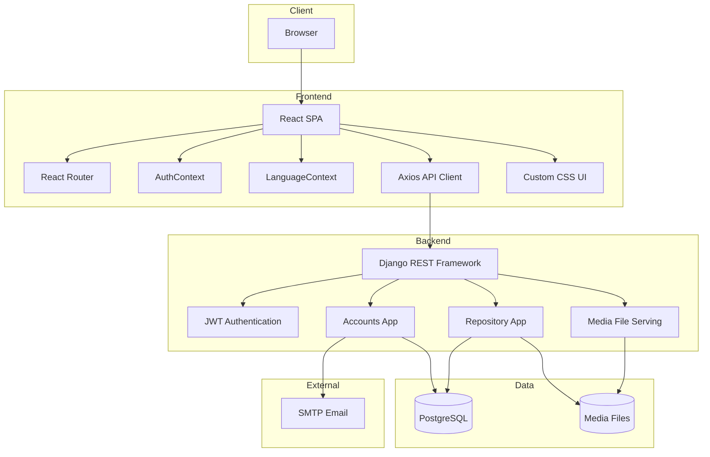
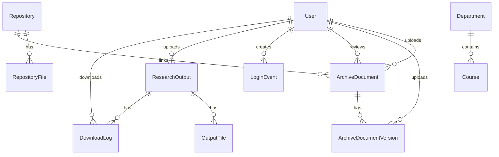
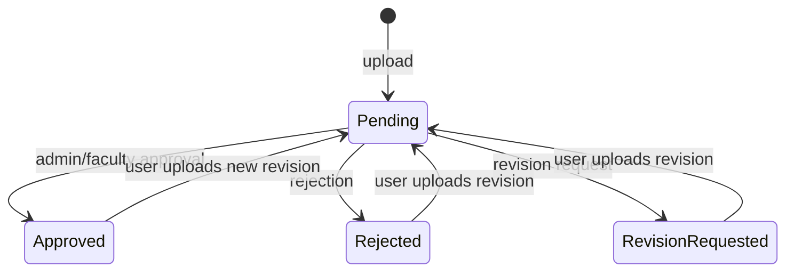

# SaliksikLab System Design

## Overview

SaliksikLab is a web-based research repository system for academic PDF archives. The system supports authenticated uploads, faculty/admin review, versioned revisions, public/private archive visibility, repository search, user management, and analytics.

Removed features are not part of the current system design: collaboration, ngrok/SSH tunneling, and Hugging Face AI translation.

## Goals

- Provide a reliable repository for academic research PDFs.
- Enforce role-based access for admins, faculty, students, and researchers.
- Preserve revision history for archive documents.
- Support review workflows with approval, rejection, and revision feedback.
- Provide useful admin analytics, including repository status and student engagement.
- Keep deployment simple through Docker Compose with PostgreSQL and a static frontend container.

## High-Level Architecture



## Frontend Design

### Routes

| Route | Component | Access |
| --- | --- | --- |
| `/login` | `LoginPage` | Guest |
| `/register` | `RegisterPage` | Guest |
| `/forgot-password` | `ForgotPasswordPage` | Guest |
| `/reset-password` | `ResetPasswordPage` | Guest |
| `/dashboard` | `DashboardPage` | Authenticated |
| `/repository` | `RepositoryPage` | Authenticated |
| `/archives/:id` | `ArchiveDetailPage` | Authenticated |
| `/archives/:id/view` | `ArchivePdfViewerPage` | Authenticated |
| `/upload` | `UploadPage` | Authenticated |
| `/profile` | `ProfilePage` | Authenticated |
| `/admin` | `AdminPage` | Admin |
| `/analytics` | `AnalyticsPage` | Admin |
| `/reports` | `ReportGenerationPage` | Admin route, hidden from sidebar |

### Key Frontend Modules

| Module | Responsibility |
| --- | --- |
| `src/api/axios.js` | API base URL, JWT attachment, token refresh, auth failure redirect |
| `src/contexts/AuthContext.jsx` | Current user state, login/register/logout, user refresh |
| `src/contexts/LanguageContext.jsx` | Static English/Filipino UI strings |
| `src/components/Sidebar.jsx` | Role-aware navigation and profile shortcut |
| `src/pages/DashboardPage.jsx` | Summary cards, recent archive activity, recent submissions |
| `src/pages/AnalyticsPage.jsx` | Approval donut, engagement line chart, courses, departments/courses |
| `src/pages/AdminPage.jsx` | User approval, role changes, repository review/admin tools |
| `src/pages/ArchiveDetailPage.jsx` | Archive details, review actions, revisions, preview/download |
| `src/pages/UploadPage.jsx` | Archive metadata and PDF upload form |

## Backend Design

### Django Apps

| App | Responsibility |
| --- | --- |
| `accounts` | Custom user, roles, account approval, JWT login, password reset, login events |
| `repository` | Outputs, archives, versions, review workflow, analytics, backup/restore |
| `config` | Settings, root URLs, ASGI/WSGI entrypoints |

### Root API Structure

```text
/api/auth/          accounts.urls
/api/repository/    repository.urls
/admin/             Django admin
/media/             media files in development
```

## Domain Model



### Important Models

| Model | Notes |
| --- | --- |
| `User` | Email login, role, department, avatar, account approval |
| `LoginEvent` | One row per successful login, used for engagement analytics |
| `Department` | Admin-managed academic department |
| `Course` | Admin-managed course, optionally tied to a department |
| `ArchiveDocument` | Primary reviewed PDF archive record |
| `ArchiveDocumentVersion` | Immutable revision history for archive files |
| `ResearchOutput` | Legacy output model still supported by repository APIs |
| `OutputFile` | Legacy output file version |
| `DownloadLog` | Download tracking |
| `Repository` / `RepositoryFile` | General versioned file container |

## Access Control

| Role | Main Abilities |
| --- | --- |
| Admin | Manage users, approve accounts, review archives, manage departments/courses, export/backup/restore, view analytics |
| Faculty | Browse archives, upload, review assigned private/archive items where permitted |
| Student | Upload archives, revise own submissions, browse visible approved archive content |
| Researcher | Upload archives, revise own submissions, browse visible approved archive content |

Repository APIs filter data by role. Non-admin users see approved public content and their own submissions; admin users can see and manage broader repository state.

## Archive Review Flow



Revision uploads create `ArchiveDocumentVersion` rows and reset the review state to pending.

## Analytics Design

The `/api/repository/stats/` endpoint returns:

- Total, approved, pending, rejected, and current user's upload count.
- Output counts by type, department, course, and year.
- A 14-day `user_engagement` series from `LoginEvent`:
  - `daily_active_users`
  - `logins_per_day`

The frontend renders:

- Approval breakdown donut chart.
- User engagement line chart.
- Course distribution bar chart.
- Department and course output-count rows.

## File Storage

Files are stored under Django `MEDIA_ROOT`.

| File Type | Path Pattern |
| --- | --- |
| Legacy output files | `outputs/<output_id>/v<version>/<filename>` |
| Archive uploads | `archives/<archive_id>/<filename>` |
| Archive revisions | `archives/<archive_id>/v<version>/<filename>` |
| Avatars | `avatars/user_<id>.<ext>` |

Production deployments should serve media through the backend or a dedicated media/static-file layer with access controls appropriate to public/private archive visibility.

## Deployment

Docker Compose runs:

- PostgreSQL database.
- Django backend on port `8080`.
- Nginx-served React frontend on port `3000`.

The backend container applies migrations and collects static files through `backend/docker-entrypoint.sh`.

## Security Notes

- JWT access tokens are short-lived; refresh tokens rotate through the frontend API client flow.
- Admin-only routes use role checks.
- Account approval can disable unapproved user access.
- Password reset uses one-time UUID reset tokens.
- Uploads are constrained to PDFs for archive workflows.
- CORS and CSRF trusted origins are explicit environment variables.
- Local media, SQLite files, virtualenvs, and build outputs should not be treated as source code.
