# SaliksikLab - System Design Document

## Research Repository Management System

---

## Table of Contents

1. [System Overview](#system-overview)
2. [Architecture Diagram](#architecture-diagram)
3. [User Interface Layer](#user-interface-layer)
4. [Services Layer](#services-layer)
5. [Database Schema](#database-schema)
6. [Libraries & Integrations](#libraries--integrations)
7. [API Architecture](#api-architecture)
8. [Security Architecture](#security-architecture)
9. [Deployment Architecture](#deployment-architecture)

---

## System Overview

SaliksikLab is a comprehensive research repository management system designed to handle academic research outputs, collaboration, and code execution. The system supports multiple user roles and provides both mobile and desktop interfaces.

### Key Features
- Research output submission and version control
- Role-based access control (Admin, Faculty, Student, Researcher)
- Collaboration hub with Git-style workflows
- In-browser code execution environment
- Analytics and reporting dashboard
- File preview and download tracking
- Email notifications

---

## Architecture Diagram

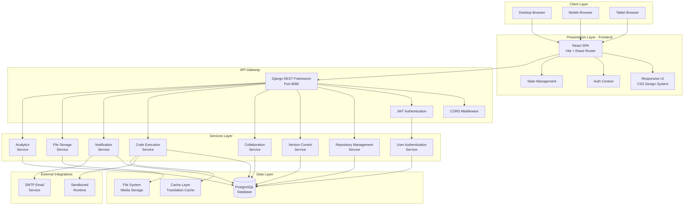

---

## User Interface Layer

### 1. Responsive Design Architecture

The system employs a mobile-first responsive design strategy using CSS custom properties and media queries.

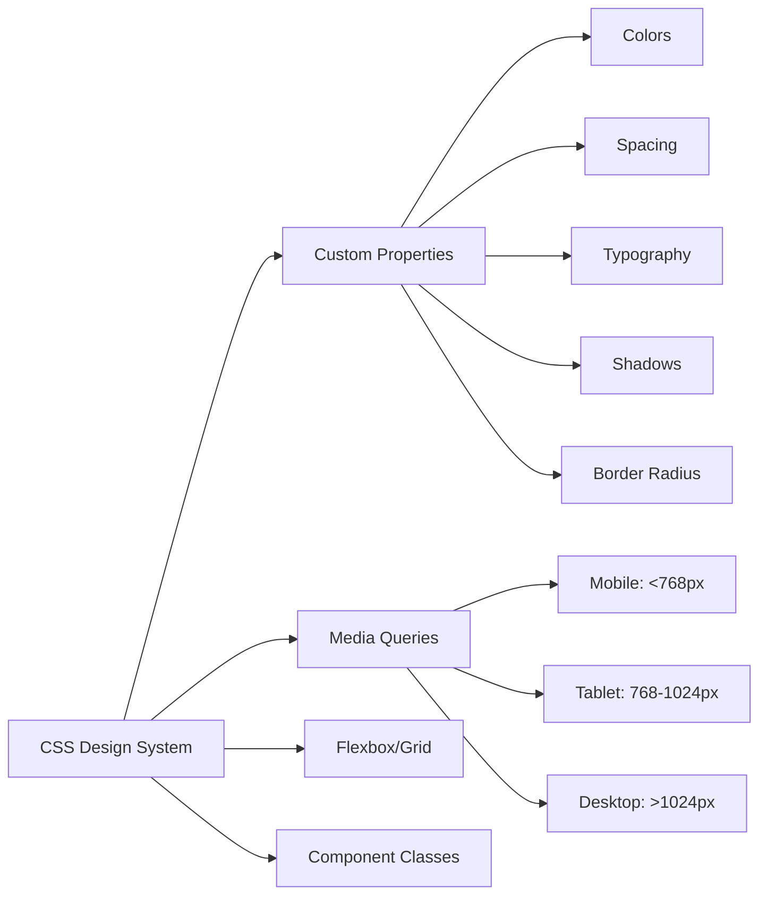

### 2. Page Components

| Page | Route | Purpose | Responsive Behavior |
|------|-------|---------|---------------------|
| Login | `/login` | User authentication | Single column, full-width form |
| Register | `/register` | New user registration | Single column, full-width form |
| Dashboard | `/dashboard` | Analytics overview | Grid adjusts columns based on viewport |
| Repository | `/repository` | Browse research outputs | Card grid: 1 col mobile, 2-3 col desktop |
| Detail | `/repository/:id` | View output details | Sidebar stacks on mobile |
| Upload | `/upload` | Submit new research | Form adjusts width |
| Admin | `/admin` | Admin management | Table scrolls horizontally on mobile |
| Profile | `/profile` | User profile management | Single column layout |
| Code Lab | `/code-lab` | In-browser IDE | Split-pane editor |
| Collaboration | `/collaborate` | Project collaboration | Tab navigation adapts |

### 3. Mobile-Specific Considerations

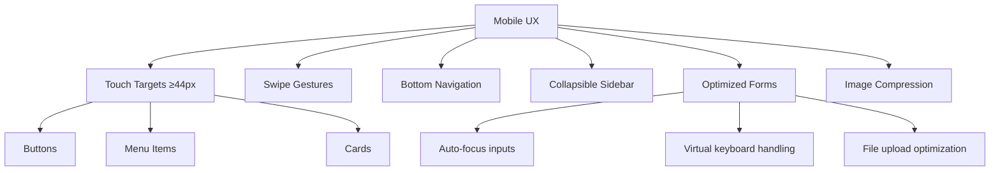

### 4. Component Hierarchy

```
App
├── AuthProvider
│   └── LanguageProvider
│       ├── Sidebar (Navigation)
│       ├── Main Content Area
│       │   ├── LoginPage
│       │   ├── RegisterPage
│       │   ├── DashboardPage
│       │   │   ├── StatCard (×5)
│       │   │   ├── AnalyticsChart
│       │   │   └── RecentSubmissionsTable
│       │   ├── RepositoryPage
│       │   │   ├── SearchBar
│       │   │   ├── FilterPanel
│       │   │   ├── RepositoryCard (×N)
│       │   │   └── Pagination
│       │   ├── DetailPage
│       │   │   ├── MetadataCard
│       │   │   ├── FilePreviewer
│       │   │   ├── VersionHistoryPanel
│       │   │   └── AdminActions
│       │   ├── UploadPage
│       │   │   └── UploadForm
│       │   ├── AdminPage
│       │   │   ├── UserManagementTable
│       │   │   ├── ExportControls
│       │   │   └── PendingApprovals
│       │   ├── ProfilePage
│       │   │   └── ProfileForm
│       │   ├── CodePlaygroundPage
│       │   │   ├── CodeEditor
│       │   │   ├── LanguageSelector
│       │   │   ├── OutputPanel
│       │   │   └── RunHistoryPanel
│       │   └── CollaborationPage
│       │       ├── ProjectList
│       │       ├── ProjectDetail
│       │       │   ├── IssuesTab
│       │       │   ├── MergeRequestsTab
│       │       │   ├── CommitsTab
│       │       │   └── MembersTab
│       │       └── NotificationPanel
│       └── Toast Notifications
```

---

## Services Layer

### 1. User Authentication Service

**Location:** `backend/accounts/`

**Responsibilities:**
- User registration and login
- JWT token management (access + refresh)
- Password reset workflow
- Role-based authorization
- Account approval workflow

**Key Components:**

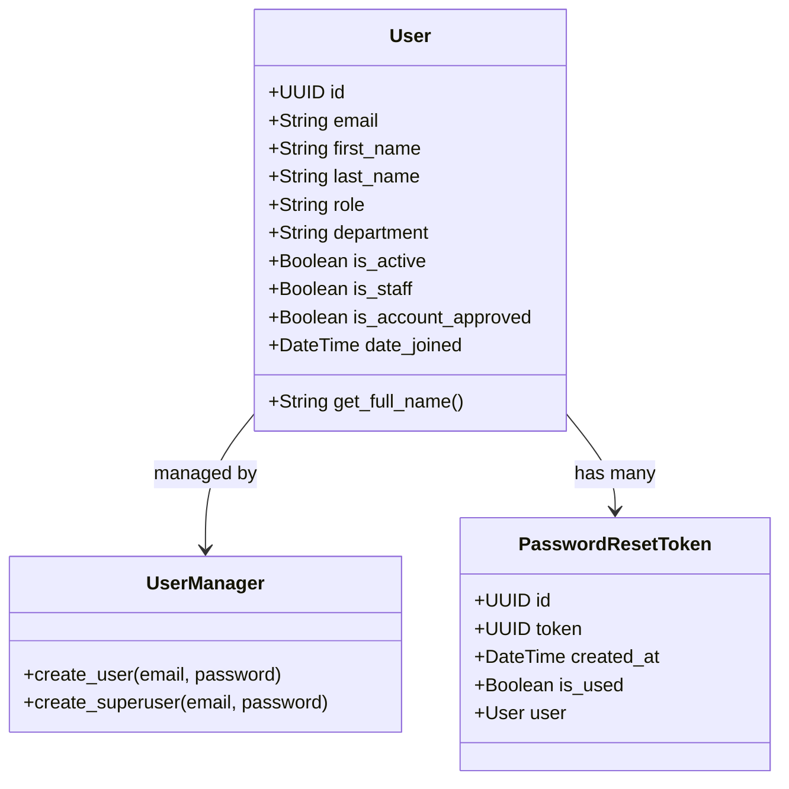

**API Endpoints:**

| Method | Endpoint | Description | Auth Required |
|--------|----------|-------------|---------------|
| POST | `/api/auth/register/` | Register new user | No |
| POST | `/api/auth/login/` | Login, get tokens | No |
| POST | `/api/auth/refresh/` | Refresh access token | No |
| GET | `/api/auth/me/` | Get current user | Yes |
| PATCH | `/api/auth/me/` | Update profile | Yes |
| POST | `/api/auth/forgot-password/` | Request password reset | No |
| POST | `/api/auth/reset-password/` | Complete password reset | No |

**Authentication Flow:**

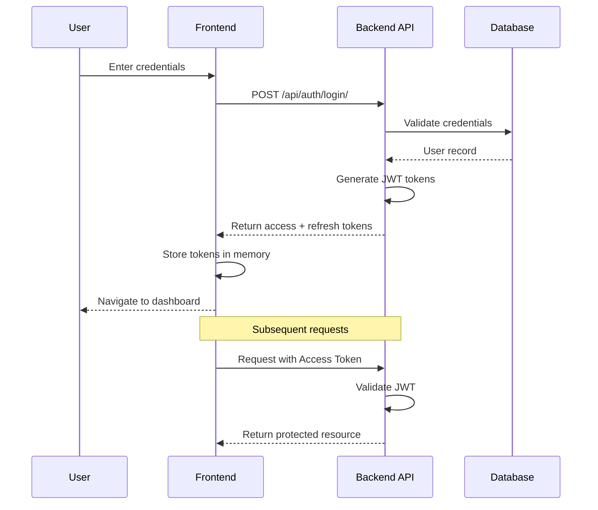

### 2. Repository Management Service

**Location:** `backend/repository/`

**Responsibilities:**
- Research output CRUD operations
- File upload and storage
- Search and filtering
- Download tracking
- Approval workflow
- Data export (CSV, JSON)

**Key Models:**

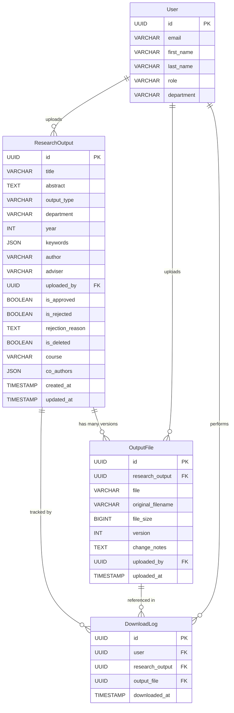

**API Endpoints:**

| Method | Endpoint | Description | Auth | Role |
|--------|----------|-------------|------|------|
| GET | `/api/repository/` | List outputs (paginated) | Yes | All |
| POST | `/api/repository/` | Upload new output | Yes | All |
| GET | `/api/repository/:id/` | Get output details | Yes | All |
| PATCH | `/api/repository/:id/` | Update metadata | Yes | Owner/Admin |
| DELETE | `/api/repository/:id/` | Soft delete | Yes | Owner/Admin |
| POST | `/api/repository/:id/approve/` | Approve/reject | Yes | Admin |
| GET | `/api/repository/:id/download/` | Download latest | Yes | All |
| GET | `/api/repository/:id/download/:fid/` | Download version | Yes | All |
| GET | `/api/repository/:id/preview/` | Preview inline | Yes | All |
| POST | `/api/repository/:id/revise/` | Submit revision | Yes | Owner/Admin |
| GET | `/api/repository/:id/versions/` | List versions | Yes | All |
| POST | `/api/repository/:id/rollback/` | Rollback version | Yes | Admin |
| GET | `/api/repository/stats/` | Dashboard analytics | Yes | All |
| GET | `/api/repository/export/csv/` | CSV export | Yes | Admin |
| GET | `/api/repository/backup/` | JSON backup | Yes | Admin |

**Version Control Flow:**

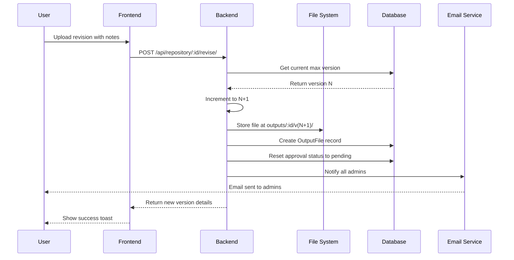

### 3. Collaboration Service

**Location:** `backend/collaboration/`

**Responsibilities:**
- Project workspace management
- Issue tracking
- Merge request workflow
- Commit history
- Team notifications
- Member management

**Key Models:**

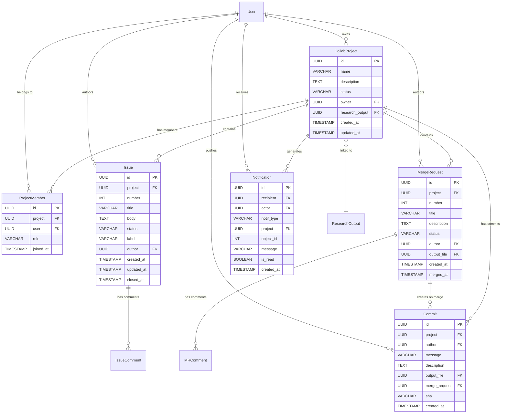

**Collaboration Workflow:**

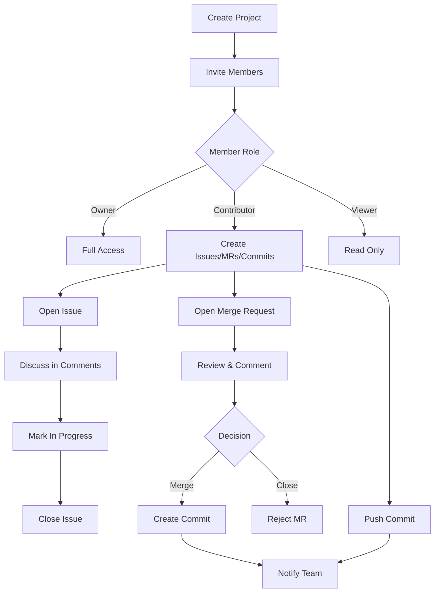

### 4. Code Execution Service

**Location:** `backend/code_execution/`

**Responsibilities:**
- Sandboxed code execution
- Support for Python, Java, C++
- Execution time/memory limits
- Run history tracking
- Translation caching

**Architecture:**

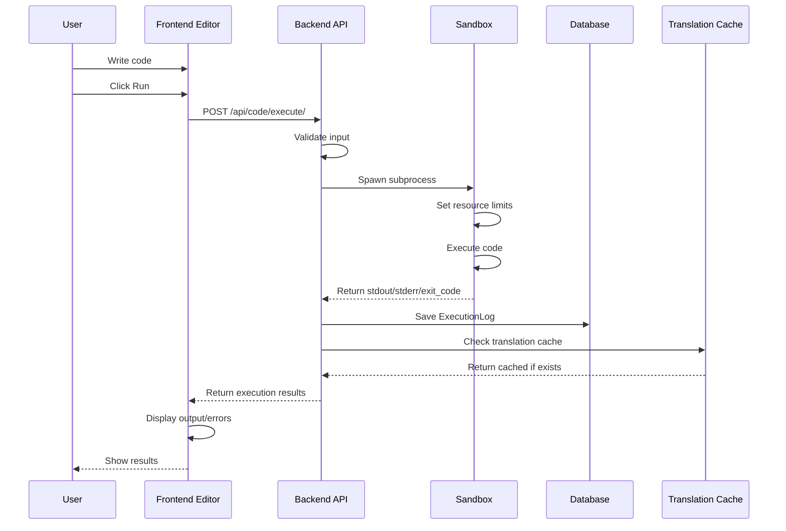

**Security Measures:**
- CPU timeout: 10 seconds
- Max output: 64 KB
- Max memory: 128 MB
- No network access
- Isolated filesystem
- Process isolation

**API Endpoints:**

| Method | Endpoint | Description | Auth |
|--------|----------|-------------|------|
| POST | `/api/code/execute/` | Run code | Yes |
| GET | `/api/code/history/` | Get run history | Yes |

### 5. Notification Service

**Responsibilities:**
- Email notifications
- In-app notifications
- Notification preferences
- Delivery tracking

**Notification Types:**

| Event | Trigger | Recipients | Channel |
|-------|---------|------------|---------|
| Submission approved | Admin approves | Submitter | Email |
| Submission rejected | Admin rejects | Submitter | Email |
| Revision submitted | User revises | All admins | Email |
| Password reset | User requests | Requesting user | Email |
| Issue opened | User creates issue | Project members | In-app |
| Issue closed | User closes issue | Project members | In-app |
| MR opened | User opens MR | Project members | In-app |
| MR merged | User merges MR | Project members | In-app |
| Commit pushed | User pushes commit | Project members | In-app |
| Member added | Owner invites | Invited user | In-app |

### 6. File Storage Service

**Storage Structure:**
```
media/
└── outputs/
    ├── <output_id_1>/
    │   ├── v1/
    │   │   └── thesis_draft.pdf
    │   ├── v2/
    │   │   └── thesis_revised.pdf
    │   └── v3/
    │       └── thesis_final.pdf
    ├── <output_id_2>/
    │   └── v1/
    │       └── source_code.zip
    └── ...
```

**File Operations:**
- Upload: Django `FileField` with custom `upload_to` function
- Download: Django `FileResponse` with download tracking
- Preview: Inline serving with appropriate MIME types
- Deletion: Cascade delete with version rollback

**Supported File Types:**

| Category | Extensions |
|----------|------------|
| Documents | `.pdf`, `.doc`, `.docx`, `.txt`, `.md` |
| Archives | `.zip`, `.tar`, `.gz`, `.rar` |
| Source Code | `.py`, `.js`, `.ts`, `.java`, `.c`, `.cpp`, `.h`, `.cs`, `.php`, `.rb` |
| Web | `.html`, `.css`, `.json`, `.xml`, `.yaml`, `.yml` |
| Images | `.png`, `.jpg`, `.jpeg`, `.gif`, `.svg` |

**File Size Limits:**
- Maximum upload: 100 MB
- Streaming enabled for large files

---

## Database Schema

### Complete Entity Relationship Diagram

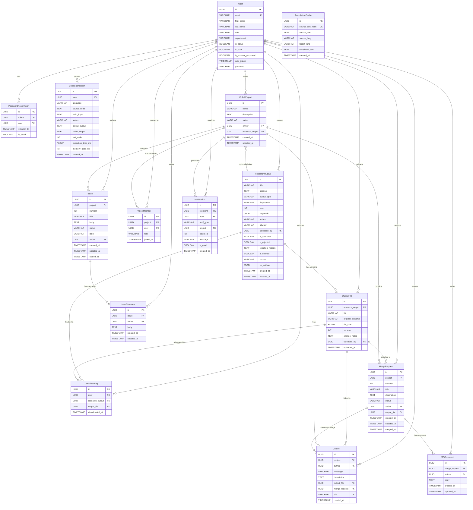

### Database Tables Summary

| Table Name | Records (Est.) | Purpose |
|------------|---------------|---------|
| `accounts_user` | 1,000 - 10,000 | User accounts |
| `accounts_passwordresettoken` | 100 - 500 | Password reset tokens |
| `repository_researchoutput` | 5,000 - 50,000 | Research output metadata |
| `repository_outputfile` | 10,000 - 100,000 | Versioned file records |
| `repository_downloadlog` | 50,000 - 500,000 | Download tracking |
| `code_execution_codesubmission` | 10,000 - 100,000 | Code execution history |
| `code_execution_translationcache` | 1,000 - 10,000 | Translation cache |
| `collaboration_collabproject` | 500 - 5,000 | Collaboration projects |
| `collaboration_projectmember` | 1,000 - 25,000 | Project memberships |
| `collaboration_issue` | 2,000 - 20,000 | Issue tracking |
| `collaboration_issuecomment` | 5,000 - 50,000 | Issue discussions |
| `collaboration_mergerequest` | 1,000 - 10,000 | Merge requests |
| `collaboration_mrcomment` | 2,000 - 20,000 | MR reviews |
| `collaboration_commit` | 5,000 - 50,000 | Commit history |
| `collaboration_notification` | 10,000 - 100,000 | In-app notifications |
| `auth_group` | 10 - 50 | Django auth groups |
| `auth_permission` | 100 - 200 | Django permissions |
| `django_session` | 1,000 - 10,000 | User sessions |
| `django_admin_log` | 5,000 - 50,000 | Admin action logs |

### Indexing Strategy

```sql
-- User authentication
CREATE INDEX idx_user_email ON accounts_user(email);
CREATE INDEX idx_user_role ON accounts_user(role);

-- Repository search
CREATE INDEX idx_output_title ON repository_researchoutput(title);
CREATE INDEX idx_output_type ON repository_researchoutput(output_type);
CREATE INDEX idx_output_dept ON repository_researchoutput(department);
CREATE INDEX idx_output_year ON repository_researchoutput(year);
CREATE INDEX idx_output_approved ON repository_researchoutput(is_approved);
CREATE INDEX idx_output_deleted ON repository_researchoutput(is_deleted);
CREATE INDEX idx_output_created ON repository_researchoutput(created_at DESC);

-- File versions
CREATE INDEX idx_file_output ON repository_outputfile(research_output_id);
CREATE INDEX idx_file_version ON repository_outputfile(version DESC);

-- Download analytics
CREATE INDEX idx_download_user ON repository_downloadlog(user_id);
CREATE INDEX idx_download_output ON repository_downloadlog(research_output_id);
CREATE INDEX idx_download_date ON repository_downloadlog(downloaded_at DESC);

-- Collaboration
CREATE INDEX idx_project_owner ON collaboration_collabproject(owner_id);
CREATE INDEX idx_member_project ON collaboration_projectmember(project_id);
CREATE INDEX idx_member_user ON collaboration_projectmember(user_id);
CREATE INDEX idx_issue_project ON collaboration_issue(project_id, number);
CREATE INDEX idx_mr_project ON collaboration_mergerequest(project_id, number);
CREATE INDEX idx_commit_project ON collaboration_commit(project_id, created_at DESC);
CREATE INDEX idx_notification_recipient ON collaboration_notification(recipient_id, is_read);

-- Code execution
CREATE INDEX idx_code_user ON code_execution_codesubmission(user_id, created_at DESC);
CREATE INDEX idx_translation_hash ON code_execution_translationcache(source_text_hash);
```

---

## Libraries & Integrations

### Frontend Dependencies

```json
{
  "dependencies": {
    "react": "^18.2.0",
    "react-dom": "^18.2.0",
    "react-router-dom": "^7.0.0",
    "axios": "^1.6.0",
    "lucide-react": "^0.300.0",
    "react-hot-toast": "^2.4.0",
    "prop-types": "^15.8.0"
  },
  "devDependencies": {
    "@vitejs/plugin-react": "^4.2.0",
    "vite": "^5.0.0"
  }
}
```

| Library | Purpose | Version |
|---------|---------|---------|
| React 18 | UI component framework | 18.2+ |
| Vite 5 | Build tool & dev server | 5.0+ |
| React Router 7 | Client-side routing | 7.0+ |
| Axios | HTTP client with interceptors | 1.6+ |
| Lucide React | Icon library | 0.300+ |
| React Hot Toast | Toast notifications | 2.4+ |
| PropTypes | Runtime type checking | 15.8+ |

### Backend Dependencies

```txt
Django>=4.2
djangorestframework>=3.14
djangorestframework-simplejwt>=5.3
django-cors-headers>=4.3
psycopg2-binary>=2.9
Pillow>=10.0
```

| Library | Purpose | Version |
|---------|---------|---------|
| Django | Web framework | 4.2+ |
| DRF | REST API framework | 3.14+ |
| SimpleJWT | JWT authentication | 5.3+ |
| CORS Headers | Cross-origin support | 4.3+ |
| psycopg2 | PostgreSQL adapter | 2.9+ |
| Pillow | Image processing | 10.0+ |

### External Integrations

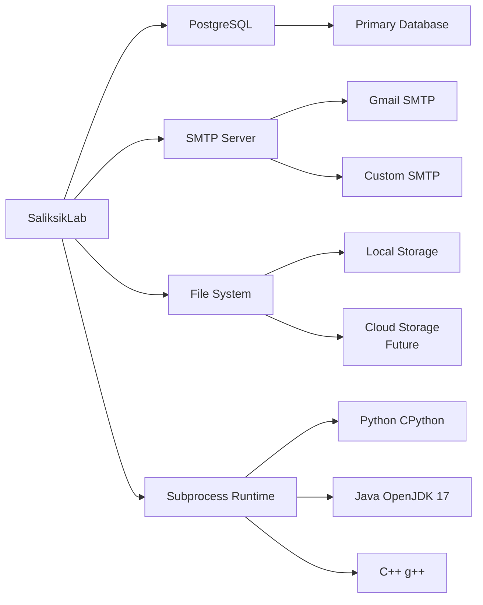

| Integration | Type | Purpose | Configuration |
|-------------|------|---------|---------------|
| PostgreSQL | Database | Primary data store | `DB_NAME`, `DB_USER`, `DB_PASSWORD` |
| SMTP | Email | Notifications | `EMAIL_HOST`, `EMAIL_PORT`, `EMAIL_HOST_USER` |
| File System | Storage | Media files | `MEDIA_ROOT`, `MEDIA_URL` |
| Python Runtime | Code Execution | Python code runner | Sandboxed subprocess |
| Java Runtime | Code Execution | Java code runner | Sandboxed subprocess |
| C++ Compiler | Code Execution | C++ code runner | Sandboxed subprocess |

### API Integration Points

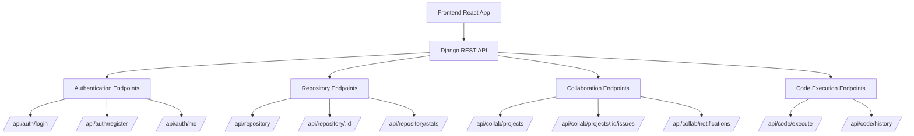

---

## API Architecture

### REST API Design Principles

1. **Resource-based URLs**: `/api/repository/`, `/api/auth/users/`
2. **HTTP methods**: GET (read), POST (create), PATCH (update), DELETE (remove)
3. **JSON request/response**: Consistent format
4. **Pagination**: Cursor-based for large datasets
5. **Error handling**: Standardized error responses
6. **Authentication**: JWT Bearer tokens
7. **Rate limiting**: Configurable per endpoint

### API Response Format

**Success Response:**
```json
{
  "count": 100,
  "next": "http://localhost:8080/api/repository/?page=2",
  "previous": null,
  "results": [
    {
      "id": "uuid-here",
      "title": "Research Title",
      "author": "John Doe",
      "is_approved": true,
      "created_at": "2026-04-05T12:00:00Z"
    }
  ]
}
```

**Error Response:**
```json
{
  "detail": "Authentication credentials were not provided.",
  "code": "not_authenticated"
}
```

### API Endpoint Categories

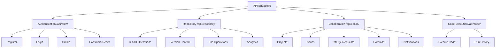

### Rate Limiting Strategy

| Endpoint Category | Rate Limit | Window |
|-------------------|------------|--------|
| Authentication | 10 requests | 1 minute |
| Repository read | 100 requests | 1 minute |
| Repository write | 20 requests | 1 minute |
| Code execution | 5 requests | 1 minute |
| Collaboration | 50 requests | 1 minute |

---

## Security Architecture

### Authentication & Authorization

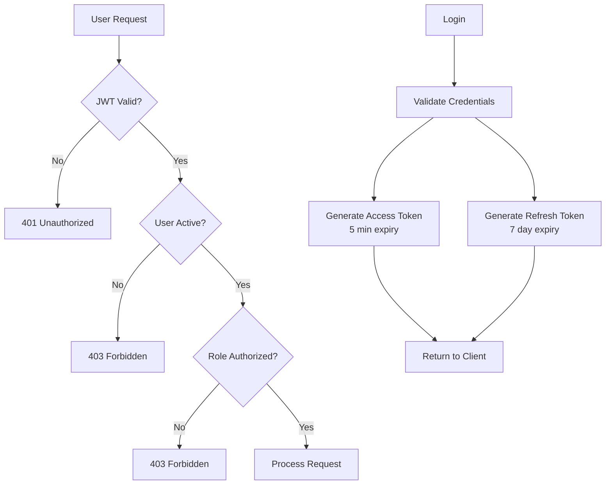

### Security Measures

| Layer | Measure | Implementation |
|-------|---------|----------------|
| Transport | HTTPS | SSL/TLS in production |
| Authentication | JWT | RS256 signing, short expiry |
| Authorization | RBAC | Role checks in views |
| Input Validation | Server-side | DRF serializers |
| File Upload | Validation | Extension whitelist, size limit |
| SQL Injection | Prevention | Django ORM |
| XSS | Prevention | React auto-escaping |
| CSRF | Protection | JWT in headers |
| CORS | Configuration | Whitelist origins |
| Rate Limiting | Throttling | Per-IP, per-user |

### Role-Based Access Control Matrix

| Resource | Student | Researcher | Faculty | Admin |
|----------|---------|------------|---------|-------|
| View approved outputs | ✅ | ✅ | ✅ | ✅ |
| Upload outputs | ✅ | ✅ | ✅ | ✅ |
| Edit own outputs | ✅ | ✅ | ✅ | ✅ |
| Delete own outputs | ✅ | ✅ | ✅ | ✅ |
| Approve outputs | ❌ | ❌ | ❌ | ✅ |
| Reject outputs | ❌ | ❌ | ❌ | ✅ |
| Rollback versions | ❌ | ❌ | ❌ | ✅ |
| Export data | ❌ | ❌ | ❌ | ✅ |
| Manage users | ❌ | ❌ | ❌ | ✅ |
| Use Code Lab | ✅ | ✅ | ✅ | ✅ |
| Create projects | ✅ | ✅ | ✅ | ✅ |
| Manage all projects | ❌ | ❌ | ❌ | ✅ |

---

## Deployment Architecture

### Development Environment

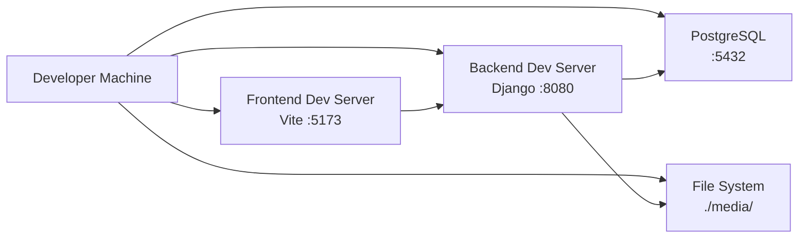

### Production Architecture (Recommended)

```mermaid
graph TB
    subgraph "Internet"
        A[Users]
    end
    
    subgraph "Load Balancer / Reverse Proxy"
        B[Nginx / HAProxy]
    end
    
    subgraph "Application Servers"
        C1[Django + Gunicorn<br/>Instance 1]
        C2[Django + Gunicorn<br/>Instance 2]
        C3[Django + Gunicorn<br/>Instance 3]
    end
    
    subgraph "Static Files"
        D[Nginx Static Server]
        E[CDN<br/>Optional]
    end
    
    subgraph "Database Layer"
        F[(PostgreSQL Primary)]
        G[(PostgreSQL Replica)<br/>Optional]
    end
    
    subgraph "Storage"
        H[Shared File Storage<br/>NFS / S3]
    end
    
    subgraph "Cache Layer"
        I[Redis<br/>Optional]
    end
    
    A --> B
    B --> C1
    B --> C2
    B --> C3
    B --> D
    D --> E
    
    C1 --> F
    C2 --> F
    C3 --> F
    F --> G
    
    C1 --> H
    C2 --> H
    C3 --> H
    
    C1 --> I
    C2 --> I
    C3 --> I
```

### Deployment Components

| Component | Technology | Purpose |
|-----------|------------|---------|
| Web Server | Nginx | Reverse proxy, static files |
| App Server | Gunicorn | WSGI server for Django |
| Database | PostgreSQL 14+ | Primary data store |
| File Storage | Local / S3 | Media file storage |
| Cache | Redis (optional) | Session cache, query cache |
| Email | SMTP | Notification delivery |
| Monitoring | Sentry (optional) | Error tracking |
| CI/CD | GitHub Actions | Automated testing & deployment |

### Environment Variables

```env
# Django
SECRET_KEY=<secure-random-string>
DEBUG=False
ALLOWED_HOSTS=yourdomain.com,www.yourdomain.com

# Database
DB_NAME=saliksiklab
DB_USER=saliksik_user
DB_PASSWORD=<secure-password>
DB_HOST=db.yourdomain.com
DB_PORT=5432

# CORS
CORS_ALLOWED_ORIGINS=https://yourdomain.com

# Email
EMAIL_BACKEND=django.core.mail.backends.smtp.EmailBackend
EMAIL_HOST=smtp.gmail.com
EMAIL_PORT=587
EMAIL_USE_TLS=True
EMAIL_HOST_USER=your-email@gmail.com
EMAIL_HOST_PASSWORD=<app-password>
DEFAULT_FROM_EMAIL=Research Repository <noreply@yourdomain.com>

# Frontend
FRONTEND_URL=https://yourdomain.com

# File Upload
MAX_UPLOAD_SIZE=104857600
```

---

## Scalability Considerations

### Horizontal Scaling Strategies

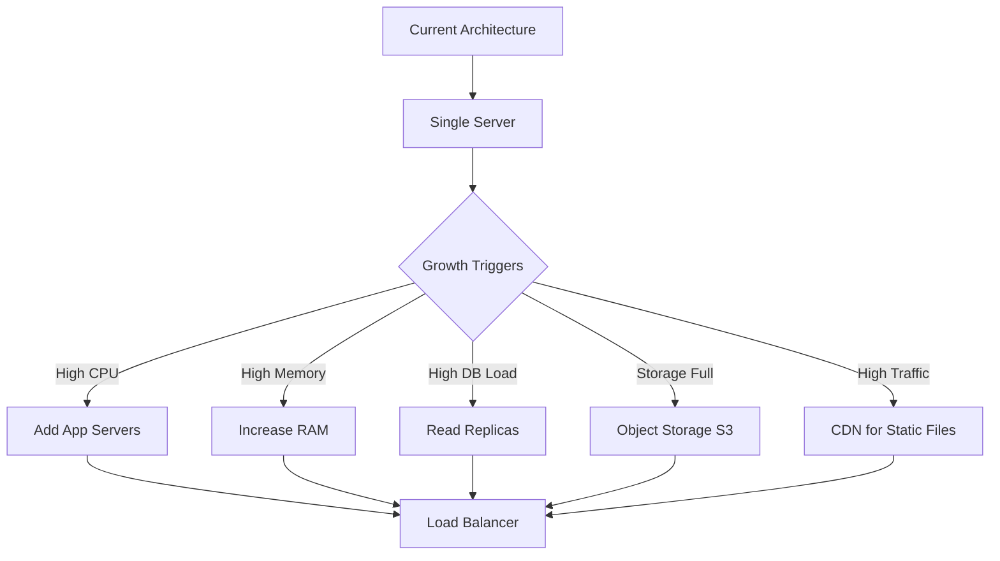

### Scaling Recommendations

| Metric | Current | Threshold | Action |
|--------|---------|-----------|--------|
| Requests/sec | 10-50 | >100 | Add app servers |
| Database connections | 20 | >100 | Connection pooling |
| Storage | Local FS | >80% capacity | Migrate to S3 |
| Response time | <200ms | >500ms | Optimize queries, add cache |
| File uploads | Local | >10GB/day | Use object storage |

### Future Enhancements

1. **Microservices Architecture**: Separate services for auth, repository, collaboration
2. **Message Queue**: Celery + Redis for async tasks (email, code execution)
3. **Search Engine**: Elasticsearch for advanced search capabilities
4. **Real-time Updates**: WebSockets for live notifications
5. **Mobile Apps**: React Native for native mobile experience
6. **API Versioning**: Support multiple API versions
7. **GraphQL**: Alternative API query language
8. **Containerization**: Docker + Kubernetes for orchestration

---

## Monitoring & Observability

### Key Metrics to Track

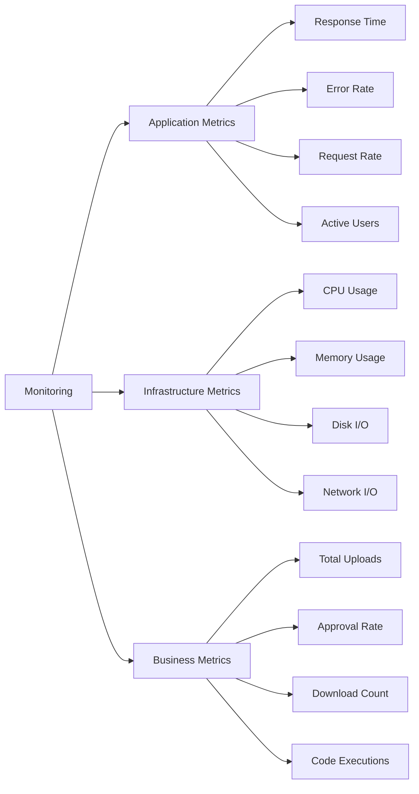

### Logging Strategy

| Log Type | Level | Destination | Retention |
|----------|-------|-------------|-----------|
| Application | INFO, ERROR | File + Sentry | 30 days |
| Access | INFO | File | 90 days |
| Database | WARNING, ERROR | File | 30 days |
| Security | WARNING, ERROR | File + Alert | 1 year |
| Audit | INFO | Database | Permanent |

---

## Appendix

### Technology Stack Summary

**Frontend:**
- React 18 with Vite 5
- React Router 7 for routing
- Axios for HTTP requests
- Lucide React for icons
- Custom CSS design system

**Backend:**
- Python 3.10+
- Django 4.2+
- Django REST Framework
- SimpleJWT for authentication
- PostgreSQL 14+

**Infrastructure:**
- Nginx (reverse proxy)
- Gunicorn (WSGI server)
- File system storage
- SMTP for email

### Glossary

| Term | Definition |
|------|------------|
| JWT | JSON Web Token - stateless authentication mechanism |
| RBAC | Role-Based Access Control - permission model based on user roles |
| WSGI | Web Server Gateway Interface - Python web server standard |
| CORS | Cross-Origin Resource Sharing - browser security mechanism |
| ORM | Object-Relational Mapping - database abstraction layer |
| SPA | Single Page Application - client-side rendered web app |
| MR | Merge Request - proposal to merge changes (GitLab terminology) |
| SHA | Secure Hash Algorithm - unique identifier for commits |

### Document Version History

| Version | Date | Author | Changes |
|---------|------|--------|---------|
| 1.0 | 2026-04-05 | System Architect | Initial system design document |

---

*This system design document provides a comprehensive overview of the SaliksikLab research repository management system architecture, including all major components, data flows, and integration points.*
