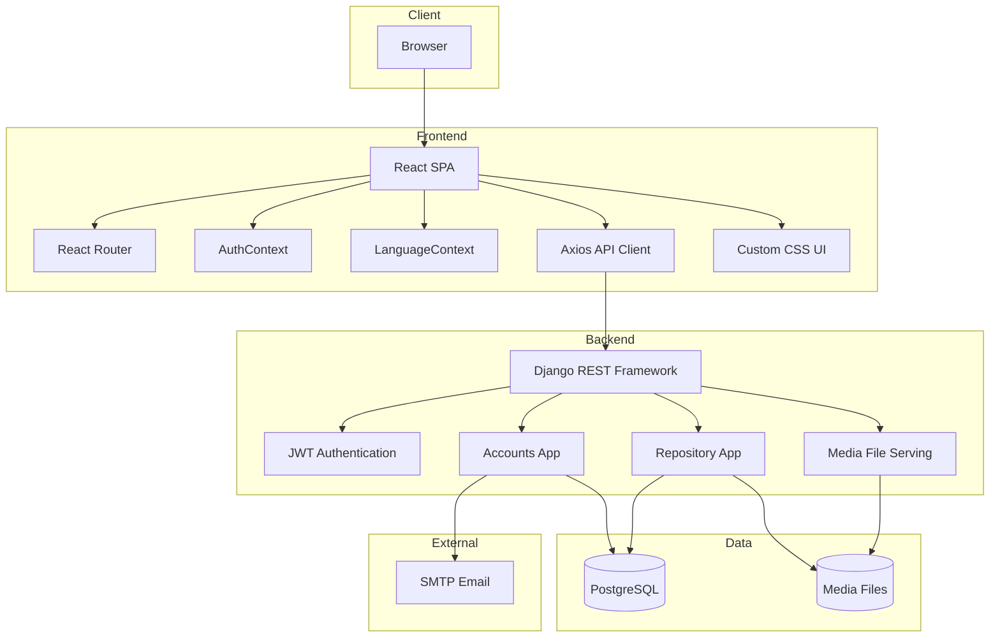
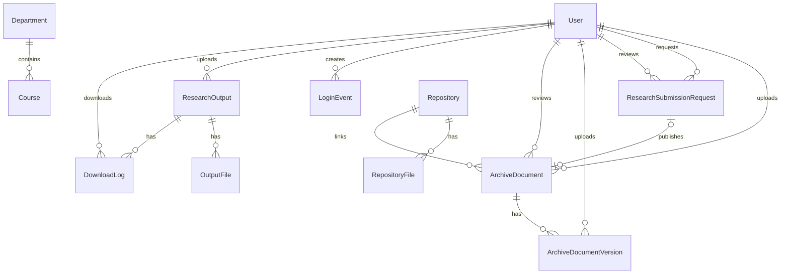
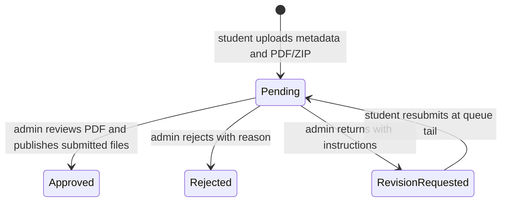

# Tukiva System Design

## Overview

Tukiva is a web-based research repository system for academic PDF archives. The system supports authenticated uploads, faculty/admin review, versioned revisions, approval-based archive access, repository search, user management, and analytics.

Removed features are not part of the current system design: collaboration, SSH tunnel scripts, and Hugging Face AI translation. Development deployments allow ngrok/Cloudflare tunnel hostnames through explicit host, CORS, and CSRF settings.

## Goals

- Provide a reliable repository for academic research PDFs.
- Enforce role-based access for admins, faculty, and students.
- Preserve revision history for archive documents.
- Support review workflows with approval, rejection, and revision feedback.
- Provide useful admin analytics, including repository status and student engagement.
- Keep deployment simple through Docker Compose with PostgreSQL and a static frontend container.

## High-Level Architecture


```mermaid
graph TB
    subgraph Client
        BROWSER[Browser]
    end

    subgraph Frontend
        SPA[React SPA]
        ROUTER[React Router]
        AUTHCTX[AuthContext]
        LANGCTX[LanguageContext]
        API[Axios API Client]
        UI[Custom CSS UI]
    end

    subgraph Backend
        DRF[Django REST Framework]
        JWT[JWT Authentication]
        ACCOUNTS[Accounts App]
        REPO[Repository App]
        MEDIA[Media File Serving]
    end

    subgraph Data
        PG[(PostgreSQL)]
        FILES[(Media Files)]
    end

    subgraph External
        SMTP[SMTP Email]
    end

    BROWSER --> SPA
    SPA --> ROUTER
    SPA --> AUTHCTX
    SPA --> LANGCTX
    SPA --> API
    SPA --> UI
    API --> DRF
    DRF --> JWT
    DRF --> ACCOUNTS
    DRF --> REPO
    DRF --> MEDIA
    ACCOUNTS --> PG
    REPO --> PG
    REPO --> FILES
    MEDIA --> FILES
    ACCOUNTS --> SMTP
```

## Frontend Design

### Routes

| Route | Component | Access |
| --- | --- | --- |
| `/login` | `LoginPage` | Guest |
| `/register` | `RegisterPage` | Guest |
| `/forgot-password` | `ForgotPasswordPage` | Guest |
| `/reset-password` | `ResetPasswordPage` | Guest |
| `/dashboard` | `DashboardPage` | Authenticated |
| `/repository` | `RepositoryPage` | Authenticated |
| `/archives/:id` | `ArchiveDetailPage` | Authenticated |
| `/archives/:id/view` | `ArchivePdfViewerPage` | Authenticated |
| `/upload` | `UploadPage` | Student request or admin publication |
| `/submission-requests/:id` | `SubmissionRequestPage` | Student owner |
| `/profile` | `ProfilePage` | Authenticated |
| `/admin` | `AdminPage` | Admin |
| `/analytics` | `AnalyticsPage` | Admin |
| `/reports` | `ReportGenerationPage` | Admin route, hidden from sidebar |

### Key Frontend Modules

| Module | Responsibility |
| --- | --- |
| `src/api/axios.js` | API base URL, JWT attachment, token refresh, auth failure redirect |
| `src/contexts/AuthContext.jsx` | Current user state, login/register/logout, user refresh |
| `src/contexts/LanguageContext.jsx` | Static English/Filipino UI strings |
| `src/components/Sidebar.jsx` | Role-aware navigation and profile shortcut |
| `src/pages/DashboardPage.jsx` | Summary cards, recent archive activity, recent submissions |
| `src/pages/AnalyticsPage.jsx` | Approval donut, engagement line chart, courses, departments/courses |
| `src/pages/AdminPage.jsx` | FIFO upload-request queue, decisions, publication, users, and admin tools |
| `src/pages/ArchiveDetailPage.jsx` | Published archive details and administrator-only file/system controls |
| `src/pages/UploadPage.jsx` | Metadata-only student request or administrator publication form |
| `src/pages/SubmissionRequestPage.jsx` | Owned request status, feedback, and metadata resubmission |

## Backend Design

### Django Apps

| App | Responsibility |
| --- | --- |
| `accounts` | Custom user, roles, account approval, JWT login, password reset, login events |
| `repository` | Outputs, archives, versions, review workflow, analytics, backup/restore |
| `config` | Settings, root URLs, ASGI/WSGI entrypoints |

### Root API Structure

```text
/api/auth/          accounts.urls
/api/repository/    repository.urls
/admin/             Django admin
/media/             media files in development
```

## Domain Model


```mermaid
erDiagram
    User ||--o{ ArchiveDocument : uploads
    User ||--o{ ResearchSubmissionRequest : requests
    User ||--o{ ResearchSubmissionRequest : reviews
    User ||--o{ ArchiveDocumentVersion : uploads
    User ||--o{ ArchiveDocument : reviews
    User ||--o{ LoginEvent : creates
    User ||--o{ ResearchOutput : uploads
    User ||--o{ DownloadLog : downloads

    Department ||--o{ Course : contains
    ArchiveDocument ||--o{ ArchiveDocumentVersion : has
    ResearchSubmissionRequest |o--o| ArchiveDocument : publishes
    ResearchOutput ||--o{ OutputFile : has
    ResearchOutput ||--o{ DownloadLog : has
    Repository ||--o{ RepositoryFile : has
    Repository ||--o{ ArchiveDocument : links
```

### Important Models

| Model | Notes |
| --- | --- |
| `User` | Email login, role, department, avatar, account approval |
| `LoginEvent` | One row per successful login, used for engagement analytics |
| `Department` | Admin-managed academic department |
| `Course` | Admin-managed course, optionally tied to a department |
| `ResearchSubmissionRequest` | Metadata-only student request, decision state, and FIFO queue timestamp |
| `ArchiveDocument` | Administrator-published research PDF and/or executable-system ZIP |
| `ArchiveDocumentVersion` | Immutable revision history for archive files |
| `ResearchOutput` | Legacy output model still supported by repository APIs |
| `OutputFile` | Legacy output file version |
| `DownloadLog` | Download tracking |
| `Repository` / `RepositoryFile` | General versioned file container |

## Access Control

| Role | Main Abilities |
| --- | --- |
| Admin | Privately list/process requests, upload/publish files and systems, manage users and academic data, export/restore, and view analytics |
| Faculty | Browse approved archives and download published artifacts |
| Student | Upload private research PDFs/system ZIPs for review, revise returned requests and attachments, and browse approved archives |

Non-admin users only see approved archive content. The request-list and request-detail APIs are administrator-only; students can inspect their own request status and attachments and resubmit after a request is returned for revision. Submitted files are outside public media storage and require owner or administrator authorization to stream.

## Submission Request Flow


```mermaid
stateDiagram-v2
    [*] --> Pending: student uploads metadata and PDF/ZIP
    Pending --> Approved: admin reviews PDF and publishes submitted files
    Pending --> Rejected: admin rejects with reason
    Pending --> RevisionRequested: admin returns with instructions
    RevisionRequested --> Pending: student resubmits at queue tail
```

Pending requests are ordered by `queued_at` and `id`. The review endpoint rejects out-of-order processing. Approval creates the published `ArchiveDocument` from the student attachments. If a ZIP is present, it also creates a stopped `HostingSession` marked `is_default`, linked to that archive with its own retained source ZIP. A conditional unique constraint allows one default per archive. Saving the default requires neither the hosting worker nor the active deployment slot; administrators start it through the existing saved-system endpoint.

## Analytics Design

The `/api/repository/stats/` endpoint returns:

- Total, approved, pending, rejected, and current user's upload count.
- Output counts by type, department, course, and year.
- A 14-day `user_engagement` series from `LoginEvent`:
  - `daily_active_users`
  - `logins_per_day`

The frontend renders:

- Approval breakdown donut chart.
- User engagement line chart.
- Course distribution bar chart.
- Department and course output-count rows.

## File Storage

Files are stored under Django `MEDIA_ROOT`.

| File Type | Path Pattern |
| --- | --- |
| Legacy output files | `outputs/<output_id>/v<version>/<filename>` |
| Archive uploads | `archives/<archive_id>/<filename>` |
| Archive revisions | `archives/<archive_id>/v<version>/<filename>` |
| Executable systems | `archives/<archive_id>/system/<filename>` |
| Avatars | `avatars/user_<id>.<ext>` |

Production deployments should serve media through the backend or a dedicated media/static-file layer with access controls based on archive approval and ownership/reviewer access.

## Deployment

Docker Compose runs:

- PostgreSQL database.
- Django backend on port `8080`.
- Nginx-served React frontend on port `3000`.

The backend container applies migrations and collects static files through `backend/docker-entrypoint.sh`.

## Security Notes

- JWT access tokens are short-lived; refresh tokens rotate through the frontend API client flow.
- Admin-only routes use role checks.
- Account approval can disable unapproved user access.
- Password reset uses one-time UUID reset tokens.
- Uploads are constrained to PDFs for archive workflows.
- CORS and CSRF trusted origins are explicit environment variables.
- Local media, SQLite files, virtualenvs, and build outputs should not be treated as source code.
